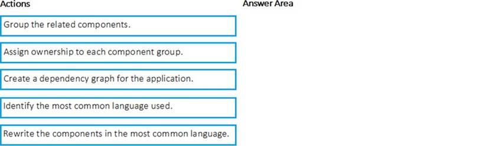
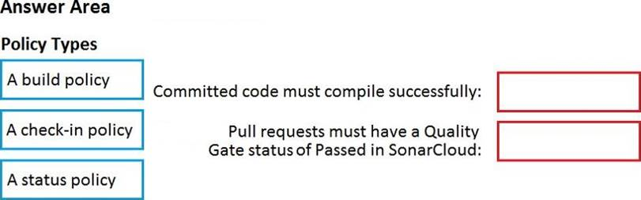
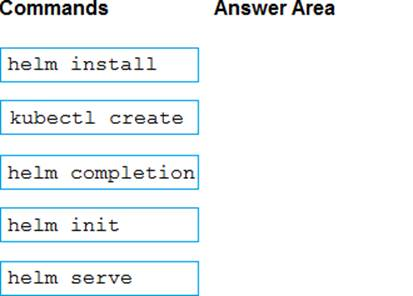
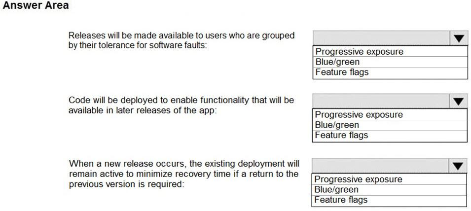
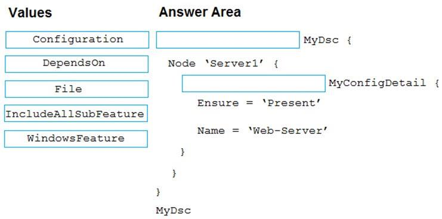
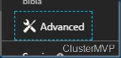

# ⬆️ Microsoft Azure AZ-400 (Designing and Implementing Microsoft DevOps Solutions) Practice Tests Exams Questions & Answers

### You plan to create a project in Azure DevOps. Multiple developers will work on the project. The developers will work offline frequently and will require access to the full project history while they are offline. Which version control solution should you use?

- [ ] TortotseSVN.
- [ ] Team Foundation Version Control.
- [ ] Subversion.
- [x] Git.

### You use Azure SQL Database Intelligent Insights and Azure Application Insights for monitoring. Which query language should you use?

- [x] Kusto Query Language (KQL).
- [ ] PL/pgSQL.
- [ ] PL/SQL.
- [ ] Transact-SQL.

### You plane to store signed images in an Azure Container Registry instance named az4009940427acr1. You need to modify the SKU for az4009940427acr1 to support the planned images. The solution must minimize costs. To complete this task, sign in to the Microsoft Azure portal.

NO ANSWER

### You need to ensure that an Azure web app named az400-9940427-main supports rolling upgrades. The solution must ensure that only 10 percent of users who connect to az400-9940427-main use update versions of the app. The solution must minimize administrative effort. To complete this task, sign in to the Microsoft Azure portal.

- [x] Set up staging environments in Azure App Service.

### Contoso, Ltd. is a manufacturing company that has a main office in Chicago. Contoso plans to improve its IT development and operations processes by implementing Azure DevOps principles. Contoso has an Azure subscription and creates an Azure DevOps organization. The Azure DevOps organization includes: The Docker extension. A deployment pool named Pool7 that contains 10 Azure virtual machines that run Windows Server 2016. The Azure subscription contains an Azure Automation account. Contoso plans to create projects in Azure DevOps as shown in the following table.You need to configure Azure Automation for the computers in Group7. Contoso identifies the following technical requirements: Implement build agents for Project1. Whenever possible, use Azure resources. Avoid using deprecated technologies. Implement a code flow strategy for Project2 that will: Enable Team2 to submit pull requests for Project2. Enable Team2 to work independently on changes to a copy of Project2. Ensure that any intermediary changes performed by Team2 on a copy of Project2 will be subject to the same restrictions as the ones defined in the build policy of Project2. Whenever possible implement automation and minimize administrative effort. Implement Project3, Project5, Project6, and Project7 based on the planned changes Implement Project4 and configure the project to push Docker images to Azure Container Registry. You need to implement the code flow strategy for Project2 in Azure DevOps. Which three actions should you perform in sequence?

- [x] Box 1: Create a repository. Box 2: Create a branch. Box 3: Add a build validation policy.
- [ ] Box 1: Create a fork. Box 2: Create a branch. Box 3: Add a build validation policy.
- [ ] Box 1: Create a repository. Box 2: Add a build policy. Box 3: Add a build validation policy.
- [ ] Box 1: Add a build validation policy. Box 2: Add a build policy. Box 3: Create a fork.

### DRAG DROP - You need to implement Project6. Which three actions should you perform in sequence? To answer, move the appropriate actions from the list of actions to the answer area and arrange them in the correct order. Select and Place:

- [x] Box 1: Open the release pipeline editor. Box 2: Enable Gates. Box 3: Add Query Work Items.
- [ ] Box 1: Add Query Work Items. Box 2: Enable Gates. Box 3: Open the Triggers tab.
- [ ] Box 1: Add a manual intervention task. Box 2: Open the release pipeline editor. Box 3: Enable Gates.
- [ ] Box 1: Open the Triggers tab. Box 2: Add a manual intervention task. Box 3: Add Query Work Items.

### Litware, Inc. an independent software vendor (ISV) Litware has a main office and five branch offices. Application Architecture The company' s primary application is a single monolithic retirement fund management system based on ASP.NE T web forms that use logic written in V8.NET. Some new sections of the application are written in C#. Variations of the application are created for individual customers. Currently, there are more than 80 have code branches in the application's code base. The application was developed by using Microsoft Visual Studio. Source code is stored in Team Foundation Server (TFS) in the main office. The branch offices access of the source code by using TFS proxy servers. Architectural Issues Litware focuses on writing new code for customers. No resources are provided to refactor or remove existing code. Changes to the code base take a long time, AS dependencies are not obvious to individual developers. Merge operations of the code often take months and involve many developers. Code merging frequently introduces bugs that are difficult to locate and resolve. Customers report that ownership costs of the retirement fund management system increase continually. The need to merge unrelated code makes even minor code changes expensive. Requirements Planned Changes Litware plans to develop a new suite of applications for investment planning. The investment planning Applications will require only minor integration with the easting retirement fund management system. The investment planning applications suite will include one multi-tier web application and two iOS mobile applications. One mobile application will be used by employees; the other will be used by customers. Litware plans to move to a more agile development methodology. Shared code will be extracted into a series of package. Litware has started an internal cloud transformation process and plans to use cloud based services whenever suitable. Litware wants to become proactive m detecting failures, rather than always waning for customer bug reports. Technical Requirements The company's investment planning applications suite must meet the following technical requirements: New incoming connections through the firewall must be minimized. Members of a group named Developers must be able to install packages. The principle of least privilege must be used for all permission assignments A branching strategy that supports developing new functionality in isolation must be used. Members of a group named Team leaders must be able to create new packages and edit the permissions of package feeds Visual Studio App Center must be used to centralize the reporting of mobile application crashes and device types in use. By default, all App Center must be used to centralize the reporting of mobile application crashes and device types in use. Code quality and release quality are critical. During release, deployments must not proceed between stages if any active bugs are logged against the release. The mobile applications must be able to call the share pricing service of the existing retirement fund management system. Until the system is upgraded, the service will only support basic authentication over HUPS. The required operating system configuration tor the test servers changes weekly. Azure Automation State Configuration must be used to ensure that the operating system on each test servers configured the same way when the servers are created and checked periodically. Current Technical. The test servers are configured correctly when first deployed, but they experience configuration drift over time. Azure Automation State Configuration fails to correct the configurations. Azure Automation State Configuration nodes are registered by using the following command. How should you complete the code to initialize App Center in the mobile application?

- [x] Box 1: [MSAnalytics.self. Box 2: MSCrasches.self]
- [ ] Box 1: [MSDistribute.self. Box 2: MSAnalytics.self]
- [ ] Box 1: [MSPush.self. Box 2: MSCrasches.self]
- [ ] Box 1: [MSAnalytics.self. Box 2: MSCrasches.self]

### You manage a project in Azure DevOps. You need to prevent the configuration of the project from changing over time. Solution: Perform a Subscription Health scan when packages are created. Does this meet the goal?

- [ ] Yes.
- [x] No.

### You have an existing build pipeline in Azure Pipelines. You need to use incremental builds without purging the environment between pipeline executions. What should you use?

- [ ] a File Transform task.
- [x] a self-hosted agent.
- [ ] Microsoft-hosted parallel jobs.

### You need to configure Azure Pipelines to control App2 builds. Which authentication method should you use?

- [ ] Windows NTLM.
- [ ] certificate.
- [ ] SAML.
- [x] personal access token (PAT).

### You have an Azure function hosted in an App Service plan named az400-9940427-func1. You need to configure az400-9940427-func1 to upgrade the functions automatically whenever new code is committed to the master branch of https://github.com/Azure-Samples/functions-quickstart. To complete this task, sign in to the Microsoft Azure portal.

NO ANSWER

### You need to recommend an integration strategy for the build process of a Java application. The solution must meet the following requirements:

✑ The builds must access an on-premises dependency management system.

✑ The build outputs must be stored as Server artifacts in Azure DevOps.

✑ The source code must be stored in a Git repository in Azure DevOps.
Solution: Configure an Octopus Tentacle on an on-premises machine. Use the Package Application task in the build pipeline. Does this meet the goal?

- [x] Yes.
- [ ] No.

### You need to replace the existing DevOps tools to support the planned changes. What should you use?

- [x] Trello: Azure Boards. Bamboo: Azure Pipelines. BitBucket: GitHub repositories.
- [ ] Trello: Azure Test Plans. Bamboo: GitHub Actions. BitBucket: Azure Artifacts.
- [ ] Trello: GitHub repositories. Bamboo: Azure Artifacts. BitBucket: Azure Pipelines.
- [ ] Trello: Azure Boards. Bamboo: GitHub Actions. BitBucket: Azure Artifacts.

### DRAG DROP -Match the Azure services to the correct descriptions. Instructions: To answer, drag the appropriate Azure service from the column on the left to its description on the right. Each service may be used once, more than once, or not at all.NOTE: Each correct match is worth one point. Select and Place:

- [ ] Provide operating system virtualization: Azure App Service. Provide portable environment for virtualized applications: Azure virtual machines. Used to build, deploy, and scale web apps: Azure Container Instances. Provide a platform for serverless code: Azure Functions.
- [ ] Provide operating system virtualization: Azure Functions. Provide portable environment for virtualized applications: Azure virtual machines. Used to build, deploy, and scale web apps: Azure Container Instances. Provide a platform for serverless code: Azure App Service.
- [x] Provide operating system virtualization: Azure virtual machines. Provide portable environment for virtualized applications: Azure Container Instances. Used to build, deploy, and scale web apps: Azure App Service. Provide a platform for serverless code: Azure Functions.
- [ ] Provide operating system virtualization: Azure virtual machines. Provide portable environment for virtualized applications: Azure Functions. Used to build, deploy, and scale web apps: Azure App Service. Provide a platform for serverless code: Azure Container Instances.

### You plan to create a release pipeline that will deploy Azure resources by using Azure Resource Manager templates. The release pipeline will create the following resources:

✑ Two resource groups

✑ Four Azure virtual machines in one resource group

✑ Two Azure SQL databases in other resource group
You need to recommend a solution to deploy the resources. Solution: Create a main template that has two linked templates, each of which will deploy the resource in its respective group. Does this meet the goal?

- [ ] Yes.
- [x] No.

### You are building an application that has the following assets: Source code. Logs from automated tests and builds. Large and frequently updated binary assets. A common library used by multiple applications. Where should you store each asset?

(ANSWER PHOTO)

### You are defining release strategies for two applications as shown in the following table. Which release strategy should you use for each application? To answer, drag the appropriate release strategies to the correct applications. Each release strategy may be used once, more than once, or not at all. You may need to drag the split bar between panes or scroll to view content. NOTE: Each correct selection is worth one point.

- [ ] App1: Rolling deployment. App2: Blue/Green deployment.
- [ ] App1: Blue/Green deployment. App2: Rolling deployment.
- [x] App1: Canary deployment. App2: Rolling deployment.
- [ ] App1: Rolling deployment. App2: Canary deployment.

### You use Azure Container Registry Tasks commands to quickly build, push, and run a Docker container image natively within Azure, showing how to offload your "inner-loop" development cycle to the cloud. ACR Tasks is a suite of features within Azure Container Registry to help you manage and modify container images across the container lifecycle. References: https://docs.microsoft.com/en-us/azure/container-registry/container-registry-quickstart-task-cli You need to implement Project4. What should you do first?

- [ ] Add the FROM instruction in the Dockerfile file.
- [ ] Add a Copy and Publish Build Artifacts task to the build pipeline.
- [x] Add a Docker task to the build pipeline.
- [ ] Add the MAINTAINER instruction in the Dockerfile file.

### Your company uses Azure DevOps to manage the build and release processes for applications. You use a Git repository for applications source control. You plan to create a new branch from an existing pull request. Later, you plan to merge the new branch and the target branch of the pull request. You need to use a pull request action to create the new branch. The solution must ensure that the branch uses only a portion of the code in the pull request. Which pull request action should you use?

- [ ] Set as default branch.
- [ ] Approve with suggestions.
- [x] Cherry-pick.
- [ ] ReactivateRevert.
- [ ] Revert.

### You need to configure authentication for App1. The solution must support the planned changes. Which three actions should you perform in sequence? To answer, move all actions from the list of actions to the answer area and arrange them in the correct order.

- [ ] Box 1: Create an app. Box 2: Add a secret. Box 3: Create a credential.
- [ ] Box 1: Create a managed service identity. Box 2: Create a credential. Box 3: Configure the ID and secret for App 1.
- [ ] Box 1: Add a secret. Box 2: Create an app. Box 3: Create a managed service identity.
- [x] Box 1: Create an app. Box 2: Create a managed service identity. Box 3: Configure the ID and secret for App1.

### You have a Microsoft ASP.NET Core web app in Azure that is accessed worldwide. You need to run a URL ping test once every five minutes and create an alert when the web app is unavailable from specific Azure regions. The solution must minimize development time. What should you do?

- [x] Create an Azure Application Insights availability test and alert.
- [ ] Create an Azure Service Health alert for the specific regions.
- [ ] Create an Azure Monitor Availability metric and alert.
- [ ] Write an Azure function and deploy the function to the specific regions.

### You have a private GitHub repository. You need to display the commit status of the repository on Azure Boards. What should you do first?

- [ ] Create a GitHub action in GitHub.
- [ ] Add the Azure Pipelines app to the GitHub repository.
- [ ] Configure multi-factor authentication (MFA) for your GitHub account.
- [x] Add the Azure Boards app to the repository.

### You mc configuring Azure DevOps build pipelines. You plan to use hosted build agents. Which build agent pool should you use to compile each application type? To answer, drag the appropriate built agent pools to the correct application types. Each butt agent pool may be used once, more than once, or not at all. You may need to drag the split bar between panes or scroll to view content. NOTE: Each correct selection is worth one point.

- [ ] An application that runs on iOS: Hosted Windows Container. An Internet Information Services (IS) web application that runs in Docker: Hosted Ubuntu 1604.
- [x] An application that runs on iOS: Hosted macOS. An Internet Information Services (IS) web application that runs in Docker: Hosted.
- [ ] An application that runs on iOS: Hosted. An Internet Information Services (IS) web application that runs in Docker: Default.
- [ ] An application that runs on iOS: Hosted Windows Container. An Internet Information Services (IS) web application that runs in Docker: Default.

### How should you configure the release retention policy for the investment planning applications suite? To answer, select the appropriate options in the answer area. NOTE: Each correct selection is worth one point.

- [x] Global release: Set the default retention policy to 30 days. Production stage: Set the stage retention policy to 60 days.
- [ ] Global release: Set the maximum retention policy to 30 days. Production stage: Set the default retention policy to 30 days.
- [ ] Global release: Set the stage retention policy to 60 days. Production stage: Set the maximum retention policy to 60 days.
- [ ] Global release: Set the stage retention policy to 30 days. Production stage: Set the stage retention policy to 30 days.

### You are automating the testing process for your company. You need to automate UI testing of a web application. Which framework should you use?

- [ ] JaCoco.
- [x] Selenium.
- [ ] Xamarin.UITest.
- [ ] Microsoft.CodeAnalysis.

### Note: This question n part of a series of questions that present the same scenario. Each question in the series contains a unique solution that might meet the stated goals. Some question sets might have more than one correct solution, while others might not have a correct solution. After you answer a question in this section, you will NOT be able to return to it. As a result these questions will not appear in the review screen. You have an approval process that contains a condition. The condition requires that releases be approved by a team leader before they are deployed. You have a policy stating that approvals must occur within eight hours. You discover that deployments fail if the approvals lake longer than two hours. You need to ensure that the deployments only fail if the approvals take longer than eight hours. Solution: From Pre-deployment conditions, you modify the Timeout setting for pre-deployment approvals. Does this meet the goal?

- [ ] Yes.
- [x] No.

### You need to configure Azure Automation for the computer in Group7. Which three actions should you perform in sequence? To answer, move the appropriate actions from the list of actions to the answer area and arrange them in the correct order.

- [ ] Box 1: Create a repository. Box 2: Add an application access policy. Box 3: Create a branch.
- [ ] Box 1: Create a fork. Box 2: Add an application access policy. Box 3: Add a build policy for the master branch.
- [ ] Box 1: Create a repository. Box 2: Create a fork. Box 3: Add a build policy for the fork.
- [x] Box 1: Create a repository. Box 2: Add a build policy for the master branch. Box 3: Create a branch.

### You need to meet the technical requirements for controlling access to Azure DevOps. What should you use?

- [ ] Azure Multi-Factor Authentication (MFA).
- [ ] on-premises firewall rules.
- [x] conditional access policies in Azure AD.
- [ ] Azure role-based access control (Azure RBAC).

### You are configuring the Azure DevOps dashboard. The solution must meet the technical requirements. Which widget should you use for each metric? To answer, drag the appropriate widgets to the correct metrics. Each widget may be used once, more than once, or not at all. You may need to drag the split bar between panes or scroll to view content. NOTE: Each correct selection is worth one point.

- [ ] Box 1: Sprint burndown. Box 2: Release pipeline overview. Box 3: Cumulative flow diagram.
- [ ] Box 1: Query tile. Box 2: Velocity. Box 3: Cumulative flow diagram.
- [x] Box 1: Velocity. Box 2: Release pipeline overview. Box 3: Query tile.
- [ ] Box 1: Velocity. Box 2: Sprint burndown. Box 3: Query tile.

### You company has a prefect in Azure DevOps for a new web application. You need to ensure that when code is checked in, a build runs automatically. Solution: From the Triggers tab of the build pipeline, you selected Batch changes while a build is in progressDoes this meet the goal?

- [ ] Yes.
- [x] No.

### You need to find and isolate shared code. The shared code will be maintained in a series of packages. Which three actions should you perform in sequence? To answer, move the appropriate actions from the list of actions to the answer area and arrange them in the correct order.

- [x] Box 1: Create a dependency graph for the application. Box 2: Group the related components. Box 3: Assign ownership to each component group.
- [ ] Box 1: Identify the most common language used. Box 2: Group the related components. Box 3: Assign ownership to each component group.
- [ ] Box 1: Rewrite the components in the most common language. Box 2: Create a dependency graph for the application. Box 3: Group the related components.
- [ ] Box 1: Assign ownership to each component group. Box 2: Rewrite the components in the most common language. Box 3: Identify the most common language used.

### You are configuring an Azure DevOps deployment pipeline. The deployed application will authenticate to a web service by using a secret stored in an Azure key vault. You need to use the secret in the deployment pipeline. Which three actions should you perform in sequence? To answer, move the appropriate actions from the list of actions to the answer area and arrange them in the correct order.

- [ ] Box 1: Add an app registration in Azure Active Directory (Azure AD). Box 2: Create a service principal in Azure Active Directory (Azure AD). Box 3: Add an Azure Resource Manager service connection to the pipeline.
- [x] Box 1: Create a service principal in Azure Active Directory (Azure AD). Box 2: Configure an access policy in the key vault. Box 3: Add an Azure Resource Manager service connection to the pipeline.
- [ ] Box 1: Export a certificate from the key vault. Box 2: Add an Azure Resource Manager service connection to the
pipeline. Box 3: Generate a self-signed certificate.
- [ ] Box 1: Generate a self-signed certificate. Box 2: Create a service principal in Azure Active Directory (Azure AD). Box 3: Export a certificate from the key vault.

### How should you confrere the release retention policy for the investment planning depletions suite?

(ANSWER PHOTO)

### You have a multi-tier application. The front end of the application is hosted in Azure App Service. You need to identify the average load times of the application pages . What should you use?

- [ ] the diagnostics logs of the App Service.
- [x] Azure Application Insights.
- [ ] Azure Advisor.
- [ ] the activity log of the App Service.

### You have an application that consists of several Azure App Service web apps and Azure m functions. You need to access the security of the web apps and the functions. Which Azure features can you use to provide a recommendation for the security of the application?

- [ ] Security & Compliance in Azure Log Analytics.
- [ ] Resource health in Azure Service Health.
- [ ] Smart Detection in Azure Application Insights.
- [x] Compute & apps in Azure Security Center.

### You need to configure a virtual machine named VM1 to securely access stored secrets in an Azure Key Vault named az400-11566895-kv. To complete this task, sign in to the Microsoft Azure portal.

- [x]You can use a system-assigned managed identity for a Windows virtual machine (VM) to access Azure Key Vault.

✑ Sign in to Azure portal

✑ Locate virtual machine VM1.

✑ Select Identity

✑ Enable the system-assigned identity for VM1 by setting the Status to On.

### You have an Azure virtual machine named VM1 that runs Linux. You plan to deploy the Desired State Configuration (DSC) extension to VM1. You need to grant the Log Analytics agent the appropriate directory permissions. How should you complete the command? To answer, select the appropriate options in the answer area. NOTE: Each correct selection is worth one point.

- [ ] Box 1: r. Box 2: /lib.
- [ ] Box 1: rx. Box 2: /etc.
- [x] Box 1: rwx. Box 2: /temp.
- [ ] Box 1: x. Box 2: /usr.

### During a code review, you discover many quality issues. Many modules contain unused variables and empty catch Modes. You need to recommend a solution to improve the quality o' the code . What should you recommend?

- [ ] In a Gradle build task, select Run Checkstyle.
- [ ] In an Xcode build task, select Use xcpretty from Advanced.
- [ ] In a Grunt build task, select Enabled from Control Options.
- [x] In a Maven build task, select Run PM.

### You are using GitHub as a source code repository. You create a client-side Git hook on the commit-msg event. The hook requires that each commit message contain a custom work item tag. You need to make a commit that does not have a work item tag. Which git commit parameter should you use?

- [ ] –squash.
- [x] –no-verify.
- [ ] –message ”.
- [ ] –no-post-rewrite.

### Contoso plans to improve its IT development and operations processes by implementing Azure DevOps principles. Contoso has an Azure subscription and creates an Azure DevOps organization.Contoso plans to improve its IT development and operations processes by implementing Azure DevOps principles. Contoso has an Azure subscription and creates an Azure DevOps organization.The Azure subscription contains an Azure Automation account. Planned Changes Contoso plans to create projects in Azure DevOps as shown in the following table. Technical Requirements Contoso identities the following technical requirements: Implement build agents rot Project 1. Whenever possible, use Azure resources Avoid using deprecated technologies Implement a code flow strategy for Project2 that will: Enable Team 2 to submit pull requests for Project2. Enable Team 2 to work independently on changes to a copy of Project? Ensure that any intermediary changes performed by Tram2 on a copy of Project2 will be subject to the same restrictions as the ones defied in the build policy of Project2. Whenever possible. Implement automation and minimize administrative effort. Implement Protect3, Project5, Project6, and Project7 based on the planned changes. Implement Project4 and configure the project to push Docker images to Azure Container Reentry. DRAG DROP You need to implement Project6. Which three actions should you perform in sequence? To answer, move the appropriate actions from the list of actions to the answer area and arrange them m the correct order.

### How should you configure the filters for the Project5 trigger?

- [ ] Box 1: branch filter to exclude. Box 2: branch filter to exclude.
- [ ] Box 1: path filter to include. Box 2: path filter to exclude.
- [x] Box 1: path filter to exclude. Box 2: branch filter to include.
- [ ] Box 1: path filter to exclude. Box 2: path filter to include.

### You are designing the security validation strategy for a project in Azure DevOps. You need to identify package dependencies that have known security issues and can be resolved by an update. What should you use?

- [ ] Octopus Deploy.
- [ ] Jenkins.
- [ ] Gradle.
- [x] SonarQube.

### You are configuring the settings of a new Git repository in Azure Repos. You need to ensure that pull requests in a branch meet the following criteria before they are merged:

✑ Committed code must compile successfully.
✑ Pull requests must have a Quality Gate status of Passed in SonarCloud.
Which policy type should you configure for each requirement? To answer, drag the appropriate policy types to the correct requirements. Each policy type may be used once, more than once, or not at all. You may need to drag the split bar between panes or scroll to view content. NOTE: Each correct selection is worth one point.

- [ ] Committed code must compile successfully: A check-in policy.Pull requests must have a Quality Gate status of Passed in SonarCloud: A status policy.
- [ ] Committed code must compile successfully: A status policy.Pull requests must have a Quality Gate status of Passed in SonarCloud: A build policy.
- [ ] Committed code must compile successfully: A build policy.Pull requests must have a Quality Gate status of Passed in SonarCloud: A check-in policy.
- [x] Committed code must compile successfully: A check-in policy.Pull requests must have a Quality Gate status of Passed in SonarCloud: A build policy.

### You are deploying a server application that will run on a Server Core installation of Windows Server 2019. You create an Azure key vault and a secret. You need to use the key vault to secure API secrets for third-party integrations. Which three actions should you perform? Each correct answer presents part of the solution. NOTE: Each correct selection is worth one point. D18912E1457D5D1DDCBD40AB3BF70D5D

- [ ] Configure RBAC for the key vault.
- [x] Modify the application to access the key vault.
- [x] Configure a Key Vault access policy.
- [ ] Deploy an Azure Desired State Configuration (DSC) extension.Deploy a virtual machine that uses a system-assigned managed identity.
- [x] Deploy a virtual machine that uses a system-assigned managed identity.

### This is a case study. Case studies are not timed separately. You can use as much exam time as you would like to complete each case. However, there may be additional case studies and sections on this exam. You must manage your time to ensure that you are able to complete all questions included on this exam in the time provided. To answer the questions included in a case study, you will need to reference information that is provided in the case study. Case studies might contain exhibits and other resources that provide more information about the scenario that is described in the case study. Each question is independent of the other questions in this case study. At the end of this case study, a review screen will appear. This screen allows you to review your answers and to make changes before you move to the next section of the exam. After you begin a new section, you cannot return to this section. To start the case study To display the first question in this case study, click the Next button. Use the buttons in the left pane to explore the content of the case study before you answer the questions. Clicking these buttons displays information such as business requirements, existing environment, and problem statements. If the case study has an All Information tab, note that the information displayed is identical to the information displayed on the subsequent tabs. When you are ready to answer a question, click the Question button to return to the question. Overview General Overview Woodgrove Bank is a financial services company that has a main office in the United Kingdom. Technical Requirements and Planned Changes Planned Changes Woodgrove Bank plans to implement the following project management changes: ✑ Implement Azure DevOps for project tracking. ✑ Centralize source code control in private GitHub repositories. ✑ Implement Azure Pipelines for build pipelines and release pipelines. Woodgrove Bank plans to implement the following changes to the identity environment: ✑ Deploy an Azure AD tenant named woodgrovebank.com.✑ Sync the Active Directory domain to Azure AD.✑ Configure App1 to use a service principal.✑ Integrate GitHub with Azure AD. Woodgrove Bank plans to implement the following changes to the core apps: ✑ Migrate App1 to ASP.NET Core.✑ Integrate Azure Pipelines and the third-party build tool used to develop App2. Woodgrove Bank plans to implement the following changes to the DevOps environment: ✑ Deploy App1 to Azure App Service. ✑ Implement source control for the DB1 schema. ✑ Migrate all the source code from TFS1 to GitHub. ✑ Deploy App2 to an Azure virtual machine named VM1. ✑ Merge the POC branch into the GitHub default branch. ✑ Implement an Azure DevOps dashboard for stakeholders to monitor development progress. Technical Requirements Woodgrove Bank identifies the following technical requirements: ✑ The initial databases for new environments must contain both schema and reference data. ✑ An Azure Monitor alert for VM1 must be configured to meet the following requirements: ✑ The commit history of the POC branch must replace the history of the default branch. ✑ The Azure DevOps dashboard must display the metrics shown in the following table. ✑ Access to Azure DevOps must be restricted to specific IP addresses. ✑ Page load times for App1 must be captured and monitored. ✑ Administrative effort must be minimized. HOTSPOT You need to configure the alert for VM1. The solution must meet the technical requirements. Which two settings should you configure? To answer, select the appropriate settings in the answer area. NOTE: Each correct selection is worth one point.

- [ ] a

### You need to recommend a procedure to implement the build agent for Project1. Which three actions should you recommend be performed in sequence?

- [x] Box 1: Sign in to Azure DevOps by using an account that is assigned the Administrator service connection security role. Box 2: Create a personal access token in the Azure
DevOps organization of Contoso. Box 3: Install and register the Azure Pipelines agent on an Azure virtual machine.
- [ ] Box 1: Sign in to Azure DevOps by using an account that is assigned the Administrator service
connection security role. Box 2: Install the Azure Pipelines agent on on- premises virtual machine. Box 3: Sign in to Azure DevOps by using an account that is assigned the agent pool administrator role.
- [ ] Box 1: Create a personal access token in the Azure DevOps organization of Contoso. Box 2: Install the Azure Pipelines agent on on- premises virtual machine. Box 3: Sign in to Azure DevOps by using an account that is assigned the agent pool administrator role.
- [ ] Box 1: Sign in to Azure DevOps by using an account that is assigned the agent pool administrator role. Box 2: Install the Azure Pipelines agent on on- premises virtual machine. Box 3: Create a personal access token in the Azure DevOps organization of Contoso.

### Contoso, Ltd. is a manufacturing company that has a main office in Chicago. Contoso plans to improve its IT development and operations processes by implementing Azure DevOps principles. Contoso has an Azure subscription and creates an Azure DevOps organization. The Azure DevOps organization includes: The Docker extension. A deployment pool named Pool7 that contains 10 Azure virtual machines that run Windows Server 2016. The Azure subscription contains an Azure Automation account. Contoso plans to create projects in Azure DevOps as shown in the following table.You need to configure Azure Automation for the computers in Group7. Contoso identifies the following technical requirements: Implement build agents for Project1. Whenever possible, use Azure resources. Avoid using deprecated technologies. Implement a code flow strategy for Project2 that will: Enable Team2 to submit pull requests for Project2. Enable Team2 to work independently on changes to a copy of Project2. Ensure that any intermediary changes performed by Team2 on a copy of Project2 will be subject to the same restrictions as the ones defined in the build policy of Project2. Whenever possible implement automation and minimize administrative effort. Implement Project3, Project5, Project6, and Project7 based on the planned changes Implement Project4 and configure the project to push Docker images to Azure Container Registry. You add the virtual machines as managed nodes in Azure Automation State Configuration. You need to configure the computer in Group7. What should you do?

- [x] Run the Register-AzureRmAutomationDscNode Azure Powershell cmdlet.
- [ ] Modify the ConfigurationMode property of the Local Configuration Manager (LCM).
- [ ] Install PowerShell Core.
- [ ] Modify the RefreshMode property of the Local Configuration Manager (LCM).

### You need to perform the GitHub code migration. The solution must support the planned changes for the DevOps environment. What should you use?

- [ ] git clone.
- [ ] GitHub Importer.
- [ ] Import repository in Azure Repos.
- [x] git-tfs.

### Topic 4, Mix Questions Set Your company implements an Agile development methodology. You plan to implement retrospectives at the end of each sprint. Which three questions should you include? Each correct answer presents part of the solution. NOTE: Each correct selection is worth one point.

- [ ] Who performed well?
- [ ] Who should have performed better?
- [x] What could have gone better?
- [x] What went well?
- [x] What should we try next?

### Your company hosts a web application in Azure. The company uses Azure Pipelines for the build and release management of the application. Stakeholders report that the past few releases have negatively affected system performance. You configure alerts in Azure Monitor. You need to ensure that new releases are only deployed to production if the releases meet defined performance baseline criteria in the staging environment first. What should you use to prevent the deployment of releases that fail to meet the performance baseline?

- [ ] Azure Scheduler job.
- [ ] Trigger.
- [x] Gate.
- [ ] Azure function.

### Litware, Inc. an independent software vendor (ISV) Litware has a main office and five branch offices. Application Architecture The company' s primary application is a single monolithic retirement fund management system based on ASP.NE T web forms that use logic written in V8.NET. Some new sections of the application are written in C#. Variations of the application are created for individual customers. Currently, there are more than 80 have code branches in the application's code base. The application was developed by using Microsoft Visual Studio. Source code is stored in Team Foundation Server (TFS) in the main office. The branch offices access of the source code by using TFS proxy servers. Architectural Issues Litware focuses on writing new code for customers. No resources are provided to refactor or remove existing code. Changes to the code base take a long time, AS dependencies are not obvious to individual developers. Merge operations of the code often take months and involve many developers. Code merging frequently introduces bugs that are difficult to locate and resolve. Customers report that ownership costs of the retirement fund management system increase continually. The need to merge unrelated code makes even minor code changes expensive. Requirements Planned Changes Litware plans to develop a new suite of applications for investment planning. The investment planning Applications will require only minor integration with the easting retirement fund management system. The investment planning applications suite will include one multi-tier web application and two iOS mobile applications. One mobile application will be used by employees; the other will be used by customers. Litware plans to move to a more agile development methodology. Shared code will be extracted into a series of package. Litware has started an internal cloud transformation process and plans to use cloud based services whenever suitable. Litware wants to become proactive m detecting failures, rather than always waning for customer bug reports. Technical Requirements The company's investment planning applications suite must meet the following technical requirements: New incoming connections through the firewall must be minimized. Members of a group named Developers must be able to install packages. The principle of least privilege must be used for all permission assignments A branching strategy that supports developing new functionality in isolation must be used. Members of a group named Team leaders must be able to create new packages and edit the permissions of package feeds Visual Studio App Center must be used to centralize the reporting of mobile application crashes and device types in use. By default, all App Center must be used to centralize the reporting of mobile application crashes and device types in use. Code quality and release quality are critical. During release, deployments must not proceed between stages if any active bugs are logged against the release. The mobile applications must be able to call the share pricing service of the existing retirement fund management system. Until the system is upgraded, the service will only support basic authentication over HUPS. The required operating system configuration tor the test servers changes weekly. Azure Automation State Configuration must be used to ensure that the operating system on each test servers configured the same way when the servers are created and checked periodically. Current Technical. The test servers are configured correctly when first deployed, but they experience configuration drift over time. Azure Automation State Configuration fails to correct the configurations. Azure Automation State Configuration nodes are registered by using the following command. You need to configure a cloud service to store the secrets required by the mobile applications to call the share pricing service. What should you include in the solution?

- [ ] Required secrets: Certificate. Storage location: Azure Data Lake.
- [x] Required secrets: Shared Access Authorization token. Storage location: Azure Storage with HTTPS access.
- [ ] Required secrets: Shared Access Authorization token. Storage location: Azure Storage with HTTPS access.
- [ ] Required secrets: Username and password. Storage location: Azure Storage with HTTP access.

### Your company uses Azure DevOps. Only users who have accounts in Azure Active Directory can access the Azure DevOps environment. You need to ensure that only devices that are connected to the on-premises network can access the Azure DevOps environment. What should you do?

- [ ] Assign the Stakeholder access level to all users.
- [ ] In Azure Active Directory, configure risky sign-ins.
- [ ] In Azure DevOps, configure Security in Project Settings.
- [x] In Azure Active Directory, configure conditional access.

### Your company uses Azure DevOps to manage the build and release processes for applications. You use a Git repository for applications source control. You need to implement a pull request strategy that reduces the history volume in the master branch. Solution: You implement a pull request strategy that uses a three-way merge.Does this meet the goal?

- [ ] Yes
- [x] No

### You integrate a cloud- hosted Jenkins server and a new Azure DevOps deployment You need Azure DevOps to send a notification to Jenkins when a developer commits changes to a branch in Azure Repos. Solution: You create a service hook subscription that uses the code pushed event. Does this meet the goal?

- [x] Yes.
- [ ] No.

### You integrate a cloud-hosted Jenkins server and a new Azure DevOps deployment. You need Azure DevOps to send a notification to Jenkins when a developer commits changes to a branch in Azure Repos. Solution: You create an email subscription to an Azure DevOps notification. Does this meet the goal?

- [ ] Yes.
- [x] No.

### Your company has a project in Azure DevOps for a new web application. The company uses Service Now for change management. You need to ensure that a change request is processed before any components can be deployed to the production environment. What are two ways to integrate into the Azure DevOps release pipeline? Each correct answer presents a complete solution. NOTE: Each correct selection is worth one point.

- [x] Define a deployment control that invokes the Service Now SOAP AP.
- [ ] Define a post deployment gate after the deployment to the QA stage.
- [ ] Define a deployment control that invokes the ServiceNow REST AP.
- [ ] Define a pre deployment gate before the deployment to the Prod stage.

### You are designing the development process for your company. You need to recommend a solution for continuous inspection of the company's code base to locate common code patterns that are known to be problematic. What should you include in the recommendation?

- [ ] Microsoft Visual Studio test plans.
- [ ] Gradle wrapper scripts.
- [x] SonarCloud analysis.
- [ ] the JavaScript task runner.

### Your company has a project in Azure DevOps for a new application. The application will be deployed to several Azure virtual machines that run Windows Server 2016. You need to recommend a deployment strategy for the virtual machines. The strategy must meet the following requirements: Ensure that the virtual machines maintain a consistent configuration. Minimize administrative effort to configure the virtual machines. What should you include in the recommendation?

- [ ] Deployment YAML and Azure pipeline stage templates.
- [x] Azure Resource Manager templates and the Custom Script Extension for Windows.
- [ ] Azure Resource Manager templates and the PowerShell Desired State Configuration (DSC) extension for Windows.
- [ ] Deployment YAML and Azure pipeline deployment groups.

### You use Azure SQL Database Intelligent Insights and Azure Application Insights foe monitoring. You need to write ad-hoc Queries against the monitoring data. Which Query language should you use?

- [ ] PL/pgSQL.
- [ ] Transact-SQL.
- [x] Azure Log Analytics.
- [ ] PL/SQL.

### Where should the build and release agents for the investment planning application suite run?

- [ ] Build agent: A hosted service. Release agent: The developers' computers.
- [ ] Build agent: A hosted service. Release agent: A hosted service.
- [ ] Build agent: The developers' computers. Release agent: A hosted service.
- [x] Build agent: A source control system. Release agent: A hosted service.

### You have Azure Pipelines and GitHub integrated as a source code repository. The build pipeline has continuous integration enabled. You plan to trigger an automated build whenever code changes are committed to the repository. You need to ensure that the system will wait until a build completes before queuing another build. What should you implement?

- [ ] path filters.
- [x] batch changes.
- [ ] scheduled builds.
- [ ] branch filters.

### You manage a project in Azure DevOps. You need to prevent the configuration of the project from changing over time. Solution: Implement Continuous Assurance for the project. Does this meet the goal?

- [x] Yes.
- [ ] No.

### You have an Azure DevOps organization named Contoso and an Azure subscription. The subscription contains an Azure virtual machine scale set named VMSS1 that is configured for autoscaling. You have a project in Azure DevOps named Project1. Project1 is used to build a web app named App1 and deploy App1 to VMSS1. You need to ensure that an email alert is generated whenever VMSS1 scales in or out. Solution: From Azure DevOps, configure the Service hooks settings for Project1.Does this meet the goal?

- [ ] Yes.
- [x] No.

### HOTSPOT You are using PowerShell to administer Azure Log Analytics workspaces. You need to list the available workspaces and their properties. How should you complete the command? To answer, select the appropriate options in the answer area. NOTE: Each correct selection is worth one point.

- [x] Box 1: Get-AzResource. Box 2: ResourceType.
- [ ] Box 1: Get-AzResourceProvider. Box 2: ResourceGroupName.
- [ ] Box 1: Get-AzResource. Box 2: Resourceld.
- [ ] Box 1: Get-AzResourceGroup. Box 2: Get-AzResource.

### You have a project in Azure DevOps named Project1. Project! contains a pipeline that builds a container image named Image! and pushes Image1 to an Azure container registry named ACR1. Image! uses a base image stored in Docker Hub. You need to ensure that Image1 is updated automatically whenever the base image is updated. What should you do?

- [x] Create and run an Azure Container Registry task.
- [ ] Add a Docker Hub service connection to Azure Pipelines.
- [ ] Enable the Azure Event Grid resource provider and subscribe to registry events.
- [ ] Create a service hook in Project1.

### Your company has four projects. The version control requirements for each project are shown in the following table.You plan to use Azure Repos for all the projects. Which version control system should you use for each project? To answer, drag the appropriate version control systems to the correct projects. Each version control system may be used once, more than once, or not at all. You may need to drag the split bar between panes or scroll to view content. NOTE: Each correct selection is worth one point.

- [x] Project 1: Team Foundation Version Control.Project 2: Git.Project 3: Subversion.Project 4: Git.
- [ ] Project 1: Git.Project 2: Perforce.Project 3: Subversion.Project 4: Team Foundation Version Control.
- [ ] Project 1: Team Foundation Version Control.Project 2: Subversion.Project 3: Perforce.Project 4: Git.
- [ ] Project 1: Subversion.Project 2: Perforce.Project 3: Team Foundation Version Control.Project 4: Git.

### Your company is building a new solution in Java. The company currently uses a SonarQube server to analyze the code of .NET solutions. You need to analyze and monitor the code quality of the Java solution. Which task types should you add to the build pipeline?

- [ ] Chef.
- [x] Gradle.
- [ ] Octopus.
- [ ] Gulp.

### Your development team is building a new web solution by using the Microsoft Visual Studio integrated development environment (IDE). You need to make a custom package available to all the developers. The package must be managed centrally, and the latest version must be available for consumption in Visual Studio automatically. Which three actions should you perform?

- [x] Publish the package to a feed.
- [x] Create a new feed in Azure Artifacts.
- [ ] Upload a package to a Git repository.
- [ ] Add the package URL to the Environment settings in Visual Studio.
- [x] Add the package URL to the NuGet Package Manager settings in Visual Studio.
- [ ] Create a Git repository in Azure Repos.

### DRAG DROP -You have an Azure Kubernetes Service (AKS) implementation that is RBAC-enabled. You plan to use Azure Container Instances as a hosted development environment to run containers in the AKS implementation. You need to configure Azure Container Instances as a hosted environment for running the containers in AKS. Which three actions should you perform in sequence? To answer, move the appropriate actions from the list of actions to the answer area and arrange them in the correct order. Select and Place:

- [x] Box 1: Create a YAML file. Box 2: Run kubectl apply. Box 3: Run helm init.
- [ ] Box 1: Run az role assignment create. Box 2: Create a YAML file. Box 3: Run helm init.
- [ ] Box 1: Run az aks install-connector. Box 2: Run kubectl apply. Box 3: Run az aks install-connector.
- [ ] Box 1: Run helm init. Box 2: Run az role assignment create. Box 3: Run kubectl apply.

### You integrate a cloud-hosted Jenkins server and a new Azure DevOps deployment. You need Azure DevOps to send a notification to Jenkins when a developer commits changes to a branch in Azure Repos. Solution: You create a service hook subscription that uses the build completed event. Does this meet the goal?

- [ ] Yes.
- [x] No.

### You integrate a cloud-hosted Jenkins server and a new Azure DevOps deployment. You need Azure DevOps to send a notification to Jenkins when a developer commits changes to a branch in Azure Repos. Solution: You add a trigger to the build pipeline. Does this meet the goal?

- [ ] Yes.
- [x] No.

### Your company builds a multi tier web application. You use Azure DevOps and host the production application on Azure virtual machines. Your team prepares an Azure Resource Manager template of the virtual machine that you mil use to test new features. You need to create a staging environment in Azure that meets the following requirements: Minimizes the cost of Azure hosting. Provisions the virtual machines automatically. Use the custom Azure Resource Manager template to provision the virtual machines. What should you do?

- [x] In Azure DevOps, configure new tasks in the release pipeline to create and delete the virtual machines m Azure DevTest Labs.
- [ ] From Azure Cloud Shell, run Azure PowerShell commands to create and delete the new virtual machines in a staging resource group.
- [ ] In Azure DevOps, configure new tasks in the release pipeline to deploy to Azure Cloud Services.
- [ ] In Azure Cloud Shell, run Azure CLI commands to create and delete the new virtual machines in a staging resource group.

### Your company uses Team Foundation Server 2013 (TFS 2013). You plan to migrate to Azure DevOps. You need to recommend a migration strategy that meets the following requirements: Preserves the dates of Team Foundation Version Control changesets. Preserves the changes dates of work items revisions. Minimizes migration effort. Migrates all TFS artifacts. What should you recommend?

- [x] On the TFS server: Upgrade TFS to the most recent RTW release. To perform the migration: Use the TFS Database Import Service.
- [ ] On the TFS server: Install the TFS Java SDK. To perform the migration: Copy the assets manually.
- [ ] On the TFS server: Upgrade to the most recent version of PowerShell Core. To perform the migration: Use the TFS Integration Platform.
- [ ] On the TFS server: Install the TFS Java SDK. To perform the migration: Use the TFS Database Import Service.

### You need to configure a cloud service to store the secrets required by the mobile applications to call the share. What should you include in the solution?

(ANSWER PHOTO)

### What should you use to implement the code quality restriction on the release pipeline for the investment planning applications suite?

- [ ] a trigger.
- [x] a pre deployment approval.
- [ ] a post-deployment approval.
- [ ] a deployment gate.

### You use Azure DevOps to manage the build and deployment of an app named App1. You have a release pipeline that deploys a virtual machine named VM1. You plan to monitor the release pipeline by using Azure Monitor You need to create an alert to monitor the performance of VM1. The alert must be triggered when the average CPU usage exceeds 70 percent for five minutes. The alert must calculate the average once every minute. How should you configure the alert rule? To answer, select the appropriate options in the answer area.

- [x] Aggregation granularity (Period): 5 minutes. Threshold value: Static. Operator: Greater than.
- [ ] Aggregation granularity (Period): 1 minute. Threshold value: Static. Operator: Greater than.
- [ ] Aggregation granularity (Period): 1 minute. Threshold value: Dynamic. Operator: Greater than.
- [ ] Aggregation granularity (Period): 5 minutes. Threshold value: Dynamic. Operator: Less than.

### You need to create an alert to monitor the performance of VM1. The alert must be triggered when the average CPU usage exceeds 70 percent for five minutes. The alert must calculate the average once every minute.

How should you configure the alert rule? To answer, select the appropriate options in the answer area.

### You have a project in Azure DevOps. You plan to deploy a self-hosted agent by using an unattended configuration script. Which two values should you define in the configuration script? Each correct answer presents part of the solution. NOTE: Each correct selection is worth one point.

- [x] authorization credentials.
- [ ] the project name.
- [ ] the deployment group name.
- [x] the organization URLthe agent pool name.
- [ ] the agent pool name.

### Your company has a project in Azure DevOps. You plan to create a release pipeline that will deploy resources by using Azure Resource Manager templates. The templates will reference secrets stored in Azure Key Vault. You need to recommend a solution for accessing the secrets stored in the key vault during deployments. The solution must use the principle of least privilege. What should you include in the recommendation?

- [ ] Restrict access to delete the key vault: a personal access token (PAT). Restrict access to the secrets in Key Vault by using: a personal access token (PAT).
- [ ] Restrict access to delete the key vault: a personal access token (PAT). Restrict access to the secrets in Key Vault by using: RBAC.
- [x] Restrict access to delete the key vault: an Azure Key Vault access policy. Restrict access to the secrets in Key Vault by using: RBAC.
- [ ] Restrict access to delete the key vault: RBAC. Restrict access to the secrets in Key Vault by using: a personal access token (PAT).

### You need to recommend a solution for deploying charts by using Helm and Tiller to Azure Kubernetes Service (AKS) in an RBAC-enabled cluster. Which three commands should you recommend be run in sequence?

- [ ] Box 1: helm init. Box 2: kubectl create. Box 3: helm install.
- [x] Box 1: kubectl create. Box 2: helm init. Box 3: helm install.
- [ ] Box 1: helm init. Box 2: helm serve. Box 3: helm completion.
- [ ] Box 1: kubectl create. Box 2: helm init. Box 3: helm serve.

### You have an Azure DevOps organization named Contoso, an Azure DevOps project named Project1, an Azure subscription named Sub1, and an Azure key vault named vault1. You need to ensure that you can reference the values of the secrets stored in vault1 in all the pipelines of Project1. The solution must prevent the values from being stored in the pipelines. What should you do?

- [x] Create a variable group in Project1.
- [ ] Add a secure file to Project1.
- [ ] Modify the security settings of the pipelines.
- [ ] Configure the security policy of Contoso.

### You have a project in Azure DevOps. You have an Azure Resource Group deployment project in Microsoft Visual Studio that is checked in to the Azure DevOps project. You need to create a release pipeline that will deploy resources by using Azure Resource Manager templates. The solution must minimize administrative effort. Which task type should you include in the solution?

- [ ] Azure Cloud Service Deployment.
- [ ] Azure RM Web App Deployment.
- [x] Azure PowerShell.
- [ ] Azure App Service Manage.

### Drag and Drop You need to use Azure Automation Sure Configuration to manage the ongoing consistency of virtual machine configurations. Which five actions should you perform in sequence?

(ANSWER PHOTO)

### You are automating the build process for a Java-based application by using Azure DevOps. You need to add code coverage testing and publish the outcomes to the pipeline. What should you use?

- [x] Cobertura.
- [ ] Bullseye Coverage.
- [ ] MSTest.
- [ ] Coverlet.
- [ ] Coverage.py.
- [ ] NUnit.

### You have a private distribution group that contains provisioned and unprovisioned devices. You need to distribute a new iOS application to the distribution group by using Microsoft Visual Studio App Center. What should you do?

- [ ] Request the Apple ID associated with the user of each device.
- [x] Register the devices on the Apple Developer portal.
- [ ] Create an active subscription in App Center Test.
- [ ] Add the device owner to the organization in App Center.

### Your company is concerned that when developers introduce open source libraries, it creates licensing compliance issues. You need to add an automated process to the build pipeline to detect when common open source libraries are added to the code base. What should you use?

- [ ] PDM.
- [ ] OWASPZAP.
- [x] WhiteSource.
- [ ] Jenkins.

### DRAG DROP - You need to implement Project6. Which three actions should you perform in sequence? To answer, move the appropriate actions from the list of actions to the answer area and arrange them in the correct order. Select and Place:

- [x] Box 1: Open the release pipeline editor. Box 2: Enable Gates. Box 3: Add Query Work Items.
- [ ] Box 1: Add Query Work Items. Box 2: Enable Gates. Box 3: Add a manual intervention task.
- [ ] Box 1: Add a manual intervention task. Box 2: Enable Gates. Box 3: Open the Triggers tab.
- [ ] Box 1: Open the Triggers tab. Box 2: Add a manual intervention task. Box 3: Add Query Work Items.

### You are planning projects for three customers. Each customer's preferred process for work items is shown in the following table. The customers all plan to use Azure DevOps for work item management. Which work item process should you use for each customer?

- [ ] Litware: XP. Contoso: CMMI. A. Datum: Agile.
- [ ] Litware: Scrum. Contoso: Agile. A. Datum: CMMI.
- [x] Litware: Scrum. Contoso: Agile. A. Datum: CMMI.
- [ ] Litware: XP. Contoso: CMMI. A. Datum: Scrum.

### You need to implement Project6. Which three actions should you perform in sequence? To answer, move the appropriate actions from the list of actions to the answer area and arrange them m the correct order.

(ANSWER PHOTO)

### Your company plans to use an agile approach to software development. You need to recommend an application to provide communication between members of the development team who work in locations around the world. The applications must meet the following requirements: Provide the ability to isolate the members of different project teams into separate communication channels and to keep a history of the chats within those channels. Be available on Windows 10, Mac OS, iOS, and Android operating systems. Provide the ability to add external contractors and suppliers to projects. Integrate directly with Azure DevOps. What should you recommend?

- [ ] Microsoft Project.
- [ ] Bamboo.
- [ ] Microsoft Lync.
- [x] Microsoft Teams.

### You have an Azure Resource Manager template that deploys a multi-tier application. You need to prevent the user who performs the deployment from viewing the account credentials and connection strings used by the application. What should you use?

- [ ] an Azure Resource Manager parameter file.
- [ ] an Azure Storage table.
- [ ] an Appsettings.json files.
- [x] Azure Key Vault.
- [ ] a Web.config file.

### Your company has a project in Azure DevOps for a new web application. You need to ensure that when code is checked in, a build runs automatically. Solution: From the Continuous deployment trigger settings of the release pipeline, you enable the Pull request trigger setting. Does the meet the goal?

- [ ] Yes.
- [x] No.

### Your company is building a new solution in Java. The company currently uses a SonarQube server to analyze the code of .NET solutions. You need to analyze and monitor the code quality of the Java solution. Which task types should you add to the build pipeline?

- [ ] Octopus.
- [ ] Chef.
- [x] Maven.
- [ ] Grunt.

### You are developing a multi-tier application. The application will use Azure App Service web apps as the front end and an Azure SQL database as the back end. The application will use Azure functions to write some data to Azure Storage. You need to send the Azure DevOps team an email message when the front end fails to return a status code of 200. Which feature should you use?

- [ ] Service Map in Azure Log Analytics.
- [ ] Profiler in Azure Application Insights.
- [ ] Availability tests in Azure Application Insights.
- [x] Application Map in Azure Application Insights.

### You have an approval process that contains a condition. The condition requires that releases be approved by a team leader before they are deployed. You have a poky stating that approvals must occur within eight hour. You discover that deployments fail if the approvals take longer than two hours. You need to ensure that the deployments only fail if the approvals take longer than eight hours. Solution: From Post-deployment conditions, you modify the Time between re-evaluation of gates option.Does this meet the goal?

- [ ] Yes.
- [x] No.

### You use Azure Artifacts to host NuGet packages that you create. You need to make one of the packages available to anonymous users outside your organization. The solution must minimize the number of publication points. What should you do?

- [x] Create a new feed for the package.
- [ ] Publish the package to a public NuGet repository.
- [ ] Promote the package to a release view.
- [ ] Change the feed URL of the package.

### Your company creates a web application. You need to recommend a solution that automatically sends to Microsoft Teams a dairy summary of the exceptions that occur m the application. Which two Azure services should you recommend?

- [ ] Microsoft Visual Studio App Center.
- [ ] Azure DevOps Project.
- [x] Azure Logic Apps.
- [ ] Azure PipelinesAzure Application Insights.
- [x] Azure Application Insights.

### Your company has a project in Azure DevOps for a new web application. The company identifies security as one of the highest priorities. You need to recommend a solution to minimize the likelihood that infrastructure credentials will be leaked. What should you recommend?

- [ ] Add a Run Inline Azure PowerShell task to the pipeline.
- [ ] Add a PowerShell task to the pipeline and run Set-AzureKeyVaultSecret.
- [x] Add a Azure Key Vault task to the pipeline.
- [ ] Add Azure Key Vault references to Azure Resource Manger templates.

### Your company has a hybrid cloud between Azure and Azure Stack. The company uses Azure DevOps for its CI/CD pipelines. Some applications are built by using Erlang and Hack. You need to ensure that Erlang and Hack are supported as part of the build strategy across the hybrid cloud. The solution must minimize management overhead. What should you use to execute the build pipeline?

- [ ] AzureDevOps self-hosted agents on Azure DevTest Labs virtual machines.
- [x] AzureDevOps self-hosted agents on virtual machine that run on Azure Stack.
- [ ] AzureDevOps self-hosted agents on Hyper-V virtual machines
- [ ] a Microsoft-hosted agent.

### You plan to create an image that will contain a .NET Core application. You have a Dockerfile file that contains the following code. You need to ensure that the image is as small as possible when the image is built. Which line should you modify in the file?

- [x] 1.
- [ ] 3.
- [ ] 4.
- [ ] 7.

### Your company develops an app for OS. All users of the app have devices that are members of a private distribution group in Microsoft Visual Studio App Center. You plan to distribute a new release of the app. You need to identify which certificate file you require to distribute the new release from App Center. Which file type should you upload to App Center?

- [ ] .cer.
- [ ] .pvk.
- [ ] .pfx.
- [x] .p12.

### Your company has a prefect in Azure DevOps for a new web application. You need to ensure that when code is checked in, a build runs automatically. Solution: from the Triggers tab of the build pipeline, you select Enable continuous integration Does this meet the goal?

- [ ] Yes.
- [x] No.

### You have an Azure Kubermets Service (AKS) implementation that is RBAC-enabled. You plan to use Azure Container Instances as a hosted development environment to run containers in the AKS implementation. You need to conjure Azure Container Instances as a hosted environment for running me containers in AKS. Which three actions should you perform m sequence?

(ANSWER PHOTO)

### You have a project Azure DevOps. You plan to create a build pipeline that will deploy resources by using Azure Resource Manager templates. The templates will reference secretes stored in Azure Key Vault. You need to ensure that you can dynamically generate the resource ID of the key vault during template deployment. What should you include in the template?

- [ ] Box 1: Microsoft.KeyVault/vaults. Box 2: templateLink.
- [x] Box 1: Microsoft Resources/deployment. Box 2: templateLink.
- [ ] Box 1: Microsoft.KeyVault/vaults. Box 2: deployment.
- [ ] Box 1: templateLink. Box 2: deployment.

### Which two components are required to integrate Azure DevOps and Bitbucket?

- [x] an External Git service connection.
- [ ] a Microsoft hosted agent.
- [ ] service hooks.
- [ ] a self-hosted agenta deployment M group.
- [ ] a deployment M group.

### To resolve the current technical issue, what should you do to the Register-AzureRmAutomationDscNode command?

- [x] Change the value of the ConfigurationMode parameter.
- [ ] Replace the Register-AzureRmAutomationDscNode cmdlet with Register-AzureRmAutomationScheduledRunbook.
- [ ] Add the AllowModuleOverwrite parameter.
- [ ] Add the DefaultProfile parameter.

### Which branching strategy should you recommend for the investment planning applications suite?

- [ ] release isolation.
- [ ] main only.
- [ ] development isolation.
- [x] feature isolation.

### You plan to share packages that you wrote, tested, validated, and deployed by using Azure Artifacts. You need to release multiple builds of each package by using a single feed. The solution must limit the release of packages that are in development. What should you use?

- [ ] global symbols.
- [ ] local symbols.
- [x] upstream sources.
- [ ] views.

### In Azure DevOps, you create Project3. You need to meet the requirements of the project. What should you do first?

- [x] From Azure DevOps, create a service endpoint.
- [ ] From SonarQube, obtain an authentication token.
- [ ] From Azure DevOps, modify the build definition.
- [ ] From SonarQube, create a project.

### question 166 NO IDEA

### You have 50 Node.js-based projects that you scan by using WhiteSource. Each project includes Package.json, Package-lock.json, and Npm-shrinkwrap.json files. You need to minimize the number of libraries reports by WhiteSource to only the libraries that you explicitly reference. What should you do?

- [ ] Configure the File System Agent plug in.
- [ ] Delete Package lock.json.
- [ ] Configure the Artifactory plug-in.
- [x] Add a devDependencies section to Package-lock.json.

### question 174 NO IDEA

### Your company develops a client banking application that processes a large volume of data. Code quality is an ongoing issue for the company. Recently, the code quality has deteriorated because of an increase in time pressure on the development team. You need to implement static code analysis. During which phase should you use static code analysis?

- [ ] build.
- [x] production release.
- [ ] staging.
- [ ] integration testing.

### 197 NO IDEA

### You have a GitHub repository. You create a new repository in Azure DevOps. You need to recommend a procedure to clone the repository from GitHub to Azure DevOps. What should you recommend?

- [ ] Create a webhook.
- [ ] Create a service connection for GitHub.
- [x] From Import a Git repository, click Import.
- [ ] Create a pull request.
- [ ] Create a personal access token in Azure DevOps.

### Your company is building a mobile app that targets Android devices and OS devices. Your team uses Azure DevOps to manage all work items and release cycles. You need to recommend a solution to perform the following tasks. Collect crash reports for issue analysis. Distribute beta releases to your testers. Get user feedback on the functionality of new apps. What should you include in the recommendation?

- [ ] Jenkins integration.
- [ ] Azure Application Insights widgets.
- [x] the Microsoft Test & Feedback extension.
- [ ] Microsoft Visual Studio App Center integration.

### You manage build pipelines and deployment pipelines by using Azure DevOps. Your company has a team of 500 developers. New members are added continual lo the team You need to automate me management of users and licenses whenever possible. Which task must you perform manually?

- [ ] modifying group memberships.
- [x] procuring licenses.
- [ ] adding users.
- [ ] assigning entitlements.

### Your company is concerned that when developers introduce open source Libraries, it creates licensing compliance issues. You need to add an automated process to the build pipeline to detect when common open source libraries are added to the code base. What should you use?

- [ ] Code Style.
- [ ] Microsoft Visual SourceSafe.
- [x] Black Duck.
- [ ] Jenkins.

### You are developing an open source solution that uses a GitHub repository. You create a new public project in Azure DevOps. You plan to use Azure Pipelines for continuous build. The solution will use the GitHub Checks API. Which authentication type should you use?

- [ ] a personal access token.
- [ ] SAML.
- [x] GitHub App.
- [ ] OAuth.

### question 229 NO IDEA

### You have multi-tier application that h« an Azure Web Apps front end and art Azure SQL Datable back end. You need to recommend a solution to capture and store telemetry data. The solution must meet the following requirements: Support using ad-hoc queries to identify baselines. Trigger alerts when metrics in the baseline are exceeded. Store application and database metrics in a central location. What should you include in the recommendation?

- [ ] Azure Application Insights.
- [ ] Azure SQL Database Intelligent Insights.
- [ ] Azure Event Hubs.
- [x] Azure Log Analytics.

### 258 NO IDEA

### Your company uses cloud-hosted Jenkins for builds. You need to ensure that Jenkins can retrieve source code from Azure Repos. Which three actions should you perform?

- [x] Add the Team Foundation Server (TFS) plug-in to Jenkins.
- [x] Create a personal access token m your Azure DevOps account.
- [ ] Create a webhook in Jenkins.
- [ ] Add a domain to your Jenkins account.
- [x] Create a service hook m Azure DevOps.

### Your company uses Service Now for incident management. You develop an application that runs on Azure. The company needs to generate a ticket in Service Now when the application fails to authenticate. Which Azure Log Analytics solution should you use?

- [ ] Automation & Control.
- [x] IT Service Management Connector (ITSM).
- [ ] Application lmi.
- [ ] hu Connector.
- [ ] insight & Analytics.

### You need to recommend a Docker container build strategy that meets the following requirements: Minimizes image sizes. Minimizes the security surface area of the final image. What should you include in the recommendation?

- [x] multi-stage builds.
- [ ] single-stage builds.
- [ ] PowerShell Desired State Configuration (DSC).
- [ ] Docker Swarm.

### During a code review, you discover quality issues in a Java application. You need to recommend a solution to detect quality issues including unused variables and empty catch blocks. What should you recommend?

- [x] In a Maven build task, select Run PM.
- [ ] In an Xcode build task, select Use xcpretty from Advanced.
- [ ] In a Gulp build task, specify a custom condition expression.
- [ ] In a Grunt build task, select Enabled from Control Options.

### You create a Microsoft ASP.NET Core application. You plan to use Azure Key Vault to provide secrets to the application as configuration data. You need to create a Key Vault access policy to assign secret permissions to the application. The solution must use the principle of least privilege. Which secret permissions should you use?

- [ ] List only.
- [x] Get only.
- [ ] Get and List.

### You have a branch policy in a project in Azure DevOps. The policy requires that code always builds successfully. You need to ensure that a specific user can always merge changes to the master branch, even if the code fails to compile. The solution must use the principle of least privilege. What should you do?

- [ ] Add the user to the Build Administrators group.
- [ ] Add the user to the Project Administrators group.
- [ ] From the Security settings of the repository, modify the access control for the user.
- [x] From the Security settings of the branch, modify the access control for the user.

### Your team uses an agile development approach. You need to recommend a branching strategy for the team's Git repository. The strategy must meet the following requirements. Provide the ability to work on multiple independent tasks in parallel. Ensure that checked-in code remains in a releasable state always. Ensure that new features can be abandoned at any time. Encourage experimentation. What should you recommend?

- [ ] a single long-running branch without forking.
- [ ] multiple long-running branches.
- [ ] a single fork per team member.
- [x] a single long-running branch with multiple short-lived topic branches.

### You are configuring a release pipeline in Azure DevOps as shown in the exhibit.

- [x] Box 1: 7. Box 2: The Web Application artifact.
- [ ] Box 1: 0. Box 2: The Production stage.
- [ ] Box 1: 2. Box 2: The Develooment stage.
- [ ] Box 1: 5. Box 2: The Production stage.

### Which task must you perform manually?

- [x] modifying group memberships.
- [ ] procuring licenses.
- [ ] adding users.
- [ ] assigning entitlements.

### You need to configure Azure Container Instances as a hosted environment for running the containers in AKS. Which three actions should you perform in sequence?

### What should the project use to automate the authentication?

- [ ] Azure Automation account.
- [x] Azure Artifacts Credential Provider.
- [ ] Azure Active Directory (Azure AD) account that has multi-factor authentication (MFA) enabled.
- [ ] Azure Active Directory (Azure AD) service principal.

### You are implementing a package management solution for a Node.js application by using Azure Artifacts. You need to configure the development environment to connect to the package repository. The solution must minimize the likelihood that credentials will be leaked. Which file should you use to configure each connection? To answer, drag the appropriate files to the correct connections. Each file may be used once, more than once, or not at all. You may need to drag the split bar between panes or scroll to view content. NOTE: Each correct selection is worth one point. Select and Place:

- [ ] Feed registry information: The npmrc file in the user's home folder. Credentials: The npmrc file in the project.
- [ ] Feed registry information: The Package.json file in the project. Credentials: The Project.json file in the project.
- [ ] Feed registry information: The Project.json file in the project. Credentials: The npmrc file in the project.
- [x] Feed registry information: The npmrc file in the project. Credentials: The npmrc file in the user's home folder.

### Your company plans to deploy an application to the following endpoints: Ten virtual machines hosted in Azure. Ten virtual machines hosted in an on-premises data center environment. All the virtual machines have the- Azure Pipelines agent. You need to implement a release strategy for deploying the application to the endpoints. What should you recommend using to deploy the application to the endpoints? To answer, drag the appropriate components to the correct endpoints. Each component may be used once, more than once, or not at all. You may need to drag the split bar between panes or scroll to view content. NOTE: Each correct selection is worth one point. Select and Place:

- [ ] Ten virtual machines hosted in Azure: A management group. Ten virtual machines hosted in an on-premises data center environment: Application roles.
- [ ] Ten virtual machines hosted in Azure: A resource group. Ten virtual machines hosted in an on-premises data center environment: A management group.
- [x] Ten virtual machines hosted in Azure: A deployment group. Ten virtual machines hosted in an on-premises data center environment: A deployment group.
- [ ] Ten virtual machines hosted in Azure: Application roles. Ten virtual machines hosted in an on-premises data center environment: A resource group.

### You need to configure access to Azure DevOps agent pools to meet the following requirements: Use a project agent pool when authoring build or release pipelines. View the agent pool and agents of the organization. Use the principle of least privilege. Which role memberships are required for the Azure DevOps organization and the project?

- [ ] Organization: Service Account. Project: Administrator.
- [ ] Organization: User. Project: Service Account.
- [ ] Organization: Administrator. Project: User.
- [x] Organization: Reader. Project: Service Account.

### You need to recommend project metrics for dashboards in Azure DevOps. Which chart widgets should you recommend for each metric?

- [ ] The elapsed time from the creation of work items to their completion: Burndown. The elapsed time to complete work items once they are active: . The remaining work: Cycle Time.
- [ ] The elapsed time from the creation of work items to their completion: Cycle Time. The elapsed time to complete work items once they are active: Burndown. The remaining work: Lead Time.
- [ ] The elapsed time from the creation of work items to their completion: Velocity. The elapsed time to complete work items once they are active: Burndown. The remaining work: Cycle Time.
- [ ] The elapsed time from the creation of work items to their completion: Burndown. The elapsed time to complete work items once they are active: Lead Time. The remaining work: Velocity.

### What should you use?

- [ ] SourceGear Vault.
- [ ] Jenkins.
- [ ] Microsoft Visual SourceSafe.
- [x] WhiteSource Bolt.

### Contoso, Ltd. is a manufacturing company that has a main office in Chicago. Contoso plans to improve its IT development and operations processes by implementing Azure DevOps principles. Contoso has an Azure subscription and creates an Azure DevOps organization. The Azure DevOps organization includes: The Docker extension. A deployment pool named Pool7 that contains 10 Azure virtual machines that run Windows Server 2016. The Azure subscription contains an Azure Automation account. Contoso plans to create projects in Azure DevOps as shown in the following table.You need to configure Azure Automation for the computers in Group7. Contoso identifies the following technical requirements: Implement build agents for Project1. Whenever possible, use Azure resources. Avoid using deprecated technologies. Implement a code flow strategy for Project2 that will: Enable Team2 to submit pull requests for Project2. Enable Team2 to work independently on changes to a copy of Project2. Ensure that any intermediary changes performed by Team2 on a copy of Project2 will be subject to the same restrictions as the ones defined in the build policy of Project2. Whenever possible implement automation and minimize administrative effort. Implement Project3, Project5, Project6, and Project7 based on the planned changes Implement Project4 and configure the project to push Docker images to Azure Container Registry. You need to configure Azure Automation for the computers in Group7. Which three actions should you perform in sequence?

- [x] Box 1: Create a Desired State Configuration (DSC) configuration file that has an extension of ps1. Box 2: Run the Import-AzureRmAutomationDscConfiguration
Azure PowerShell cmdlet. Box 3: Run the Start-AzureRmAutomationDscCompilationJob Azre PowerShell cdleut.
- [ ] Box 1: Run the Import-AzureRmAutomationDscConfiguration Azure PowerShell cmdlet. Box 2: Create a Desired State Configuration (DSC) configuration file that has an extension of ps1. Box 3: Run the New-AzureRmResourceGroupDeployment Azure PowerShell cmdlet.
- [ ] Box 1: Run the New-AzureRmResourceGroupDeployment Azure PowerShell cmdlet. Box 2: Create an Azure Resource Manager template file that hasan extension of . json. Box 3: Run the New-AzureRmResourceGroupDeployment Azure PowerShell cmdlet.
- [ ] Box 1: Create an Azure Resource Manager template file that has an extension of . json. Box 2: Run the New-AzureRmResourceGroupDeployment Azure PowerShell cmdlet. Box 3: Run the Import-AzureRmAutomationDscConfiguration Azure PowerShell cmdlet.

### You need to ensure that the https://contoso.com/statushook webhook is called every time a repository named az40010480345acr1 receives a new version of an image named dotnetapp. To complete this task, sign in to the Microsoft Azure portal.

### You need to ensure that an Azure web app named az400-9940427-main can retrieve secrets from an Azure key vault named az400-9940427-kv1 by using a system managed identity. The solution must use the principle of least privilege. To complete this task, sign in to the Microsoft Azure portal.

### You need to create deployment files for an Azure Kubernetes Service (AKS) cluster. The deployments must meet the provisioning storage requirements shown in the following table.

- [ ] Deployment 1: azurekeyvault-flexvolume. Deployment 2: blobfuse-flexvol. Deployment 3: volume.beta.kubernetes.io/storage-provisioner.
- [ ] Deployment 1: kubernetes.io/azure-disk. Deployment 2: kubernetes.io/azure-file. Deployment 3: volume.beta.kubernetes.io/storage-provisioner.
- [ ] Deployment 1: azurekeyvault-flexvolume. Deployment 2: blobfuse-flexvol. Deployment 3: kubernetes.io/azure-file.
- [x] Deployment 1: kubernetes.io/azure-file. Deployment 2: kubernetes.io/azure-disk. Deployment 3: azurekeyvault-flexvolume.

### You need to design a branching model for the new functionality. Which branch lifetime and branch time should you use in the branching model?

### Your company uses Git as a source code control system for a complex app named App1. You plan to add a new functionality to App1.

-[ ] Branch lifetime: Long-lived. Branch type: Feature.
-[ ] Branch lifetime: Short-lived. Branch type: Integration.
-[x] Branch lifetime: Short-lived. Branch type: Feature.
-[ ] Branch lifetime: Long-lived. Branch type: Integration.

### What will Azure DevOps use to authenticate with the tool?

- [ ] certificate authentication.
- [x] a personal access token (PAT).
- [ ] a Shared Access Signature (SAS) token.
- [ ] NTLM authentication.

### You are configuring Azure Pipelines for three projects in Azure DevOps as shown in the following table. Which version control system should you recommend for each project?

- [x] Project1: Git in Azure Repos. Project2: GitHub Enterprise. Project3: Bitbucket Cloud.
- [ ] Project1: Assembla Subversion. Project2: GitHub Enterprise. Project3:Git in Azure Repos.
- [ ] Project1: Bitbucket Cloud. Project2: Assembla Subversion. Project3: GitHub Enterprise.
- [ ] Project1: GitHub Enterprise. Project2: Assembla Subversion. Project3: Git in Azure Repos.

### What should you recommend?

- [ ] a single long-running branch.
- [ ] multiple long-running branches.
- [ ] a single fork per team member.
- [x] a single-running branch with multiple short-lived topic branches.

### You provision an Azure Kubernetes Service (AKS) cluster that has RBAC enabled. You have a Helm chart for a client application. You need to configure Helm and Tiller on the cluster and install the chart. Which three commands should you recommend be run in sequence?

- [ ] Box 1: helm init. Box 2: kubectl create. Box 3: helm install.
- [x] Box 1: kubectl create. Box 2: helm init. Box 3: helm install.
- [ ] Box 1: helm init. Box 2: helm serve. Box 3: helm completion.
- [ ] Box 1: kubectl create. Box 2: helm init. Box 3: helm serve.

### You need to use Azure Automation State Configuration to manage the ongoing consistency of virtual machine configurations. Which five actions should you perform in sequence?

- [ ] Box 1: Assign the node configuration. Box 2: Create a management group. Box 3: Assign tags to the virtual machines. Box 4: Upload a configuration to Azure Automation State Configuration. Box 5: Compile a configuration into a node configuration.
- [ ] Box 1: Onboard the virtual machines to Azure Automation State Configuration. Box 2: Assign tags to the virtual machines. Box 3: Upload a configuration to Azure Automation State
Configuration. Box 4: Compile a configuration into a node configuration. Box 5: Assign the node configuration.
- [ ] Box 1: Assign tags to the virtual machines. Box 2: Assign the node configuration. Box 3: Create a management group. Box 4: Check the compliance status of the node. Box 5: Onboard the virtual machines to Azure Automation State Configuration.
- [x] Box 1: Assign the node configuration. Box 2: Upload a configuration to Azure Automation State Configuration. Box 3: Compile a configuration into a node configuration. Box 4: Onboard the virtual machines to Azure Automation State Configuration. Box 5: Check the compliance status of the node.

### You need to increase the security of your team's development process. Which type of security tool should you recommend for each stage of the development process?

- [x] Pull request: Threat modeling. Continuous integration: Static code analysis. Continuous delivery: Penetration testing.
- [ ] Pull request: Static code analysis. Continuous integration: Threat modeling. Continuous delivery: Penetration testing.
- [ ] Pull request: Penetration testing. Continuous integration: Threat modeling. Continuous delivery: Static code analysis.
- [ ] Pull request: Static code analysis. Continuous integration: Penetration testing. Continuous delivery: Threat modeling.

### You plan to use Azure Kubernetes Service (AKS) to host containers deployed from images hosted in a Docker Trusted Registry.

### You plan to use Azure Kubernetes Service (AKS) to host containers deployed from images hosted in a Docker Trusted Registry. You need to recommend a solution for provisioning and connecting to AKS. The solution must ensure that AKS is RBAC-enabled and uses a custom service principal. Which three commands should you recommend be run in sequence? To answer, move the appropriate commands from the list of commands to the answer area and arrange them in the correct order. Select and Place:

- [x] Box 1: az aks create. Box 2: az ad sp create-for-rbac. Box 3: kubectl create.
- [ ] Box 1: kubectl create. Box 2: az aks get-credentials. Box 3: az ad sp create-for-rbac.
- [ ] Box 1: az ad sp create-for-rbac. Box 2: az aks get-credentials. Box 3: az aks create.
- [ ] Box 1: az aks create. Box 2: az role assignment create. Box 3: kubectl create.

### You need to implement a release strategy for deploying the application to the endpoints. What should you recommend using to deploy the application to the endpoints?

### Your company is creating a suite of three mobile applications. You need to control access to the application builds. The solution must be managed at the organization level. What should you use?

- [ ] Groups to control the build access: Azure Active Directory groups. Group type: Private.
- [ ] Groups to control the build access: Azure Active Directory groups. Group type: Public.
- [x] Groups to control the build access: Microsoft Visual Studio App Center distribution groups. Group type: Shared.
- [ ] Groups to control the build access: Active Directory groups. Group type: Shared.

### Which parts of the taxonomy should you enable the team to perform autonomously?

- [x] Features and Tasks.
- [ ] Initiatives and Epics.
- [ ] Epics and Features.
- [ ] Stories and Tasks.

### Which Azure DevOps component should you use?

- [x] Kanban boards.
- [ ] sprint planning.
- [ ] delivery plans.
- [ ] portfolio backlogs.

### You need to create the distribution groups shown in the following table.

### You are implementing an Azure DevOps strategy for mobile devices using App Center. You plan to use distribution groups to control access to releases.

- [x] Group1: Private. Group2: Public. Group3: Shared.
- [ ] Group1: Shared. Group2: Private. Group3: Public.
- [ ] Group1: Public. Group2: Shared. Group3: Private.
- [ ] Group1: Private. Group2: Shared. Group3: Public.

### You need to identify which access levels are required to ensure that developers can request and gather feedback from the pilot users. The solution must use the principle of least privilege. Which access levels m Azure DevOps should you identify?

### What should you use?

- [x] Deployment queue settings.
- [ ] Deployment conditions.
- [ ] Release gates.
- [ ] Pull request triggers.

### What are two possible virtual machine images that you can use for the Microsoft-hosted agent pool?

- [ ] vs2017-win2016.
- [x] ubuntu-16.04.
- [ ] win1803.
- [ ] macOS-10.13vs.2015-win2012r2.
- [ ] vs.2015-win2012r2.

### You need to configure access to Azure DevOps Agent pooh to meet the forwarding requirements: Use a project agent pool when authoring build release pipelines. View the agent pool and agents of the organization. Use the principle of least privilege. Which role memberships are required for the Azure 0e%Oos organization and the project?

### You need to configure the development environment to connect to the package repository. The solution must minimize the likelihood that credentials will be leaked. Which file should you use to configure each connection?

### Your company is building a new web application.

### You plan to collect feedback from pilot users on the features being delivered. All the pilot users have a corporate computer that has Google Chrome and the Microsoft Test & Feedback extension installed. The pilot users will test the application by using Chrome.

- [x] Developers: Basic. Pilot users: Stakeholder.
- [ ] Developers: Stakeholder. Pilot users: Basic.
- [ ] Developers: Stakeholder. Pilot users: Stakeholder.
- [ ] Developers: Basic. Pilot users: Basic.

### Which package feed access levels should be assigned to the Developers and Team Leaders groups for the investment planning applications suite?

- [x] Developers: Reader. Team Leaders: Owner.
- [ ] Developers: Collaborator. Team Leaders: Reader.
- [ ] Developers: Contributor. Team Leaders: Owner.
- [ ] Developers: Contributor. Team Leaders: Collaborator.

### Your company has a project in Azure DevOps for a new web application. You need to ensure that when code is checked in, a build runs automatically. Solution: From the Pre-deployment conditions settings of the release pipeline, you select Batch changes while a build is in progress. Does this meet the goal?

- [ ] Yes.
- [x] No.

### Your company has a project in Azure DevOps for a new web application. You need to ensure that when code is checked in, a build runs automatically. Solution: From the Pre-deployment conditions settings of the release pipeline, you select After stage. Does this meet the goal?

- [ ] Yes.
- [x] No.

### Your company uses Azure DevOps for the build pipelines and deployment pipelines of Java-based projects. You need to recommend a strategy for managing technical debt. Which two actions should you include in the recommendation?

- [ ] Configure post-deployment approvals in the deployment pipeline.
- [x] Configure pre-deployment approvals in the deployment pipeline.
- [x] Integrate Azure DevOps and SonarQube.
- [ ] Integrate Azure DevOps and Azure DevTest Labs.

### Your company deploys applications in Docker containers. You want to detect known exploits in the Docker images used to provision the Docker containers. You need to integrate image scanning into the application lifecycle. The solution must expose the exploits as early as possible during the application lifecycle. What should you configure?

- [x]  a task executed in the continuous integration pipeline and a scheduled task that analyzes the image registry.
- [ ] manual tasks performed during the planned phase and the deployment phase.
- [ ] a task executed in the continuous deployment pipeline and a scheduled task against a running production container.
- [ ] a task executed in the continuous integration pipeline and a scheduled task that analyzes the production container.

### Your company uses a Git repository in Azure Repos to manage the source code of a web application. The master branch is protected from direct updates. Developers work on new features in the topic branches. Because of the high volume of requested features, it is difficult to follow the history of the changes to the master branch. You need to enforce a pull request merge strategy. The strategy must meet the following requirements: Consolidate commit histories. Merge the changes into a single commit. Which merge strategy should you use in the branch policy?

- [x] squash merge.
- [ ] fast-forward merge.
- [ ] Git fetch.
- [ ] no-fast-forward merge

### Your company has an on-premises Bitbucket Server that is used for Git-based source control. The server is protected by a firewall that blocks inbound Internet traffic. You plan to use Azure DevOps to manage the build and release processes. Which two components are required to integrate Azure DevOps and Bitbucket? Each correct answer presents part of the solution. NOTE: Each correct selection is worth one point.

- [ ] a deployment group
- [ ] a Microsoft-hosted agent
- [ ] service hooks
- [x] a self-hosted agent
- [x] an External Git service connection

### You are creating a YAML-based Azure pipeline to deploy an Azure Data factory instance that has the following requirements; • If a Data Factory instance exists already, the instance must be overwritten. • No other resources in a resource group named Fabrikam must be affected. How should you complete the code? To answer, select the appropriate options in the answer area. NOTE: Each correct selection is worth one point.

- [x] Box 1: Create Or Update Resource Group. Box 2: Incrementall.
- [ ] Box 1: Resource Group. Box 2: Linked artifact.
- [ ] Box 1: Resource Group. Box 2: West us.
- [ ] Box 1: Linked artifact. Box 2: Resource Group.

### You use release pipelines in Azure Pipelines to deploy an app. Secrets required be the pipeline are stored as pipeline variables. Logging of commands is enabled for the Azure Pipelines agent. You need to prevent the values of the secrets from being logged. What should you do?

- [x] Store the secrets in the environment variables instead of the pipeline variables.
- [ ] Pass the secrets on the command line instead of in the pipeline variables.
- [ ] Apply a prefix of secret to the name of the variables.
- [ ] Echo the values of the secrets to the command line.

### DRAG DROP You are using the Dependency Tracker extension in a project in Azure DevOps. You generate a risk graph for the project. What should you use in the risk graph to identify the number of dependencies and the risk level of the project? To answer, drag the appropriate elements to the correct data points. Each element may be used once, more than once, or not at all. You may need to drag the split bar between panes or scroll to view content. NOTE: Each correct selection is worth one point. Select and Place:

- [ ] Number of dependencies: Node color. Risk level: Link color.
- [ ] Number of dependencies: Link color. Risk level: Link length.
- [ ] Number of dependencies: Node color. Risk level: Link length.
- [ ] Number of dependencies: Link width. Risk level: Link color.

### Note: This question is part of a series of questions that present the same scenario. Each question in the series contains a unique solution that might meet the stated goals. Some question sets might have more than one correct solution, while others might not have a correct solution. After you answer a question in this section, you will NOT be able to return to it. As a result, these questions will not appear in the review screen. You need to recommend an integration strategy for the build process of a Java application. The solution must meet the following requirements: The build must access an on-premises dependency management system. The build outputs must be stored as Server artifacts in Azure DevOps. The source code must be stored in a Git repository in Azure DevOps. Solution: Configure the build pipeline to use a Microsoft-hosted agent pool running a Linux image. Include the Java Tool Installer task in the build pipeline. Does this meet the goal?

- [x] yes
- [ ] no

### You have an Azure solution that contains a build pipeline in Azure Pipelines. You experience intermittent delays before the build pipeline starts. You need to reduce the time it takes to start the build pipeline. What should you do?

- [ ] Enable self-hosted build agents.
- [ ] Create a new agent pool.
- [ ] Split the build pipeline into multiple stages.
- [x] Purchase an additional parallel job.

### You have a project in Azure DevOps. You create the following YAML template named Template1.yml. steps: – script: npm install – script: yarn install – script: npm run compile You create the following pipeline named File1.yml. parameters: usersteps: – task: MyTask@1 – script: echo Done You need to ensure that Template1.yaml runs before File1.yml. How should you update File1.yml?

- [ ] parameters: usersteps: extends: template: template1.yml
– task: MyTask@1 – script: echo Done
- [ ] template: template1.yml parameters: usersteps:
– task: MyTask@1 – script: echo Done
- [x] extends: template: templatel.yml parameters: usersteps:
– task: MyTask@1 – script: echo Done
- [ ] parameters: usersteps: – template: templatel.yml
– task: MyTask@1 – script: echo Done

### HOTSPOT You plan to use Desired State Configuration (DSC) to maintain the configuration state of virtual machines that run Windows Server. You need to perform the following: Install Internet Information Services (IIS) on the virtual machines. Update the default home page of the IIS web server. How should you configure the DSC configuration file? To answer, select the appropriate options in the answer area. NOTE: Each correct selection is worth one point. Hot Area:

- [x] Box 1: WindowsFeature. Box 2: File.
- [ ] Box 1: Script. Box 2: Package.
- [ ] Box 1: WindowsFeature. Box 2: Package.
- [ ] Box 1: Script. Box 2: WindowsFeature.

### You plan to onboard 10 new developers. You need to recommend a development environment that meets the following requirements: Integrates with GitHub Provides integrated debugging tools Supports remote workers and hot-desking environments Supports developers who use browsers, tablets, and Chromebooks What should you recommend?

- [ ] VS Code
- [ ] Xamarin Studio
- [ ] MonoDevelop
- [x] Github Studio Codespaces

### You have a project in Azure DevOps that has a release pipeline. You need to integrate work item tracking and an Agile project management system to meet the following requirements: Ensure that developers can track whether their commits are deployed to production. Report the deployment status. Minimize integration effort. Which system should you use?

- [ ] Asana
- [ ] Basecamp
- [ ] Trello
- [x] Jira

### You have several Azure Active Directory (Azure AD) accounts. You need to ensure that users use multi-factor authentication (MFA) to access Azure apps from untrusted networks. What should you configure in Azure AD?

- [ ] access reviews
- [ ] managed identities
- [ ] entitlement management
- [x] conditional access

### HOTSPOT You have an Azure subscription that contains the resources shown in the following table. You plan to create a linked service in DF1. The linked service will connect to SQL1 by using Microsoft SQL Server authentication. The password for the SQL Server login will be stored in KV1. You need to configure DF1 to retrieve the password when the data factory connects to SQL1. The solution must use the principle of least privilege. How should you configure DF1? To answer, select the appropriate options in the answer area. NOTE: Each correct selection is worth one point. Hot Area:

- [ ] Permission type: Access policy. Access method: Secret.
- [ ] Permission type: Access policy. Access method: Role-based access control (RBAC).
- [x] Permission type: Secret. Access method: Access policy.
- [ ] Permission type: Role-based access control (RBAC). Access method: Secret.

### You configure Azure Application Insights and the shared service plan tier for a web app. You enable Smart Detection. You confirm that standard metrics are visible in the logs, but when you test a failure, you do not receive a Smart Detection notification. What prevents the Smart Detection notification from being sent?

- [ ] You must enable the Snapshot Debugger for the web app.
- [x] Smart Detection uses the first 24 hours to establish the normal behavior of the web app.
- [ ] The web app is configured to use the shared service plan tier.
- [ ] You must restart the web app before Smart Detection is enabled.

### DRAG DROP You have an Azure DevOps organization named Contoso. You have 10 Azure virtual machines that run Windows Server 2019. The virtual machines host an application that you build and deploy by using Azure Pipelines. Each virtual machine has the Web Server (IIS) role installed and configured. You need to ensure that the web server configurations on the virtual machines is maintained automatically. The solution must provide centralized management of the configuration settings and minimize management overhead. Which four actions should you perform in sequence? To answer, move the appropriate actions from the list of actions to the answer area and arrange them in the correct order. Select and Place:

- [x] Box 1: Create an Azure Automation account. Box 2: Instali the custom Desired State Configuration (DSC) extension on the virtual machines. Box 3: Onboard the virtual machines to the Azure Automation account. Box 4: Complete the Desired State Configuration (DSC) configuration.
- [ ] Box 1: Instali the custom Desired State Configuration (DSC) extension on the virtual machines. Box 2: Create a zip file and upload it to Azure Blob storage. Box 3: Onboard the virtual machines to the Azure Automation account. Box 4: Complete the Desired State Configuration (DSC) configuration.
- [ ] Box 1: Complete the Desired State Configuration (DSC) configuration. Box 2: Onboard the virtual machines to the Azure Automation account. Box 3: Create a zip file and upload it to Azure Blob storage. Box 4: Complete the Desired State Configuration (DSC) configuration.
- [ ] Box 1: Onboard the virtual machines to the Azure Automation account. Box 2: Complete the Desired State Configuration (DSC) configuration. Box 3: Create a zip file and upload it to Azure Blob storage. Box 4: Create an Azure Automation account.

### DRAG DROP You have an Azure Kubernetes Service (AKS) cluster. You need to deploy an application to the cluster by using Azure DevOps. Which three actions should you perform in sequence? To answer, move the appropriate actions from the list of actions to the answer area and arrange them in the correct order. Select and Place:

- [ ] Box 1: Add a llelm package and deploy a task to the deployment pipeline. Box 2: Configure RBAC roles in the cluster. Box 3: Create a service account in the cluster.
- [ ] Box 1: Add a Docker Compose task to the deployment pipeline. Box 2: Configure RBAC roles in the cluster. Box 3: Create a service account in the cluster.
- [ ] Box 1: Create a service account in the cluster. Box 2: Configure RBAC roles in the cluster. Box 3: Add a llelm package and deploy a task to the deployment pipeline.
- [x] Box 1: Create a service principal in Azure Active Directory (Azure AD). Box 2: Add a llelm package and deploy a task to the deployment pipeline. Box 3: Add a Docker Compose task to the deployment pipeline.

### DRAG DROP You have a project in Azure DevOps. You need to associate an automated test to a test case. Which three actions should you perform in sequence? To answer, move the appropriate actions from the list of actions to the answer area and arrange them in the correct order. Select and Place:

- [ ] Box 1: Debug the project. Box 2: Add the automated test to a build pipeline. Box 3: Create a work item.
- [x] Box 1: Create a test project. Box 2: Check in a project to the Azure DevOps repository. Box 3: Add the automated test to a build pipeline.
- [ ] Box 1: Debug the project. Box 2: Add the automated test to a build pipeline. Box 3: Create a work item.
- [ ] Box 1: Create a work item. Box 2: Check in a project to the Azure DevOps repository. Box 3: Debug the project.

### HOTSPOT You use Azure Pipelines to manage the build and deployment of apps. You are planning the release strategies for a new app. You need to choose strategies for the following scenarios: Releases will be made available to users who are grouped by their tolerance for software faults. Code will be deployed to enable functionality that will be available in later releases of the app. When a new release occurs, the existing deployment will remain active to minimize recovery time if a return to the previous version is required. Which strategy should you choose for each scenario? To answer, select the appropriate options in the answer area. NOTE: Each correct selection is worth one point. Hot Area:

- [x] Box 1: Progressive exposure. Box 2: Feature flags. Box 3: Blue/green.
- [ ] Box 1: Blue/green. Box 2: Progressive exposure. Box 3: Feature flags.
- [ ] Box 1: Feature flags. Box 2: Progressive exposure. Box 3: Blue/green.
- [ ] Box 1: Blue/green. Box 2: Feature flags. Box 3: Progressive exposure.

### DRAG DROP As part of your application build process, you need to deploy a group of resources to Azure by using an Azure Resource Manager template located on GitHub. Which three action should you perform in sequence? To answer, move the appropriate actions from the list of actions to the answer area and arrange them in the correct order. Select and Place:

- [x] Box 1: Create a release pipeline. Box 2: Add an Azure Resource Group Deployment task. Box 3: Set the template parameters.
- [ ] Box 1: Set the template parameters. Box 2: Create a job agent. Box 3: Create a release pipeline.
- [ ] Box 1: Create a job agent. Box 2: Create a package. Box 3: Add an Azure Resource Group Deployment task.
- [ ] Box 1: Create a release pipeline. Box 2: Create a package. Box 3: Set the template parameters.

### HOTSPOT You are finalizing a release in GitHub. You need to apply the following labels to the release: Name Email Release v3.0 Release date How should you complete the git command? To answer, select the appropriate options in the answer area. NOTE: Each correct selection is worth one point. Hot Area:

- [ ] Box 1: add. Box 2: -c. Box 3: -b.
- [ ] Box 1: commit. Box 2: -b. Box 3: -c.
- [ ] Box 1: push. Box 2: -a. Box 3: -a.
- [ ] Box 1: tag. Box 2: -a. Box 3: -m.

### DRAG DROP You manage the Git repository for a large enterprise application. During the development of the application, you use a file named Config.json. You need to prevent Config.json from being committed to the source control whenever changes to the application are committed. Which three actions should you perform in sequence? To answer, move the appropriate actions from the list of actions to the answer area and arrange them in the correct order. Select and Place:

- [x] Box 1: Delete and recreate the repository. Box 2: Add Config.json to the gitignore file. Box 3: Runthe git add . gitignore command.
- [ ] Box 1: Add Config.json to the gitignore file. Box 2: Run the git reflog expire command. Box 3: Run the git commit command.
- [ ] Box 1: Delete and recreate the repository. Box 2: Run the git commit command. Box 3: Run the git reflog expire command.
- [ ] Box 1: Runthe git add .gitignore command. Box 2: Add Config.json to the gitignore file. Box 3: Delete and recreate the repository.

### HOTSPOT You manage the Git repository for a large enterprise application. You need to minimize the data size of the repository. How should you complete the commands? To answer, select the appropriate options in the answer area. NOTE: Each correct selection is worth one point. Hot Area:

- [x] Box 1: aggressive. Box 2: prune.
- [ ] Box 1: prune. Box 2: auto.
- [ ] Box 1: prune. Box 2: force.
- [ ] Box 1: auto. Box 2: aggressive.

### SIMULATION You plan to deploy a website that will be hosted in two Azure regions. You need to create an Azure Traffic Manager profile named az40011566895n1-tm in a resource group named RG1lod11566895. The solution must ensure that users will always connect to a copy of the website that is in the same country. To complete this task, sign in to the Microsoft Azure portal.

### You are developing an iOS application by using Azure DevOps. You need to test the application manually on 10 devices without releasing the application to the public. Which two actions should you perform? Each correct answer presents part of the solution. NOTE: Each correct selection is worth one point.

- [ ] Create a Microsoft Intune device compliance policy.
- [x] Deploy a certificate from an internal certification authority (CA) to each device
- [ ] Register the application in the iTunes store
- [ ] Onboard the devices into Microsoft Intune
- [ ] Distribute a new release of the application
- [x] Register the IDs of the devices in the Apple Developer portal

### Your company develops an application named App1 that is deployed in production. As part of an application update, a new service is being added to App1. The new service requires access to an application named App2 that is currently in development. You need to ensure that you can deploy the update to App1 before App2 becomes available. You must be able to enable the service in App1 once App2 is deployed. What should you do?

- [x] Implement a feature flag.
- [ ] Create a fork in the build.
- [ ] Create a branch in the build.
- [ ] Implement a branch policy.

### You have an Azure DevOps project named Project1 and an Azure subscription named Sub1. Sub1 contains an Azure SQL database named DB1. You need to create a release pipeline that uses the Azure SQL Database Deployment task to update DB1. Which artifact should you deploy?

- [ ] a BACPAC
- [x] a DACPAC
- [ ] an LDF file
- [ ] an MDF file

### You have a free tier of an Azure DevOps organization named Contoso. Contoso contains 10 private projects. Each project has multiple jobs with no dependencies. The build process requires access to resource files located in an onpremises file system. You frequently run the jobs on five self-hosted agents but experience long build times and frequently queued builds. You need to minimize the number of queued builds and the time it takes to run the builds. What should you do?

- [ ] Configure the pipelines to use the Microsoft-hosted agents.
- [x] Register additional self-hosted agents.
- [ ] Purchase self-hosted parallel jobs.
- [ ] Purchase Microsoft-hosted parallel jobs.

### Note: This question-is part of a series of questions that present the same scenario. Each question-in the series contains a unique solution that might meet the stated goals. Some question-sets might have more than one correct solution, while others might not have a correct solution. After you answer a question-in this section, you will NOT be able to return to it. As a result, these questions will not appear in the review screen. You have an approval process that contains a condition. The condition requires that releases be approved by a team leader before they are deployed. You have a policy stating that approvals must occur within eight hours. You discover that deployment fail if the approvals take longer than two hours. You need to ensure that the deployments only fail if the approvals take longer than eight hours. Solution: From Post-deployment conditions, you modify the Timeout setting for post-deployment approvals. Does this meet the goal?

- [ ] Yes
- [x] No

### SIMULATION You have several apps that use an Azure SQL Database named db1. You need to ensure that queries to db1 are tuned by Azure over time. The solution must only apply to db1. To complete this task, sign in to the Microsoft Azure portal.

### SIMULATION You plan to implement a CI/CD strategy for an Azure Web App named az400-11566895-main. You need to configure a staging environment for az400-11566895-main. To complete this task, sign in to the Microsoft Azure portal.

### You plan to use Terraform to deploy an Azure resource group. You need to install the required frameworks to support the planned deployment. Which two frameworks should you install? Each correct answer presents part of the solution. NOTE: Each correct selection is worth one point.

- [ ] Vault
- [x] Terratest
- [ ] Node.js
- [x] Yeoman
- [ ] Tiller

### SIMULATION You need to create a virtual machine template in an Azure DevTest Labs environment named az400-9940427-dtl1. The template must be based on Windows Server 2019 Datacenter. Virtual machines created from the template must include the selenium tool and the Google Chrome browser. To complete this task, sign in to the Microsoft Azure portal.

### Your company has a release pipeline in an Azure DevOps project. You plan to deploy to an Azure Kubernetes Services (AKS) cluster by using the Helm package and deploy task. You need to install a service in the AKS namespace for the planned deployment. Which service should you install?

- [ ] Azure Container Registry
- [ ] Chart
- [ ] Kubectl
- [x] Tiller

### SIMULATION You plan to add a new web farm that will be published by using an IP address of 10.0.0.5. You need to allow traffic from the web farm to an Azure Database for MySQL server named az400-11566895-mysql. To complete this task, sign in to the Microsoft Azure portal.

### You have an Azure DevOps project that contains a release pipeline and a Git repository. When a new code revision is committed to the repository, a build and release is triggered. You need to ensure that release information for the pipeline is added automatically to the work items associated to the Git commit. What should you do?

- [ ] Modify the Integrations options for the pipeline.
- [x] Modify the post-deployment conditions for the last stage of the pipeline.
- [ ] Add an agentless job to the pipeline.
- [ ] Modify the service hooks for the project.

### You are designing a build pipeline in Azure Pipelines. The pipeline requires a self-hosted agent. The build pipeline will run once daily and will take 30 minutes to complete. You need to recommend a compute type for the agent. The solution must minimize costs. What should you recommend?

- [ ] an Azure Kubernetes Service (AKS) cluster.
- [x] Azure Container Instances.
- [ ] an Azure virtual machine scale set.
- [ ] Azure virtual machines.

### You have an Azure subscription that contains multiple Azure services. You need to send an SMS alert when scheduled maintenance is planned for the Azure services. Which two actions should you perform? Each correct answer presents part of the solution. NOTE: Each correct selection is worth one point.

- [ ] Enable Azure Security Center.
- [ ] Create and configure an Azure Monitor alert rule.
- [x] Create an Azure Service Health alert.
- [x] Create and configure an action group.

### DRAG DROP You have recently created a web application for your company. You have been tasked with making sure that a summary of the exceptions that transpire in the application is automatically sent to Microsoft Teams on a daily basis. Which of the following Azure services should you use? Answer by dragging the correct options from the list to the answer area. Select and Place:

- [x] Box 1: Azure Logic Apps. Box 2: Azure Application Insights.
- [ ] Box 1: Azure Application Insights. Box 2: Azure Logic Apps.
- [ ] Box 1: Azure DevOps Project. Box 2: Azure Pipelines.
- [ ] Box 1: Azure Logic Apps. Box 2: Azure Application Insights.

### DRAG DROP You are preparing to deploy an Azure resource group via Terraform. To achieve your goal, you have to install the necessary frameworks. Which of the following are the frameworks you should use? Answer by dragging the correct options from the list to the answer area. Select and Place:

- [ ] Box 1: Vault. Box 2: Terratest.
- [ ] Box 1: Yeoman. Box 2: Tiller.
- [x] Box 1: Yeoman. Box 2: Terratest.
- [ ] Box 1: Terratest. Box 2: Yeoman.

### DRAG DROP You have an on-premises Bitbucket Server with a firewall configured to block inbound Internet traffic. The server is used for Git-based source control. You intend to manage the build and release processes using Azure DevOps. This plan requires you to integrate Azure DevOps and Bitbucket. Which of the following will allow for this integration? Answer by dragging the correct options from the list to the answer area. Select and Place:

- [ ] Box 1: A Microsoft-hosted agent. Box 2: Service hooks.
- [ ] Box 1: Service hooks. Box 2: A Microsoft-hosted agent.
- [ ] Box 1: Service hooks. Box 2: A Microsoft-hosted agent.
- [x] Box 1: A self-hosted agent. Box 2: An External Git service connection.

### You are in the process of building a mobile app aimed at Android and iOS devices. All work items and release cycles are managed via Azure DevOps. You want to make sure that crash reports for issue analysis is collected, and that beta releases are distributed to your testers. Also, you want to ensure that user feedback on the functionality of new apps is received. Which of the following must be part of your solution?

- [x] The Microsoft Test & Feedback extension.
- [ ] OWASP ZAP
- [ ] TFS Integration Platform
- [ ] Code Style

### Your company makes use of Azure SQL Database Intelligent Insights and Azure Application Insights for monitoring purposes. You have been tasked with analyzing the monitoring using ad-hoc queries. You need to utilize the correct query language. Solution: You use Azure Log Analytics. Does the solution meet the goal?

- [ ] Yes
- [x] No

### You need to consider the underlined segment to establish whether it is accurate. Your company has a multi-tier application that has its front end hosted in Azure App Service. To pinpoint the average load times of the application pages, you should make use of Azure Event Hubs. Select “No adjustment required” if the underlined segment is accurate. If the underlined segment is inaccurate, select the accurate option.

- [ ] No adjustment required.
- [x] Azure Application Insights
- [ ] Azure Log Analytics
- [ ] Azure Advisor

### Your company has an application that contains a number of Azure App Service web apps and Azure functions. You would like to view recommendations with regards to the security of the web apps and functions. You plan to navigate to Compute and Apps to achieve your goal. Which of the following should you access to make use of Compute and Apps?

- [ ] Azure Log Analytics
- [ ] Azure Event Hubs
- [ ] Azure Advisor
- [x] Azure Security Center

### You have created an Azure DevOps project for a new application that will be deployed to a number of Windows Server 2016 Azure virtual machines. You are preparing a deployment solution that allows for the virtual machines to maintain a uniform configuration, and also keep administrative effort with regards to configuring the virtual machines to a minimum. Which of the following should be part of your solution? (Choose two.)

- [x] Azure Resource Manager templates.
- [ ] The PowerShell Desired State Configuration (DSC) extension for Windows.
- [ ] Azure pipeline deployment groups.
- [x] The Custom Script Extension for Windows.
- [ ] Azure pipeline stage templates.

### Your company has an Azure DevOps project, which includes a build pipeline that makes use of roughly fifty open source libraries. You have been tasked with making sure that you are able to scan project for common security weaknesses in the open source libraries. Which of the following actions should you take?

- [x] You should create a build task and use the WhiteSource Bolt service.
- [ ] You should create a deployment task and use the WhiteSource Bolt service.
- [ ] You should create a build task and use the Chef service.
- [ ] You should create a deployment task and use the Chef service.

### You intend to make use of Azure Artifacts to share packages that you wrote, tested, validated, and deployed. You want to use a solitary feed to release several builds of each package. You have to make sure that the release of packages that are in development is restricted. Which of the following actions should you take?

- [ ] You should make use of static code analysis.
- [ ] You should make use of views.
- [ ] You should make use of dynamic code analysis.
- [x] You should make use of upstream sources.

### Your company hosts a web application in Azure, and makes use of Azure Pipelines for managing the build and release of the application. When stakeholders report that system performance has been adversely affected by the most recent releases, you configure alerts in Azure Monitor. You are informed that new releases must satisfy specified performance baseline conditions in the staging environment before they can be deployed to production. You need to make sure that releases not satisfying the performance baseline are prevented from being deployed. Which of the following actions should you take?

- [ ] You should make use of a branch control check.
- [ ] You should make use of an alert trigger.
- [x] You should make use of a gate.
- [ ] You should make use of an approval check.

### You are currently defining a release strategy for an app, named APP-01. The strategy should allow you to keep the time it takes to deploy new releases of the app to a minimum. The strategy should also allow you to roll back in the shortest time required. Which of the following is the release strategy you should use?

- [x] Red/Black deployment
- [ ] Rolling deployment
- [ ] “Big Bang” deployment
- [ ] Canary deployment

### You scan a Node.js application using WhiteSource Bolt. The scan finds numerous libraries with invalid licenses, but are only used during development. You have to make sure that only production dependencies are scanned by WhiteSource Bolt. Which of the following is a command you should run?

- [ ] npm edit
- [ ] npm publish
- [x] npm install
- [ ] npm update

### You are making use of Azure DevOps to configure Azure Pipelines for project, named PROJ-01. You are preparing to use a version control system that allows for source code to be stored on a managed Windows server located on the company network. Which of the following is the version control system you should use?

- [x] Github Enterprise
- [ ] Bitbucket cloud
- [ ] Github Professional
- [ ] Git in Azure Repos

### Your company has an Azure DevOps environment that can only be accessed by Azure Active Directory users. You are instructed to make sure that the Azure DevOps environment can only be accessed from devices connected to the company’s on-premises network. Which of the following actions should you take?

- [ ] Assign the devices to a security group.
- [ ] Create a GPO.
- [ ] Configure Security in Project Settings from Azure DevOps.
- [x] Configure conditional access in Azure Active Directory.

### Note: The question-is included in a number of questions that depicts the identical set-up. However, every question-has a distinctive result. Establish if the solution satisfies the requirements. You run the Register-AzureRmAutomationDscNode command in your company’s environment. You need to make sure that your company’s test servers remain correctly configured, regardless of configuration drift.Solution: You set the -ConfigurationMode parameter to ApplyAndAutocorrect. Does the solution meet the goal?

- [x] Yes
- [ ] No

### Note: The question is included in a number of questions that depicts the identical set-up. However, every question has a distinctive result. Establish if the solution satisfies the requirements. You run the Register-AzureRmAutomationDscNode command in your company’s environment. You need to make sure that your company’s test servers remain correctly configured, regardless of configuration drift. Solution: You set the -ConfigurationMode parameter to ApplyAndMonitor. Does the solution meet the goal?

- [ ] Yes
- [x] No

### You are currently developing a project for a client that will be managing work items via Azure DevOps. You want to make sure that the work item process you use for the client allows for requirements, change requests, risks, and reviews to be tracked. Which of the following is the option you would choose?

- [ ] Basic
- [ ] Agile
- [ ] Scrum
- [x] CMMI

### Your company is currently making use of Team Foundation Server 2013 (TFS 2013), but intend to migrate to Azure DevOps. You have been tasked with supplying a migration approach that allows for the preservation of Team Foundation Version Control changesets dates, as well as the changes dates of work items revisions. The approach should also allow for the migration of all TFS artifacts, while keeping migration effort to a minimum. You have suggested upgrading TFS to the most recent RTW release. Which of the following should also be suggested?

- [ ] Installing the TFS kava SDK
- [x] Using the TFS Database Import Service to perform the upgrade.
- [ ] Upgrading PowerShell Core to the latest version.
- [ ] Using the TFS Integration Platform to perform the upgrade.

### You have been tasked with strengthening the security of your team’s development process. You need to suggest a security tool type for the Continuous Integration (CI) phase of the development process. Which of the following is the option you would suggest?

- [ ] Penetration testing
- [x] Static code analysis
- [ ] Threat modeling
- [ ] Dynamic code analysis

### You are making use of Azure DevOps manage build pipelines, and also deploy pipelines. The development team is quite large, and is regularly added to. You have been informed that the management of users and licenses must be automated when it can be. Which of the following is a task that can’t be automated?

- [ ] Group membership changes
- [ ] License assignment
- [ ] Assigning entitlements
- [x] License procurement

### You need to consider the underlined segment to establish whether it is accurate. The Burnup widget measures the elapsed time from creation of work items to their completion. Select “No adjustment required” if the underlined segment is accurate. If the underlined segment is inaccurate, select the accurate option.

- [ ] No adjustment required.
- [x] Lead time
- [ ] Test results trend
- [ ] Burndown

### You are configuring project metrics for dashboards in Azure DevOps. You need to configure a chart widget that measures the elapsed time to complete work items once they become active. Which of the following is the widget you should use?

- [ ] Cumulative Flow Diagram
- [ ] Burnup
- [x] Cycle time
- [ ] Burndown

### You have an application that consists of several Azure App Service web apps and Azure functions. You need to access the security of the web apps and the functions. Which Azure features can you use to provide a recommendation for the security of the application?

- [ ] Security & Compliance in Azure Log Analytics.
- [ ] Resource health in Azure Service Health.
- [ ] Smart Detection in Azure Application Insights.
- [x] Compute & apps in Azure Security Center.

### You have an Azure DevOps project that contains a build pipeline. The build pipeline uses approximately 50 open source libraries. You need to ensure that all the open source libraries comply with your company’s licensing standards. Which service should you use?

- [ ] NuGet
- [ ] Maven
- [x] Black Duck
- [ ] Helm

### You administer an Azure DevOps project that includes package feeds. You need to ensure that developers can unlist and deprecate packages. The solution must use the principle of least privilege. Which access level should you grant to the developers?

- [ ] Collaborator
- [x] Contributor
- [ ] Owner

### SIMULATION You plan to store signed images in an Azure Container Registry instance named az4009940427acr1. You need to modify the SKU for az4009940427acr1 to support the planned images. The solution must minimize costs. To complete this task, sign in to the Microsoft Azure portal.

### HOTSPOT You have an Azure DevOps project that contains a build pipeline. The build pipeline uses approximately 50 open source libraries. You need to ensure that the project can be scanned for known security vulnerabilities in the open source libraries. What should you do? To answer, select the appropriate options in the answer area. NOTE: Each correct selection is worth one point. Hot Area:

- [x] Object to create: A build task. Service to use: WhiteSource Bolt.
- [ ] Object to create: An artifacts repository. Service to use: WhiteSource Bolt.
- [ ] Object to create: A deployment task. Service to use: A build task.
- [ ] Object to create: WhiteSource Bolt. Service to use: A build task.

### DRAG DROP You are creating a NuGet package. You plan to distribute the package to your development team privately.You need to share the package and test that the package can be consumed. Which four actions should you perform in sequence? To answer, move the appropriate actions from the list of actions to the answer area and arrange them in the correct order. Select and Place:

- [x] Box 1: Configure a self-hosted agent. Box 2: Create a new Azure Artifacts feed. Box 3: Publish a package. Box 4: Connect to an Azure Artifacts feed.
- [ ] Box 1: Create a new Azure Artifacts feed. Box 2: Publish a package. Box 3: Configure a self-hosted agent. Box 4: Connect to an Azure Artifacts feed.
- [ ] Box 1: Configure a self-hosted agent. Box 2: Publish a package. Box 3: Connect to an Azure Artifacts feed. Box 4: Create a new Azure Artifacts feed.
- [ ] Box 1: Create a new Azure Artifacts feed. Box 2: Connect to an Azure Artifacts feed. Box 3: Publish a package. Box 4: Configure a self-hosted agent.

### You have a project in Azure DevOps named Project1. Project1 contains a pipeline that builds a container image named Image1 and pushes Image1 to an Azure container registry named ACR1. Image1 uses a base image stored in Docker Hub. You need to ensure that Image1 is updated automatically whenever the base image is updated. What should you do?

- [ ] Enable the Azure Event Grid resource provider and subscribe to registry events.
- [ ] Add a Docker Hub service connection to Azure Pipelines.
- [x] Create and run an Azure Container Registry task.
- [ ] Create a service hook in Project1.

### DRAG DROP You need to deploy Internet Information Services (IIS) to an Azure virtual machine that runs Windows Server 2019. How should you complete the Desired State Configuration (DSC) configuration script? To answer, drag the appropriate values to the correct locations. Each value may be used once, more than once, or not at all. You may need to drag the split bar between panes or scroll to view content. NOTE: Each correct selection is worth one point. Select and Place:

- [x] Box 1: Configuration. Box 2: WindowsFeature.
- [ ] Box 1: IncludeAllSubFeature. Box 2: File.
- [ ] Box 1: Configuration. Box 2: DependsOn.
- [ ] Box 1: WindowsFeature. Box 2: Configuration.

### You need to configure GitHub to use Azure Active Directory (Azure AD) for authentication. What should you do first?

- [ ] Create a conditional access policy in Azure AD.
- [x] Register GitHub in Azure AD.
- [ ] Create an Azure Active Directory B2C (Azure AD B2C) tenant.
- [ ] Modify the Security settings of the GitHub organization.

### SIMULATION You manage a website that uses an Azure SQL Database named db1 in a resource group named RG1lod11566895. You need to modify the SQL database to protect against SQL injection. To complete this task, sign in to the Microsoft Azure portal.

### HOTSPOT Your company has an Azure subscription. The company requires that all resource group in the subscription have a tag named organization set to a value of Contoso. You need to implement a policy to meet the tagging requirement. How should you complete the policy? To answer, select the appropriate options in the answer area. NOTE: Each correct selection is worth one point. Hot Area:

- [ ] Box 1: Deny. Box 2: MicrosoftResources/subscriptions/resourceGroups.
- [ ] Box 1: Microsoft Resources/subscriptions. Box 2: MicrosoftResources/subscriptions/resourceGroups.
- [ ] Box 1: Deny. Box 2: Microsoft Resources/deployments.
- [x] Box 1: MicrosoftResources/subscriptions/resourceGroups. Box 2: Deny.

### Your company has a project in Azure DevOps for a new web application. The company uses ServiceNow for change management. You need to ensure that a change request is processed before any components can be deployed to the production environment. What are two ways to integrate ServiceNow into the Azure DevOps release pipeline? Each correct answer presents a complete solution. NOTE: Each correct selection is worth one point.

- [ ] Define a deployment control that invokes the ServiceNow REST API.
- [x] Define a pre-deployment gate before the deployment to the Prod stage.
- [ ] Define a deployment control that invokes the ServiceNow SOAP API.
- [x] Define a post-deployment gate after the deployment to the QA stage.

### HOTSPOT You have an application named App1 that has a custom domain of app.contoso.com. You create a test in Azure Application Insights as shown in the following exhibit. Use the drop-down menus to select the answer choice that completes each statement based on the information presented in the graphic. NOTE: Each correct selection is worth one point. Hot Area:

- [x] Box 1: every five minutes at a random location. Box 2: all the HTML, JavaScripts, and images of App1 load.
- [ ] Box 1: every 30 seconds at a random location. Box 2: the HTML of App1 and the HTML from URLs in <a> tags load.
- [ ] Box 1: the HTML of App1 and the HTML from URLs in <a> tags load. Box 2: App1 responds to an ICMP ping.
- [ ] Box 1: all the HTML, JavaScripts, and images of App1 load. Box 2: App1 responds to an ICMP ping.

### You are creating a build pipeline in Azure Pipelines. You define several tests that might fail due to third-party applications. You need to ensure that the build pipeline completes successfully if the third-party applications are unavailable. What should you do?

- [ ] Configure the build pipeline to use parallel jobs
- [ ] Configure flaky tests
- [ ] Increase the test pass percentage
- [x] Add the Requirements quality widget to your dashboard

### DRAG DROP You have an Azure subscription that contains a resources group named RG1. RG1 contains the following resources: Four Azure virtual machines that run Windows Server and have Internet Services (IIS) installed. SQL Server on an Azure virtual machine. An Azure Load Balancer. You need to deploy an application to the virtual machines in RG1 by using Azure Pipelines. Which four actions should you perform in sequence? To answer, move the appropriate actions from the list of actions to the answer area and arrange them in the correct order. NOTE: More than one order of answer choices is correct. You will receive credit for any of the correct orders you select. Select and Place:

- [x] Box 1: Create an agent pool. Box 2: Create a deployment group. Box 3: Execute the Azure Pipelines Agent extension to the virtual machines. Box 4: Add and configure a deployment group job for the pipeline.
- [ ] Box 1: Create an agent pool. Box 2: Execute the Azure Pipelines Agent extension to the virtual machines. Box 3: Create a deployment group. Box 4: .Add the Puppet Agent extension to the virtual machines
- [ ] Box 1: Add and configure a deployment group job for the pipeline. Box 2: Create an agent pool. Box 3: Create a deployment group. Box 4: Add the Puppet Agent extension to the virtual machines.
- [ ] Box 1: Create a deployment group. Box 2: Add the Puppet Agent extension to the virtual machines. Box 3: Execute the Azure Pipelines Agent extension to the virtual machines. Box 4: Create an agent pool.

### You have a build pipeline in Azure Pipelines that uses different jobs to compile an application for 10 different architectures. The build pipeline takes approximately one day to complete. You need to reduce the time it takes to execute the build pipeline. Which two actions should you perform? Each correct answer presents part of the solution. NOTE: Each correct selection is worth one point.

- [ ] Move to a blue/green deployment pattern.
- [ ] Create a deployment group.
- [x] Increase the number of parallel jobs.
- [ ] Reduce the size of the repository
- [x] Create an agent pool..

### HOTSPOT You company uses a Git source-code repository. You plan to implement Gitflow as a workflow strategy.You need to identify which branch types are used for production code and preproduction code in the strategy. Which branch type should you identify for each code type? To answer, select the appropriate options in the answer area. NOTE: Each correct selection is worth one point. Hot Area:

- [ ] Box 1: Develop. Box 2: Feature.
- [ ] Box 1: Feature. Box 2: Master.
- [x] Box 1: Master. Box 2: Develop.
- [ ] Box 1: Master. Box 2: Feature.

### DRAG DROP You have an Azure DevOps release pipeline as shown in the following exhibit. You need to complete the pipeline to configure OWASP ZAP for security testing. Which five Azure CLI tasks should you add in sequence? To answer, move the tasks from the list of tasks to the answer area and arrange them in the correct order. Select and Place:

- [x] Box 1: Call the Baseline Scan. Box 2: Download the file. Box 3: Convert Report Format. Box 4: Publish Test Results. Box 5: Destroy OWASP Container.
- [ ] Box 1: Docker CLI installer. Box 2: Destroy OWASP Container. Box 3: Publish Test Results. Box 4: Call the Baseline Scan. Box 5: Download the file.
- [ ] Box 1: Call the Baseline Scan. Box 2: Destroy OWASP Container. Box 3: Download the file. Box 4: Build machine image. Box 5: Publish Test Results.
- [ ] Box 1: Download the file. Box 2: Publish Test Results. Box 3: Destroy OWASP Container. Box 4: Call the Baseline Scan. Box 5: Docker CLI installer.

### You need to execute inline testing of an Azure DevOps pipeline that uses a Docker deployment model. The solution must prevent the results from being published to the pipeline. What should you use for the inline testing?

- [ ] a single stage Dockerfile
- [ ] an Azure Kubernetes Service (AKS) pod
- [ ] a multi-stage Dockerfile
- [x] a Docker Compose file

### You have an Azure subscription that contains an Azure Active Directory (Azure AD) tenant. You are configuring a build pipeline in Azure Pipelines that will include a task named Task1. Task1 will authenticate by using an Azure AD service principal. Which three values should you configure for Task1? Each correct answer presents part of the solution. NOTE: Each correct selection is worth one point.

- [x] the tenant ID
- [x] the subscription ID
- [ ] the client secret
- [x] the app ID
- [ ] the object ID

### DRAG DROP You are deploying a new application that uses Azure virtual machines. You plan to use the Desired State Configuration (DSC) extension on the virtual machines. You need to ensure that the virtual machines always have the same Windows feature installed. Which three actions should you perform in sequence? To answer, move the appropriate actions from the list of actions to the answer area and arrange them in the correct order. Select and Place:

- [ ] Box 1: Create a YAML configuration file. Box 2: Load the file to Azure Blob storage. Box 3: Create a PowerShell configuration file.
- [x] Box 1: Create a Power Shell configuration file. Box 2: Load the file to Azure Blob storage. Box 3: Configure the Custom Script Extension on the virtual machines.
- [ ] Box 1: Create a PowerShell configuration file. Box 2: Load the file to Azure Blob storage. Box 3: Load the file to Azure Files.
- [ ] Box 1: Load the file to Azure Files. Box 2: Load the file to Azure Blob storage. Box 3: Create a PowerShell configuration file.

### Your company has an Azure DevOps project, The source code for the project is stored in an on-premises repository and uses on an on-premises build server. You plan to use Azure DevOps to control the build process on the build server by using a self-hosted agent. You need to implement the self-hosted agent. You download and install the agent on the build server. Which two actions should you perform next? Each correct answer presents part of the solution.

- [ ] From Azure, create a shared access signature (SAS).
- [x] From the build server, create a certificate, and then upload the certificate to Azure Storage.
- [ ] From the build server, create a certificate, and then upload the certificate to Azure Key Vault.
- [ ] From DevOps, create a personal access token (PAT).
- [x] From the build server, run config.cmd.

### You are developing an application. The application source has multiple branches. You make several changes to a branch used for experimentation. You need to update the main branch to capture the changes made to the experimentation branch and override the history of the Git repository. Which Git option should you use?

- [ ] Rebase
- [ ] Fetch
- [x] Merge
- [ ] Push

### Note: This question is part of a series of questions that present the same scenario. Each question in the series contains a unique solution that might meet the stated goals. Some question sets might have more than one correct solution, while others might not have a correct solution. After you answer a question in this section, you will NOT be able to return to it. As a result, these questions will not appear in the review screen. You plan to update the Azure DevOps strategy of your company. You need to identify the following issues as they occur during the company’s development process: Licensing violations Prohibited libraries Solution: You implement pre-deployment gates. Does this meet the goal?

- [ ] Yes
- [x] No

### Note: This question is part of a series of questions that present the same scenario. Each question in the series contains a unique solution that might meet the stated goals. Some question sets might have more than one correct solution, while others might not have a correct solution. After you answer a question in this section, you will NOT be able to return to it. As a result, these questions will not appear in the review screen. You plan to update the Azure DevOps strategy of your company. You need to identify the following issues as they occur during the company’s development process: Licensing violations Prohibited libraries Solution: You implement automated security testing. Does this meet the goal?

- [ ] Yes
- [x] No

### You use a Git repository in Azure Repos to manage the source code of a web application. Developers commit changes directly to the master branch. You need to implement a change management procedure that meets the following requirements: The master branch must be protected, and new changes must be built in the feature branches first. Changes must be reviewed and approved by at least one release manager before each merge. Changes must be brought into the master branch by using pull requests. What should you configure in Azure Repos?

- [x] branch policies of the master branch.
- [ ] Services in Project Settings.
- [ ] Deployment pools in Project Settings
- [ ] branch security of the master branch

### Note: This question is part of a series of questions that present the same scenario. Each question in the series contains a unique solution that might meet the stated goals. Some question sets might have more than one correct solution, while others might not have a correct solution. After you answer a question in this section, you will NOT be able to return to it. As a result, these questions will not appear in the review screen. You plan to update the Azure DevOps strategy of your company. You need to identify the following issues as they occur during the company’s development process: Licensing violations Prohibited libraries Solution: You implement continuous integration. Does this meet the goal?

- [x] Yes
- [ ] No

### HOTSPOT You plan to create alerts that will be triggered based on the page load performance of a home page. You have the Application Insights log query shown in the following exhibit. Use the drop-down menus to select the answer choice that completes each statement based on the information presented in the graphic. NOTE: Each correct selection is worth one point. Hot Area:

- [ ] Box 1: percentile_duration_50. Box 2: item Type.
- [x] Box 1: percentile_duration_95. Box 2: success.
- [ ] Box 1: success. Box 2: percentile_duration_95.
- [ ] Box 1: percentile_duration_95. Box 2: source.

### SIMULATION You plan to deploy a runbook that will create Azure AD user accounts. You need to ensure that runbooks can run the Azure PowerShell cmdlets for Azure Active Directory. To complete this task, sign in to the Microsoft Azure portal.

- [x] See solution below.                               Nie potrafie zrobic tego pytania.

### DRAG DROP You are creating a container for an ASP.NET Core app. You need to create a Dockerfile file to build the image. The solution must ensure that the size of the image is minimized.How should you configure the file? To answer, drag the appropriate values to the correct targets. Each value must be used once, more than once, or not at all. You may need to drag the split bar between panes or scroll to view content. NOTE: Each correct selection is worth one point. Select and Place:

- [x] Box 1: Microsoft/dotnet:2.2-sdk. Box 2: dotnet restore. Box 3: microsoft/dotnet:2.2-aspnetcore-runtime.
- [ ] Box 1: microsoft/dotnet:2.2-aspnetcore-runtime. Box 2: Microsoft/dotnet:2.2-sdk. Box 3: dotnet restore.
- [ ] Box 1: microsoft/dotnet:2.2-aspnetcore-runtime. Box 2: dotnet publish -c Release -o out. Box 3: Microsoft/dotnet:2.2-sdk.
- [ ] Box 1: dotnet restore. Box 2: Microsoft/dotnet:2.2-sdk. Box 3: microsoft/dotnet:2.2-aspnetcore-runtime.

### You use WhiteSource Bolt to scan a Node.js application. The WhiteSource Bolt scan identifies numerous libraries that have invalid licenses. The libraries are used only during development and are not part of a production deployment. You need to ensure that WhiteSource Bolt only scans production dependencies. Which two actions should you perform? Each correct answer presents part of the solution. NOTE: Each correct selection is worth one point.

- [x] Run npm install and specify the –production flag.
- [ ] Modify the WhiteSource Bolt policy and set the action for the licenses used by the development tools to Reassign.
- [x] Modify the devDependencies section of the project’s Package.json file.
- [ ] Configure WhiteSource Bolt to scan the node_modules directory only.

### Your company creates a web application. You need to recommend a solution that automatically sends to Microsoft Teams a daily summary of the exceptions that occur in the application. Which two Azure services should you recommend? Each correct answer presents part of the solution. NOTE: Each correct selection is worth one point.

- [x] Azure Logic Apps.
- [ ] Azure Pipelines.
- [ ] Microsoft Visual Studio App Center.
- [ ] Azure DevOps Project.
- [x] Azure Application Insights.

### Your company uses ServiceNow for incident management. You develop an application that runs on Azure. The company needs to generate a ticket in ServiceNow when the application fails to authenticate. Which Azure Log Analytics solution should you use?

- [ ] Application Insights Connector.
- [ ] Automation & Control.
- [x] IT Service Management Connector (ITSM).
- [ ] Insight & Analytics.

### Note: This question is part of a series of questions that present the same scenario. Each question in the series contains a unique solution that might meet the stated goals. Some question sets might have more than one correct solution, while others might not have a correct solution. After you answer a question in this section, you will NOT be able to return to it. As a result, these questions will not appear in the review screen. You manage a project in Azure DevOps. You need to prevent the configuration of the project from changing over time. Solution: Implement Continuous Integration for the project. Does this meet the goal?

- [ ] Yes
- [x] No

### Note: This question is part of a series of questions that present the same scenario. Each question in the series contains a unique solution that might meet the stated goals. Some question sets might have more than one correct solution, while others might not have a correct solution. After you answer a question in this section, you will NOT be able to return to it. As a result, these questions will not appear in the review screen. You manage a project in Azure DevOps. You need to prevent the configuration of the project from changing over time. Solution: Add a code coverage step to the build pipelines. Does this meet the goal?

- [ ] Yes
- [s] No

### SIMULATION You need to configure an Azure web app named az400-9940427-main to contain an environmental variable named "MAX_ITEMS". The environmental variable must have a value of 50. To complete this task, sign in to the Microsoft Azure portal.

### SIMULATION You need to prepare a network security group (NSG) named az400-9940427-nsg1 to host an Azure DevOps pipeline agent. The solution must allow only the required outbound port for Azure DevOps and deny all other inbound and outbound access to the Internet. To complete this task, sign in to the Microsoft Azure portal.

### Your company develops an app for iOS. All users of the app have devices that are members of a private distribution group in Microsoft Visual Studio App Center. You plan to distribute a new release of the app. You need to identify which certificate file you require to distribute the new release from App Center. Which file type should you upload to App Center?

- [ ] .cer
- [ ] .pfx
- [x] .p12
- [ ] .pvk

### Note: This question is part of a series of questions that present the same scenario. Each question in the series contains a unique solution that might meet the stated goals. Some question sets might have more than one correct solution, while others might not have a correct solution. After you answer a question in this section, you will NOT be able to return to it. As a result, these questions will not appear in the review screen. You plan to create a release pipeline that will deploy Azure resources by using Azure Resource Manager templates. The release pipeline will create the following resources: Two resource groups Four Azure virtual machines in one resource group Two Azure SQL databases in other resource group You need to recommend a solution to deploy the resources. Solution: Create a single standalone template that will deploy all the resources. Does this meet the goal?

- [ ] Yes
- [x] No

### Note: This question-is part of a series of questions that present the same scenario. Each question-in the series contains a unique solution that might meet the stated goals. Some question-sets might have more than one correct solution, while others might not have a correct solution. After you answer a question-in this section, you will NOT be able to return to it. As a result, these questions will not appear in the review screen. You plan to create a release pipeline that will deploy Azure resources by using Azure Resource Manager templates. The release pipeline will create the following resources: Two resource groups Four Azure virtual machines in one resource group Two Azure SQL databases in other resource group You need to recommend a solution to deploy the resources. Solution: Create two standalone templates, each of which will deploy the resources in its respective group. Does this meet the goal?

- [ ] Yes
- [x] No

### Note: This question-is part of a series of questions that present the same scenario. Each question-in the series contains a unique solution that might meet the stated goals. Some question-sets might have more than one correct solution, while others might not have a correct solution. After you answer a question-in this section, you will NOT be able to return to it. As a result, these questions will not appear in the review screen. You have an approval process that contains a condition. The condition requires that releases be approved by a team leader before they are deployed. You have a policy stating that approvals must occur within eight hours. You discover that deployment fail if the approvals take longer than two hours. You need to ensure that the deployments only fail if the approvals take longer than eight hours. Solution: From Pre-deployment conditions, you modify the Time between re-evaluation of gates option. Does this meet the goal?

- [x] Yes
- [ ] No

### Note: This question-is part of a series of questions that present the same scenario. Each question-in the series contains a unique solution that might meet the stated goals. Some question-sets might have more than one correct solution, while others might not have a correct solution. After you answer a question-in this section, you will NOT be able to return to it. As a result, these questions will not appear in the review screen. You plan to create a release pipeline that will deploy Azure resources by using Azure Resource Manager templates. The release pipeline will create the following resources: Two resource groups Four Azure virtual machines in one resource group Two Azure SQL databases in other resource group You need to recommend a solution to deploy the resources. Solution: Create a main template that will deploy the resources in one resource group and a nested template that will deploy the resources in the other resource group. Does this meet the goal?

- [ ] Yes
- [x] No

### Your company has a project in Azure DevOps. You need to ensure that when there are multiple builds pending deployment, only the most recent build is deployed. What should you use?

- [ ] deployment conditions
- [x] deployment queue settings\
- [ ] release gates
- [ ] pull request triggers

### HOTSPOT You currently use JIRA, Jenkins, and Octopus as part of your DevOps processes. You plan to use Azure DevOps to replace these tools. Which Azure DevOps service should you use to replace each tool? To answer, select the appropriate options in the answer area. NOTE: Each correct selection is worth one point. Hot Area:

- [x] Box 1: Release pipelines. Box 2: Repos. Box 3: Build pipelines.
- [ ] Box 1: Repos. Box 2: Release pipelines. Box 3: Repos.
- [ ] Box 1: Build pipelines. Box 2: Boards. Box 3: Build pipelines.
- [ ] Box 1: Boards. Box 2: Release pipelines. Box 3: Release pipelines.

### You have an Azure DevOps organization named Contoso and an Azure DevOps project named Project1. You plan to use Microsoft-hosted agents to build container images that will host full Microsoft .NET Framework apps in a YAML pipeline in Project1. What are two possible virtual machine images that you can use for the Microsoft-hosted agent pool? Each correct answer presents a complete solution. NOTE: Each correct selection is worth one point.

- [ ] vs2017-win2016
- [x] ubuntu-16.04
- [x] win1803
- [ ] macOS-10.13
- [ ] vs.2015-win2012r2

### DRAG DROP You are developing a full Microsoft .NET Framework solution that includes unit tests. You need to configure SonarQube to perform a code quality validation of the C# code as part of the build pipelines. Which four tasks should you perform in sequence? To answer, move the appropriate tasks from the list of tasks to the answer area and arrange them in the correct order. Select and Place:

- [ ] Box 1: Visual Studio Build. Box 2: Run Code Analysis. Box 3: Publish Build Artifacts. Box 4: Prepare Analysis Configuration.
- [ ] Box 1: Visual Studio Test. Box 2: Visual Studio Build. Box 3: Prepare Analysis Configuration. Box 4: Visual Studio Test.
- [ ] Box 1: Publish Build Artifacts. Box 2: Prepare Analysis Configuration. Box 3: Visual Studio Build. Box 4: Run Code Analysis.
- [x] Box 1: Prepare Analysis Configuration. Box 2: Visual Studio Build. Box 3: Visual Studio Test. Box 4: Run Code Analysis.

### Note: This question is part of a series of questions that present the same scenario. Each question in the series contains a unique solution that might meet the stated goals. Some question sets might have more than one correct solution, while others might not have a correct solution.  After you answer a question in this section, you will NOT be able to return to it. As a result, these questions will not appear in the review screen. You need to recommend an integration strategy for the build process of a Java application. The solution must meet the following requirements: The builds must access an on-premises dependency management system. The build outputs must be stored as Server artifacts in Azure DevOps. The source code must be stored in a Git repository in Azure DevOps. Solution: Configure the build pipeline to use a Hosted VS 2017 agent pool. Include the Java Tool Installer task in the build pipeline. Does this meet the goal?

- [ ] Yes
- [x] No

### Note: This question is part of a series of questions that present the same scenario. Each question in the series contains a unique solution that might meet the stated goals. Some question sets might have more than one correct solution, while others might not have a correct solution. After you answer a question in this section, you will NOT be able to return to it. As a result, these questions will not appear in the review screen. You need to recommend an integration strategy for the build process of a Java application. The solution must meet the following requirements: The builds must access an on-premises dependency management system. The build outputs must be stored as Server artifacts in Azure DevOps. The source code must be stored in a Git repository in Azure DevOps. Solution: Install and configure a self-hosted build agent on an on-premises machine. Configure the build pipeline to use the Default agent pool. Include the Java Tool Installer task in the build pipeline. Does this meet the goal?

- [ ] Yes
- [x] No

### Your team uses an agile development approach. You need to recommend a branching strategy for the team’s Git repository. The strategy must meet the following requirements. Provide the ability to work on multiple independent tasks in parallel. Ensure that checked-in code remains in a releasable state always. Ensure that new features can be abandoned at any time. Encourage experimentation. What should you recommend?

- [ ] a single long-running branch without forking.
- [ ] multiple long-running branches.
- [ ] a single fork per team member.
- [x] a single long-running branch with multiple short-lived topic branches

### You plan to use a NuGet package in a project in Azure DevOps. The NuGet package is in a feed that requires authentication. You need to ensure that the project can restore the NuGet package automatically. What should the project use to automate the authentication?

- [ ] an Azure Automation account.
- [x] an Azure Artifacts Credential Provider.
- [ ] an Azure Active Directory (Azure AD) account that has multi-factor authentication (MFA) enabled.
- [ ] an Azure Active Directory (Azure AD) service principal

### DRAG DROP You need to increase the security of your team’s development process. Which type of security tool should you recommend for each stage of the development process? To answer, drag the appropriate security tools to the correct stages. Each security tool may be used once, more than once, or not at all. You may need to drag the split bar between panes or scroll to view content. NOTE: Each correct selection is worth one point. Select and Place:

- [x] Pull request: Threat modeling. Continuous integration: Static code analysis. Continuous delivery: Penetration testing.
- [ ] Pull request: Static code analysis. Continuous integration: Threat modeling. Continuous delivery: Penetration testing.
- [ ] Pull request: Penetration testing. Continuous integration: Static code analysis. Continuous delivery: Threat modeling.
- [ ] Pull request: Static code analysis. Continuous integration: Threat modeling. Continuous delivery: Penetration testing.

### Your company plans to use an agile approach to software development. You need to recommend an application to provide communication between members of the development team who work in locations around the world. The applications must meet the following requirements: Provide the ability to isolate the members of different project teams into separate communication channels and to keep a history of the chats within those channels. Be available on Windows 10, Mac OS, iOS, and Android operating systems. Provide the ability to add external contractors and suppliers to projects. Integrate directly with Azure DevOps. What should you recommend?

- [ ] Microsoft Project
- [ ] Bamboo
- [ ] Octopus
- [x] Slack

### You manage build pipelines and deployment pipelines by using Azure DevOps. Your company has a team of 500 developers. New members are added continually to the team. You need to automate the management of users and licenses whenever possible. Which task must you perform manually?

- [ ] modifying group memberships
- [ ] adding users
- [ ] assigning entitlements
- [x] procuring licenses
