# ⬆️ Microsoft Azure AZ-400 (Designing and Implementing Microsoft DevOps Solutions) Practice Tests Exams Questions & Answers

### You plan to create a project in Azure DevOps. Multiple developers will work on the project. The developers will work offline frequently and will require access to the full project history while they are offline. Which version control solution should you use?

- [ ] TortoiseSVN.
- [ ] Team Foundation Version Control.
- [ ] Subversion.
- [x] Git.

### You use Azure SQL Database Intelligent Insights and Azure Application Insights for monitoring. Which query language should you use?

- [x] Kusto Query Language (KQL).
- [ ] PL/pgSQL.
- [ ] PL/SQL.
- [ ] Transact-SQL.

### Contoso, Ltd. is a manufacturing company that has a main office in Chicago. Contoso plans to improve its IT development and operations processes by implementing Azure DevOps principles. Contoso has an Azure subscription and creates an Azure DevOps organization. The Azure DevOps organization includes: The Docker extension. A deployment pool named Pool7 that contains 10 Azure virtual machines that run Windows Server 2016. The Azure subscription contains an Azure Automation account. Contoso plans to create projects in Azure DevOps as shown in the following table. Contoso identifies the following technical requirements: Implement build agents for Project 1. Whenever possible, use Azure resources. Avoid using deprecated technologies. Implement a code flow strategy for Project2 that will: Enable Team2 to submit pull requests for Project2. Enable Team2 to work independently on changes to a copy of Project2. Ensure that any intermediary changes performed by Team2 on a copy of Project2 will be subject to the same restrictions as the ones defined in the build policy of Project2. Whenever possible implement automation and minimize administrative effort. Implement Protect3, Project5, Project6, and Project7 based on the planned changes. Implement Project4 and configure the project to push Docker images to Azure Container Registry. You need to implement the code flow strategy for Project2 in Azure DevOps. Which three actions should you perform in sequence?

- [x] Box 1: Create a repository. Box 2: Create a fork. Box 3: Add a build validation policy.
- [ ] Box 1: Create a fork. Box 2: Create a branch. Box 3: Add a build validation policy.
- [ ] Box 1: Create a repository. Box 2: Add a build policy. Box 3: Add a build validation policy.
- [ ] Box 1: Create a repository. Box 2: Add a build policy. Box 3: Create a branch.

### Litware, Inc. an independent software vendor (ISV) Litware has a main office and five branch offices. Application Architecture The company' s primary application is a single monolithic retirement fund management system based on ASP.NE T web forms that use logic written in V8.NET. Some new sections of the application are written in C#. Variations of the application are created for individual customers. Currently, there are more than 80 have code branches in the application's code base. The application was developed by using Microsoft Visual Studio. Source code is stored in Team Foundation Server (TFS) in the main office. The branch offices access of the source code by using TFS proxy servers. Architectural Issues Litware focuses on writing new code for customers. No resources are provided to refactor or remove existing code. Changes to the code base take a long time, AS dependencies are not obvious to individual developers. Merge operations of the code often take months and involve many developers. Code merging frequently introduces bugs that are difficult to locate and resolve. Customers report that ownership costs of the retirement fund management system increase continually. The need to merge unrelated code makes even minor code changes expensive. Requirements Planned Changes Litware plans to develop a new suite of applications for investment planning. The investment planning Applications will require only minor integration with the easting retirement fund management system. The investment planning applications suite will include one multi-tier web application and two iOS mobile applications. One mobile application will be used by employees; the other will be used by customers. Litware plans to move to a more agile development methodology. Shared code will be extracted into a series of package. Litware has started an internal cloud transformation process and plans to use cloud based services whenever suitable. Litware wants to become proactive m detecting failures, rather than always waning for customer bug reports. Technical Requirements The company's investment planning applications suite must meet the following technical requirements: New incoming connections through the firewall must be minimized. Members of a group named Developers must be able to install packages. The principle of least privilege must be used for all permission assignments A branching strategy that supports developing new functionality in isolation must be used. Members of a group named Team leaders must be able to create new packages and edit the permissions of package feeds Visual Studio App Center must be used to centralize the reporting of mobile application crashes and device types in use. By default, all App Center must be used to centralize the reporting of mobile application crashes and device types in use. Code quality and release quality are critical. During release, deployments must not proceed between stages if any active bugs are logged against the release. The mobile applications must be able to call the share pricing service of the existing retirement fund management system. Until the system is upgraded, the service will only support basic authentication over HUPS. The required operating system configuration tor the test servers changes weekly. Azure Automation State Configuration must be used to ensure that the operating system on each test servers configured the same way when the servers are created and checked periodically. The test servers are configured correctly when first deployed, but they experience configuration drift over time. Azure Automation State Configuration fails to correct the configurations. Azure Automation State Configuration nodes are registered by using the following command. How should you complete the code to initialize App Center in the mobile application?

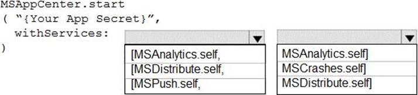

- [x] Box 1: [MSAnalytics.self. Box 2: MSCrasches.self].
- [ ] Box 1: [MSDistribute.self. Box 2: MSAnalytics.self].
- [ ] Box 1: [MSPush.self. Box 2: MSCrasches.self].
- [ ] Box 1: [MSAnalytics.self. Box 2: MSCrasches.self].

### You manage a project in Azure DevOps. You need to prevent the configuration of the project from changing over time. Solution: Perform a Subscription Health scan when packages are created. Does this meet the goal?

- [ ] Yes.
- [x] No.

### You have an existing build pipeline in Azure Pipelines. You need to use incremental builds without purging the environment between pipeline executions. What should you use?

- [ ] File Transform task.
- [x] Self-hosted agent.
- [ ] Microsoft-hosted parallel jobs.

### Woodgrove Bank is a financial services company that has a main office in the United Kingdom. Woodgrove Bank plans to implement the following project management changes: Implement Azure DevOps for project tracking. Centralize source code control in private GitHub repositories. Implement Azure Pipelines for build pipelines and release pipelines. Woodgrove Bank plans to implement the following changes to the identity environment: Deploy an Azure AD tenant named woodgrovebank.com. Sync the Active Directory domain to Azure AD. Configure App1 to use a service principal. Integrate GitHub with Azure AD. Woodgrove Bank plans to implement the following changes to the core apps: Migrate App1 to ASP.NET Core. Integrate Azure Pipelines and the third-party build tool used to develop App2. Woodgrove Bank plans to implement the following changes to the DevOps environment: Deploy App1 to Azure App Service. Implement source control for the DB1 schema. Migrate all the source code from TFS1 to GitHub. Deploy App2 to an Azure virtual machine named VM1. Merge the POC branch into the GitHub default branch. Implement an Azure DevOps dashboard for stakeholders to monitor development progress. Woodgrove Bank identifies the following technical requirements: The initial databases for new environments must contain both schema and reference data. An Azure Monitor alert for VM1 must be configured to meet the following requirements: The commit history of the POC branch must replace the history of the default branch. The Azure DevOps dashboard must display the metrics shown in the following table. Access to Azure DevOps must be restricted to specific IP addresses. Page load times for App1 must be captured and monitored. Administrative effort must be minimized. You need to configure Azure Pipelines to control App2 builds. Which authentication method should you use?

- [ ] Windows NTLM.
- [ ] Certificate.
- [ ] SAML.
- [x] Personal Access Token (PAT).

### You have an Azure function hosted in an App Service plan named az400-123456789-func1. You need to configure az400-123456789-func1 to upgrade the functions automatically whenever new code is committed to the master branch of https://github.com/Azure-Samples/functions-quickstart. To complete this task, sign in to the Microsoft Azure portal.

- [x] 1. Open Microsoft Azure Portal. 2. Log into your Azure account, select App Services in the Azure portal left navigation, and then select configure az400-123456789-func1. 3. On the app page, select Deployment Center in the left menu. 4. On the Build provider page, select Azure Pipelines (Preview), and then select Continue. 5. On the Configure page, in the Code section: For GitHub, drop down and select the Organization, Repository, and Branch you want to deploy continuously. 6. Select Continue. 7. On the Test page, choose whether to enable load tests, and then select Continue. 8. Depending on your App Service plan pricing tier, you may see a Deploy to staging page. Choose whether to enable deployment slots, and then select Continue. 9. After you configure the build provider, review the settings on the Summary page, and then select Finish.

### Woodgrove Bank is a financial services company that has a main office in the United Kingdom. Woodgrove Bank plans to implement the following project management changes: Implement Azure DevOps for project tracking. Centralize source code control in private GitHub repositories. Implement Azure Pipelines for build pipelines and release pipelines. Woodgrove Bank plans to implement the following changes to the identity environment: Deploy an Azure AD tenant named woodgrovebank.com. Sync the Active Directory domain to Azure AD. Configure App1 to use a service principal. Integrate GitHub with Azure AD. Woodgrove Bank plans to implement the following changes to the core apps: Migrate App1 to ASP.NET Core. Integrate Azure Pipelines and the third-party build tool used to develop App2. Woodgrove Bank plans to implement the following changes to the DevOps environment: Deploy App1 to Azure App Service. Implement source control for the DB1 schema. Migrate all the source code from TFS1 to GitHub. Deploy App2 to an Azure virtual machine named VM1. Merge the POC branch into the GitHub default branch. Implement an Azure DevOps dashboard for stakeholders to monitor development progress. Woodgrove Bank identifies the following technical requirements: The initial databases for new environments must contain both schema and reference data. An Azure Monitor alert for VM1 must be configured to meet the following requirements: The commit history of the POC branch must replace the history of the default branch. The Azure DevOps dashboard must display the metrics shown in the following table. Access to Azure DevOps must be restricted to specific IP addresses. Page load times for App1 must be captured and monitored. Administrative effort must be minimized. You need to replace the existing DevOps tools to support the planned changes. What should you use?

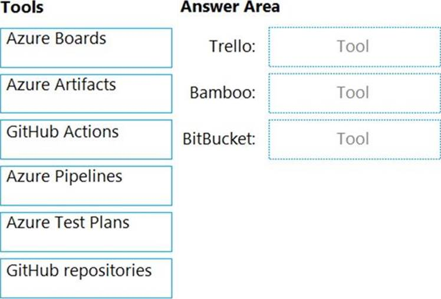

- [x] Trello: Azure Boards. Bamboo: Azure Pipelines. BitBucket: GitHub repositories.
- [ ] Trello: Azure Test Plans. Bamboo: GitHub Actions. BitBucket: Azure Artifacts.
- [ ] Trello: GitHub repositories. Bamboo: Azure Artifacts. BitBucket: Azure Pipelines.
- [ ] Trello: Azure Boards. Bamboo: GitHub Actions. BitBucket: Azure Artifacts.

### You are building an application that has the following assets: Source code. Logs from automated tests and builds. Large and frequently updated binary assets. A common library used by multiple applications. Where should you store each asset?

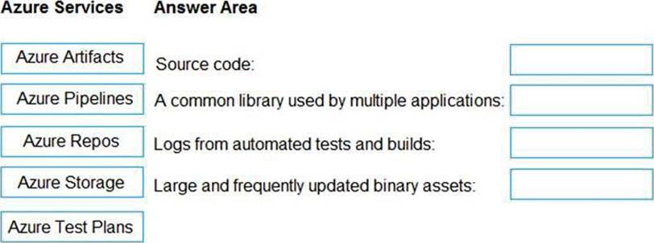

- [ ] Source code: Azure Repos. A common library used by multiple applications: Azure Storage. Logs from automated tests and builds: Azure Pipelines. Large and frequently updated binary assets: Azure Storage.
- [ ] Source code: Azure Repos. A common library used by multiple applications: Azure Artifacts. Logs from automated tests and builds: Azure Pipelines. Large and frequently updated binary assets: Azure Test Plans.
- [ ] Source code: Azure Test Plans. A common library used by multiple applications: Azure Artifacts. Logs from automated tests and builds: Azure Pipelines. Large and frequently updated binary assets: Azure Storage.
- [x] Source code: Azure Repos. A common library used by multiple applications: Azure Artifacts. Logs from automated tests and builds: Azure Pipelines. Large and frequently updated binary assets: Azure Storage.

### You are defining release strategies for two applications as shown in the following table. Which release strategy should you use for each application?

- [x] App1: Canary deployment. App2: Blue/Green deployment.
- [ ] App1: Blue/Green deployment. App2: Rolling deployment.
- [ ] App1: Canary deployment. App2: Rolling deployment.
- [ ] App1: Rolling deployment. App2: Canary deployment.

### Contoso, Ltd. is a manufacturing company that has a main office in Chicago. Contoso plans to improve its IT development and operations processes by implementing Azure DevOps principles. Contoso has an Azure subscription and creates an Azure DevOps organization. The Azure DevOps organization includes: The Docker extension. A deployment pool named Pool7 that contains 10 Azure virtual machines that run Windows Server 2016. The Azure subscription contains an Azure Automation account. Contoso plans to create projects in Azure DevOps as shown in the following table. Contoso identifies the following technical requirements: Implement build agents for Project 1. Whenever possible, use Azure resources. Avoid using deprecated technologies. Implement a code flow strategy for Project2 that will: Enable Team2 to submit pull requests for Project2. Enable Team2 to work independently on changes to a copy of Project2. Ensure that any intermediary changes performed by Team2 on a copy of Project2 will be subject to the same restrictions as the ones defined in the build policy of Project2. Whenever possible implement automation and minimize administrative effort. Implement Protect3, Project5, Project6, and Project7 based on the planned changes. Implement Project4 and configure the project to push Docker images to Azure Container Registry. You need to implement Project4. What should you do first?

- [ ] Add the FROM instruction in the Dockerfile file.
- [ ] Add a Copy and Publish Build Artifacts task to the build pipeline.
- [x] Add a Docker task to the build pipeline.
- [ ] Add the MAINTAINER instruction in the Dockerfile file.

### Your company uses Azure DevOps to manage the build and release processes for applications. You use a Git repository for applications source control. You plan to create a new branch from an existing pull request. Later, you plan to merge the new branch and the target branch of the pull request. You need to use a pull request action to create the new branch. The solution must ensure that the branch uses only a portion of the code in the pull request. Which pull request action should you use?

- [ ] Set as default branch.
- [ ] Approve with suggestions.
- [x] Cherry-pick.
- [ ] ReactivateRevert.
- [ ] Revert.

### Woodgrove Bank is a financial services company that has a main office in the United Kingdom. Woodgrove Bank plans to implement the following project management changes: Implement Azure DevOps for project tracking. Centralize source code control in private GitHub repositories. Implement Azure Pipelines for build pipelines and release pipelines. Woodgrove Bank plans to implement the following changes to the identity environment: Deploy an Azure AD tenant named woodgrovebank.com. Sync the Active Directory domain to Azure AD. Configure App1 to use a service principal. Integrate GitHub with Azure AD. Woodgrove Bank plans to implement the following changes to the core apps: Migrate App1 to ASP.NET Core. Integrate Azure Pipelines and the third-party build tool used to develop App2. Woodgrove Bank plans to implement the following changes to the DevOps environment: Deploy App1 to Azure App Service. Implement source control for the DB1 schema. Migrate all the source code from TFS1 to GitHub. Deploy App2 to an Azure virtual machine named VM1. Merge the POC branch into the GitHub default branch. Implement an Azure DevOps dashboard for stakeholders to monitor development progress. Woodgrove Bank identifies the following technical requirements: The initial databases for new environments must contain both schema and reference data. An Azure Monitor alert for VM1 must be configured to meet the following requirements: The commit history of the POC branch must replace the history of the default branch. The Azure DevOps dashboard must display the metrics shown in the following table. Access to Azure DevOps must be restricted to specific IP addresses. Page load times for App1 must be captured and monitored. Administrative effort must be minimized. You need to configure authentication for App1. The solution must support the planned changes. Which three actions should you perform in sequence? You need to replace the existing DevOps tools to support the planned changes. What should you use?

- [x] Box 1: Create an app. Box 2: Add a secret. Box 3: Configure the ID and secret for App1.
- [ ] Box 1: Create a managed service identity. Box 2: Create a credential. Box 3: Configure the ID and secret for App 1.
- [ ] Box 1: Add a secret. Box 2: Create an app. Box 3: Create a managed service identity.
- [ ] Box 1: Create an app. Box 2: Create a managed service identity. Box 3: Configure the ID and secret for App1.

### You have a Microsoft ASP.NET Core web app in Azure that is accessed worldwide. You need to run a URL ping test once every five minutes and create an alert when the web app is unavailable from specific Azure regions. The solution must minimize development time. What should you do?

- [x] Create an Azure Application Insights availability test and alert.
- [ ] Create an Azure Service Health alert for the specific regions.
- [ ] Create an Azure Monitor Availability metric and alert.
- [ ] Write an Azure function and deploy the function to the specific regions.

### You have a private GitHub repository. You need to display the commit status of the repository on Azure Boards. What should you do first?

- [ ] Create a GitHub action in GitHub.
- [ ] Add the Azure Pipelines app to the GitHub repository.
- [ ] Configure multi-factor authentication (MFA) for your GitHub account.
- [x] Add the Azure Boards app to the repository.

### You are configuring Azure DevOps build pipelines. You plan to use hosted build agents. Which build agent pool should you use to compile each application type?

- [ ] An application that runs on iOS: Hosted Windows Container. An Internet Information Services (IS) web application that runs in Docker: Hosted Ubuntu 1604.
- [x] An application that runs on iOS: Hosted macOS. An Internet Information Services (IS) web application that runs in Docker: Hosted.
- [ ] An application that runs on iOS: Hosted. An Internet Information Services (IS) web application that runs in Docker: Default.
- [ ] An application that runs on iOS: Hosted Windows Container. An Internet Information Services (IS) web application that runs in Docker: Default.

### How should you configure the release retention policy for the investment planning applications suite?

- [x] Global release: Set the default retention policy to 30 days. Production stage: Set the stage retention policy to 60 days.
- [ ] Global release: Set the maximum retention policy to 30 days. Production stage: Set the default retention policy to 30 days.
- [ ] Global release: Set the stage retention policy to 60 days. Production stage: Set the maximum retention policy to 60 days.
- [ ] Global release: Set the stage retention policy to 30 days. Production stage: Set the stage retention policy to 30 days.

### You are automating the testing process for your company. You need to automate UI testing of a web application. Which framework should you use?

- [ ] JaCoco.
- [x] Selenium.
- [ ] Xamarin.UITest.
- [ ] Microsoft.CodeAnalysis.

### You are automating the testing process for your company. You need to automate UI testing of a web application. Which framework should you use?

- [ ] JaCoco.
- [x] Playwright.
- [ ] Xamarin.UITest.
- [ ] Microsoft.CodeAnalysis.

### You have an approval process that contains a condition. The condition requires that releases be approved by a team leader before they are deployed. You have a policy stating that approvals must occur within eight hours. You discover that deployments fail if the approvals lake longer than two hours. You need to ensure that the deployments only fail if the approvals take longer than eight hours. Solution: From Pre-deployment conditions, you modify the Timeout setting for pre-deployment approvals. Does this meet the goal?

- [x] Yes.
- [ ] No.

### Contoso, Ltd. is a manufacturing company that has a main office in Chicago. Contoso plans to improve its IT development and operations processes by implementing Azure DevOps principles. Contoso has an Azure subscription and creates an Azure DevOps organization. The Azure DevOps organization includes: The Docker extension. A deployment pool named Pool7 that contains 10 Azure virtual machines that run Windows Server 2016. The Azure subscription contains an Azure Automation account. Contoso plans to create projects in Azure DevOps as shown in the following table. Contoso identifies the following technical requirements: Implement build agents for Project 1. Whenever possible, use Azure resources. Avoid using deprecated technologies. Implement a code flow strategy for Project2 that will: Enable Team2 to submit pull requests for Project2. Enable Team2 to work independently on changes to a copy of Project2. Ensure that any intermediary changes performed by Team2 on a copy of Project2 will be subject to the same restrictions as the ones defined in the build policy of Project2. Whenever possible implement automation and minimize administrative effort. Implement Protect3, Project5, Project6, and Project7 based on the planned changes. Implement Project4 and configure the project to push Docker images to Azure Container Registry. You need to configure Azure Automation for the computers in Group7. Which three actions should you perform in sequence?

- [x] Box 1: Create a Desired State Configuration (DSC) configuration file that has an extension of .ps1. Box 2: Run the Import-AzureRmAutomationDscConfiguration Azure PowerShell cmdlet. Box 3: Run the Start-AzureRmAutomationDscCompilationJob Azre PowerShell cmdlet.
- [ ] Box 1: Run the Import-AzureRmAutomationDscConfiguration Azure PowerShell cmdlet. Box 2: Create a Desired State Configuration (DSC) configuration file that has an extension of .ps1. Box 3: Run the New-AzureRmResourceGroupDeployment Azure PowerShell cmdlet.
- [ ] Box 1: Run the New-AzureRmResourceGroupDeployment Azure PowerShell cmdlet. Box 2: Create an Azure Resource Manager template file that hasan extension of .json. Box 3: Run the New-AzureRmResourceGroupDeployment Azure PowerShell cmdlet.
- [ ] Box 1: Create an Azure Resource Manager template file that has an extension of .json. Box 2: Run the New-AzureRmResourceGroupDeployment Azure PowerShell cmdlet. Box 3: Run the Import-AzureRmAutomationDscConfiguration Azure PowerShell cmdlet.

### Woodgrove Bank is a financial services company that has a main office in the United Kingdom. Woodgrove Bank plans to implement the following project management changes: Implement Azure DevOps for project tracking. Centralize source code control in private GitHub repositories. Implement Azure Pipelines for build pipelines and release pipelines. Woodgrove Bank plans to implement the following changes to the identity environment: Deploy an Azure AD tenant named woodgrovebank.com. Sync the Active Directory domain to Azure AD. Configure App1 to use a service principal. Integrate GitHub with Azure AD. Woodgrove Bank plans to implement the following changes to the core apps: Migrate App1 to ASP.NET Core. Integrate Azure Pipelines and the third-party build tool used to develop App2. Woodgrove Bank plans to implement the following changes to the DevOps environment: Deploy App1 to Azure App Service. Implement source control for the DB1 schema. Migrate all the source code from TFS1 to GitHub. Deploy App2 to an Azure virtual machine named VM1. Merge the POC branch into the GitHub default branch. Implement an Azure DevOps dashboard for stakeholders to monitor development progress. Woodgrove Bank identifies the following technical requirements: The initial databases for new environments must contain both schema and reference data. An Azure Monitor alert for VM1 must be configured to meet the following requirements: The commit history of the POC branch must replace the history of the default branch. The Azure DevOps dashboard must display the metrics shown in the following table. Access to Azure DevOps must be restricted to specific IP addresses. Page load times for App1 must be captured and monitored. Administrative effort must be minimized. You need to meet the technical requirements for controlling access to Azure DevOps. What should you use?

- [ ] Azure Multi-Factor Authentication (MFA).
- [ ] On-premises firewall rules.
- [x] Conditional access policies in Azure AD.
- [ ] Azure role-based access control (Azure RBAC).

### You are configuring the Azure DevOps dashboard. The solution must meet the technical requirements. Which widget should you use for each metric?

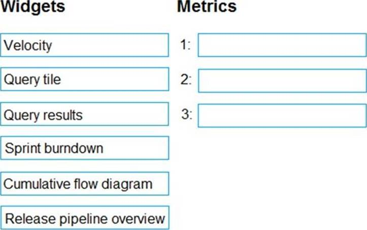

- [x] Box 1: Sprint burndown. Box 2: Release pipeline overview. Box 3: Query tile.
- [ ] Box 1: Query tile. Box 2: Velocity. Box 3: Cumulative flow diagram.
- [ ] Box 1: Velocity. Box 2: Release pipeline overview. Box 3: Query tile.
- [ ] Box 1: Velocity. Box 2: Sprint burndown. Box 3: Query tile.

### You company has a prefect in Azure DevOps for a new web application. You need to ensure that when code is checked in, a build runs automatically. Solution: From the Triggers tab of the build pipeline, you selected Batch changes while a build is in progress. Does this meet the goal?

- [ ] Yes.
- [x] No.

### You need to find and isolate shared code. The shared code will be maintained in a series of packages. Which three actions should you perform in sequence?

- [x] Box 1: Create a dependency graph for the application. Box 2: Group the related components. Box 3: Assign ownership to each component group.
- [ ] Box 1: Identify the most common language used. Box 2: Group the related components. Box 3: Assign ownership to each component group.
- [ ] Box 1: Rewrite the components in the most common language. Box 2: Create a dependency graph for the application. Box 3: Group the related components.
- [ ] Box 1: Assign ownership to each component group. Box 2: Rewrite the components in the most common language. Box 3: Identify the most common language used.

### You are configuring an Azure DevOps deployment pipeline. The deployed application will authenticate to a web service by using a secret stored in an Azure key vault. You need to use the secret in the deployment pipeline. Which three actions should you perform in sequence?

- [ ] Box 1: Add an app registration in Azure Active Directory (Azure AD). Box 2: Create a service principal in Azure Active Directory (Azure AD). Box 3: Add an Azure Resource Manager service connection to the pipeline.
- [x] Box 1: Create a service principal in Azure Active Directory (Azure AD). Box 2: Configure an access policy in the key vault. Box 3: Add an Azure Resource Manager service connection to the pipeline.
- [ ] Box 1: Export a certificate from the key vault. Box 2: Add an Azure Resource Manager service connection to the pipeline. Box 3: Generate a self-signed certificate.
- [ ] Box 1: Generate a self-signed certificate. Box 2: Create a service principal in Azure Active Directory (Azure AD). Box 3: Export a certificate from the key vault.

### You have a multi-tier application. The front end of the application is hosted in Azure App Service. You need to identify the average load times of the application pages. What should you use?

- [ ] Diagnostics logs of the App Service.
- [x] Azure Application Insights.
- [ ] Azure Advisor.
- [ ] Activity log of the App Service.

### You have an application that consists of several Azure App Service web apps and Azure functions. You need to access the security of the web apps and the functions. Which Azure feature can you use to provide a recommendation for the security of the application?

- [ ] Security & Compliance in Azure Log Analytics.
- [ ] Resource health in Azure Service Health.
- [ ] Smart Detection in Azure Application Insights.
- [x] Compute & apps in Azure Security Center.

### You need to configure a virtual machine named VM1 to securely access stored secrets in an Azure Key Vault named az400-11566895-kv. To complete this task, sign in to the Microsoft Azure portal.

- [x] 1. Sign in to Azure portal. 2. Locate virtual machine VM1. 3. Select Identity. 4. Enable the system-assigned identity for VM1 by setting the Status to On. 5. Allow the managed identity of VM1 in Key vault using Access control (IAM) blade role assignment.

### You have an Azure virtual machine named VM1 that runs Linux. You plan to deploy the Desired State Configuration (DSC) extension to VM1. You need to grant the Log Analytics agent the appropriate directory permissions. How should you complete the command?

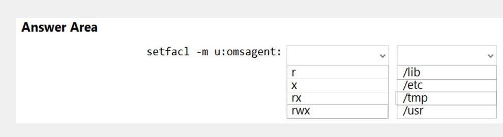

- [ ] Box 1: r. Box 2: /lib.
- [ ] Box 1: rx. Box 2: /etc.
- [x] Box 1: rwx. Box 2: /tmp.
- [ ] Box 1: x. Box 2: /usr.

### During a code review, you discover many quality issues. Many modules contain unused variables and empty catch blocks. You need to recommend a solution to improve the quality of the code. What should you recommend?

- [ ] In a Gradle build task, select Run Checkstyle.
- [ ] In a Xcode build task, select Use xcpretty from Advanced.
- [ ] In a Grunt build task, select Enabled from Control Options.
- [x] In a Maven build task, select Run PMD.

### You are using GitHub as a source code repository. You create a client-side Git hook on the commit-msg event. The hook requires that each commit message contain a custom work item tag. You need to make a commit that does not have a work item tag. Which git commit parameter should you use?

- [ ] –squash.
- [x] –no-verify.
- [ ] –message ".
- [ ] –no-post-rewrite.

### Contoso, Ltd. is a manufacturing company that has a main office in Chicago. Contoso plans to improve its IT development and operations processes by implementing Azure DevOps principles. Contoso has an Azure subscription and creates an Azure DevOps organization. The Azure DevOps organization includes: The Docker extension. A deployment pool named Pool7 that contains 10 Azure virtual machines that run Windows Server 2016. The Azure subscription contains an Azure Automation account. Contoso plans to create projects in Azure DevOps as shown in the following table. Contoso identifies the following technical requirements: Implement build agents for Project 1. Whenever possible, use Azure resources. Avoid using deprecated technologies. Implement a code flow strategy for Project2 that will: Enable Team2 to submit pull requests for Project2. Enable Team2 to work independently on changes to a copy of Project2. Ensure that any intermediary changes performed by Team2 on a copy of Project2 will be subject to the same restrictions as the ones defined in the build policy of Project2. Whenever possible implement automation and minimize administrative effort. Implement Protect3, Project5, Project6, and Project7 based on the planned changes. Implement Project4 and configure the project to push Docker images to Azure Container Registry. You need to implement Project6. Which three actions should you perform in sequence?

- [x] Box 1: Open the release pipeline editor. Box 2: Enable Gates. Box 3: Add Query Work Items.
- [ ] Box 1: Add Query Work Items. Box 2: Enable Gates. Box 3: Open the Triggers tab.
- [ ] Box 1: Add a manual intervention task. Box 2: Open the release pipeline editor. Box 3: Enable Gates.
- [ ] Box 1: Open the Triggers tab. Box 2: Add a manual intervention task. Box 3: Add Query Work Items.

### Contoso, Ltd. is a manufacturing company that has a main office in Chicago. Contoso plans to improve its IT development and operations processes by implementing Azure DevOps principles. Contoso has an Azure subscription and creates an Azure DevOps organization. The Azure DevOps organization includes: The Docker extension. A deployment pool named Pool7 that contains 10 Azure virtual machines that run Windows Server 2016. The Azure subscription contains an Azure Automation account. Contoso plans to create projects in Azure DevOps as shown in the following table. Contoso identifies the following technical requirements: Implement build agents for Project 1. Whenever possible, use Azure resources. Avoid using deprecated technologies. Implement a code flow strategy for Project2 that will: Enable Team2 to submit pull requests for Project2. Enable Team2 to work independently on changes to a copy of Project2. Ensure that any intermediary changes performed by Team2 on a copy of Project2 will be subject to the same restrictions as the ones defined in the build policy of Project2. Whenever possible implement automation and minimize administrative effort. Implement Protect3, Project5, Project6, and Project7 based on the planned changes. Implement Project4 and configure the project to push Docker images to Azure Container Registry. How should you configure the filters for the Project5 trigger?

- [ ] Box 1: branch filter to exclude. Box 2: branch filter to exclude.
- [ ] Box 1: path filter to include. Box 2: path filter to exclude.
- [ ] Box 1: path filter to exclude. Box 2: branch filter to include.
- [x] Box 1: path filter to exclude. Box 2: path filter to include.

### You are designing the security validation strategy for a project in Azure DevOps. You need to identify package dependencies that have known security issues and can be resolved by an update. What should you use?

- [ ] Octopus Deploy.
- [ ] Jenkins.
- [ ] Gradle.
- [x] SonarQube.

### You are configuring the settings of a new Git repository in Azure Repos. You need to ensure that pull requests in a branch meet the following criteria before they are merged: Committed code must compile successfully. Pull requests must have a Quality Gate status of Passed in SonarCloud. Which policy type should you configure for each requirement?

- [x] Committed code must compile successfully: A build policy. Pull requests must have a Quality Gate status of Passed in SonarCloud: A status policy.
- [ ] Committed code must compile successfully: A status policy. Pull requests must have a Quality Gate status of Passed in SonarCloud: A build policy.
- [ ] Committed code must compile successfully: A build policy. Pull requests must have a Quality Gate status of Passed in SonarCloud: A check-in policy.
- [ ] Committed code must compile successfully: A check-in policy. Pull requests must have a Quality Gate status of Passed in SonarCloud: A build policy.

### You are deploying a server application that will run on a Server Core installation of Windows Server 2019. You create an Azure key vault and a secret. You need to use the key vault to secure API secrets for third-party integrations. Which three actions should you perform?

- [ ] Configure RBAC for the key vault.
- [x] Modify the application to access the key vault.
- [x] Configure a Key Vault access policy.
- [ ] Deploy an Azure Desired State Configuration (DSC) extension.Deploy a virtual machine that uses a system-assigned managed identity.
- [x] Deploy a virtual machine that uses a system-assigned managed identity.

### Woodgrove Bank is a financial services company that has a main office in the United Kingdom. Woodgrove Bank plans to implement the following project management changes: Implement Azure DevOps for project tracking. Centralize source code control in private GitHub repositories. Implement Azure Pipelines for build pipelines and release pipelines. Woodgrove Bank plans to implement the following changes to the identity environment: Deploy an Azure AD tenant named woodgrovebank.com. Sync the Active Directory domain to Azure AD. Configure App1 to use a service principal. Integrate GitHub with Azure AD. Woodgrove Bank plans to implement the following changes to the core apps: Migrate App1 to ASP.NET Core. Integrate Azure Pipelines and the third-party build tool used to develop App2. Woodgrove Bank plans to implement the following changes to the DevOps environment: Deploy App1 to Azure App Service. Implement source control for the DB1 schema. Migrate all the source code from TFS1 to GitHub. Deploy App2 to an Azure virtual machine named VM1. Merge the POC branch into the GitHub default branch. Implement an Azure DevOps dashboard for stakeholders to monitor development progress. Woodgrove Bank identifies the following technical requirements: The initial databases for new environments must contain both schema and reference data. An Azure Monitor alert for VM1 must be configured to meet the following requirements: The commit history of the POC branch must replace the history of the default branch. The Azure DevOps dashboard must display the metrics shown in the following table. Access to Azure DevOps must be restricted to specific IP addresses. Page load times for App1 must be captured and monitored. Administrative effort must be minimized. You need to configure the alert for VM1. The solution must meet the technical requirements. Which two settings should you configure?

- [ ] Threshold value: 80%. Aggregation granularity (Period): 5 minutes.
- [x] Threshold value: 80%. Aggregation granularity (Period): 15 minutes.
- [ ] Threshold value: 50%. Aggregation granularity (Period): 15 minutes.
- [ ] Threshold value: 50%. Aggregation granularity (Period): 5 minutes.

### Contoso, Ltd. is a manufacturing company that has a main office in Chicago. Contoso plans to improve its IT development and operations processes by implementing Azure DevOps principles. Contoso has an Azure subscription and creates an Azure DevOps organization. The Azure DevOps organization includes: The Docker extension. A deployment pool named Pool7 that contains 10 Azure virtual machines that run Windows Server 2016. The Azure subscription contains an Azure Automation account. Contoso plans to create projects in Azure DevOps as shown in the following table. Contoso identifies the following technical requirements: Implement build agents for Project 1. Whenever possible, use Azure resources. Avoid using deprecated technologies. Implement a code flow strategy for Project2 that will: Enable Team2 to submit pull requests for Project2. Enable Team2 to work independently on changes to a copy of Project2. Ensure that any intermediary changes performed by Team2 on a copy of Project2 will be subject to the same restrictions as the ones defined in the build policy of Project2. Whenever possible implement automation and minimize administrative effort. Implement Protect3, Project5, Project6, and Project7 based on the planned changes. Implement Project4 and configure the project to push Docker images to Azure Container Registry. You need to recommend a procedure to implement the build agent for Project1. Which three actions should you recommend be performed in sequence?

- [x] Box 1: Sign in to Azure DevOps by using an account that is assigned the Administrator service connection security role. Box 2: Create a personal access token in the Azure DevOps organization of Contoso. Box 3: Install and register the Azure Pipelines agent on an Azure virtual machine.
- [ ] Box 1: Sign in to Azure DevOps by using an account that is assigned the Administrator service connection security role. Box 2: Install the Azure Pipelines agent on on- premises virtual machine. Box 3: Sign in to Azure DevOps by using an account that is assigned the agent pool administrator role.
- [ ] Box 1: Create a personal access token in the Azure DevOps organization of Contoso. Box 2: Install the Azure Pipelines agent on on- premises virtual machine. Box 3: Sign in to Azure DevOps by using an account that is assigned the agent pool administrator role.
- [ ] Box 1: Sign in to Azure DevOps by using an account that is assigned the agent pool administrator role. Box 2: Install the Azure Pipelines agent on on- premises virtual machine. Box 3: Create a personal access token in the Azure DevOps organization of Contoso.

### Contoso, Ltd. is a manufacturing company that has a main office in Chicago. Contoso plans to improve its IT development and operations processes by implementing Azure DevOps principles. Contoso has an Azure subscription and creates an Azure DevOps organization. The Azure DevOps organization includes: The Docker extension. A deployment pool named Pool7 that contains 10 Azure virtual machines that run Windows Server 2016. The Azure subscription contains an Azure Automation account. Contoso plans to create projects in Azure DevOps as shown in the following table. Contoso identifies the following technical requirements: Implement build agents for Project 1. Whenever possible, use Azure resources. Avoid using deprecated technologies. Implement a code flow strategy for Project2 that will: Enable Team2 to submit pull requests for Project2. Enable Team2 to work independently on changes to a copy of Project2. Ensure that any intermediary changes performed by Team2 on a copy of Project2 will be subject to the same restrictions as the ones defined in the build policy of Project2. Whenever possible implement automation and minimize administrative effort. Implement Protect3, Project5, Project6, and Project7 based on the planned changes. Implement Project4 and configure the project to push Docker images to Azure Container Registry. You add the virtual machines as managed nodes in Azure Automation State Configuration. You need to configure the computer in Group7. What should you do?

- [x] Run the Register-AzureRmAutomationDscNode Azure Powershell cmdlet.
- [ ] Modify the ConfigurationMode property of the Local Configuration Manager (LCM).
- [ ] Install PowerShell Core.
- [ ] Modify the RefreshMode property of the Local Configuration Manager (LCM).

### Woodgrove Bank is a financial services company that has a main office in the United Kingdom. Woodgrove Bank plans to implement the following project management changes: Implement Azure DevOps for project tracking. Centralize source code control in private GitHub repositories. Implement Azure Pipelines for build pipelines and release pipelines. Woodgrove Bank plans to implement the following changes to the identity environment: Deploy an Azure AD tenant named woodgrovebank.com. Sync the Active Directory domain to Azure AD. Configure App1 to use a service principal. Integrate GitHub with Azure AD. Woodgrove Bank plans to implement the following changes to the core apps: Migrate App1 to ASP.NET Core. Integrate Azure Pipelines and the third-party build tool used to develop App2. Woodgrove Bank plans to implement the following changes to the DevOps environment: Deploy App1 to Azure App Service. Implement source control for the DB1 schema. Migrate all the source code from TFS1 to GitHub. Deploy App2 to an Azure virtual machine named VM1. Merge the POC branch into the GitHub default branch. Implement an Azure DevOps dashboard for stakeholders to monitor development progress. Woodgrove Bank identifies the following technical requirements: The initial databases for new environments must contain both schema and reference data. An Azure Monitor alert for VM1 must be configured to meet the following requirements: The commit history of the POC branch must replace the history of the default branch. The Azure DevOps dashboard must display the metrics shown in the following table. Access to Azure DevOps must be restricted to specific IP addresses. Page load times for App1 must be captured and monitored. Administrative effort must be minimized. You need to perform the GitHub code migration. The solution must support the planned changes for the DevOps environment. What should you use?

- [ ] git clone.
- [ ] GitHub Importer.
- [ ] Import repository in Azure Repos.
- [x] git-tfs.

### Contoso, Ltd. is a manufacturing company that has a main office in Chicago. Contoso plans to improve its IT development and operations processes by implementing Azure DevOps principles. Contoso has an Azure subscription and creates an Azure DevOps organization. The Azure DevOps organization includes: The Docker extension. A deployment pool named Pool7 that contains 10 Azure virtual machines that run Windows Server 2016. The Azure subscription contains an Azure Automation account. Contoso plans to create projects in Azure DevOps as shown in the following table. Contoso identifies the following technical requirements: Implement build agents for Project 1. Whenever possible, use Azure resources. Avoid using deprecated technologies. Implement a code flow strategy for Project2 that will: Enable Team2 to submit pull requests for Project2. Enable Team2 to work independently on changes to a copy of Project2. Ensure that any intermediary changes performed by Team2 on a copy of Project2 will be subject to the same restrictions as the ones defined in the build policy of Project2. Whenever possible implement automation and minimize administrative effort. Implement Protect3, Project5, Project6, and Project7 based on the planned changes. Implement Project4 and configure the project to push Docker images to Azure Container Registry. In Azure DevOps, you create Project3. You need to meet the requirements of the project. What should you do first?

- [ ] From Azure DevOps, create a service endpoint.
- [ ] From SonarQube, obtain an authentication token.
- [ ] From Azure DevOps, modify the build definition.
- [x] From SonarQube, create a project.

### Your company implements an Agile development methodology. You plan to implement retrospectives at the end of each sprint. Which three questions should you include?

- [ ] Who performed well?
- [ ] Who should have performed better?
- [x] What could have gone better?
- [x] What went well?
- [x] What should we try next?

### Your company hosts a web application in Azure. The company uses Azure Pipelines for the build and release management of the application. Stakeholders report that the past few releases have negatively affected system performance. You configure alerts in Azure Monitor. You need to ensure that new releases are only deployed to production if the releases meet defined performance baseline criteria in the staging environment first. What should you use to prevent the deployment of releases that fail to meet the performance baseline?

- [ ] Azure Scheduler job.
- [ ] Trigger.
- [x] Gate.
- [ ] Azure function.

### Your company hosts a web application in Azure, and makes use of Azure Pipelines for managing the build and release of the application. When stakeholders report that system performance has been adversely affected by the most recent releases, you configure alerts in Azure Monitor. You are informed that new releases must satisfy specified performance baseline conditions in the staging environment before they can be deployed to production. You need to make sure that releases not satisfying the performance baseline are prevented from being deployed. Which of the following actions should you take?

- [ ] You should make use of a branch control check.
- [ ] You should make use of an alert trigger.
- [x] You should make use of a gate.
- [ ] You should make use of an approval check.

### Your company uses Azure DevOps. Only users who have accounts in Azure Active Directory can access the Azure DevOps environment. You need to ensure that only devices that are connected to the on-premises network can access the Azure DevOps environment. What should you do?

- [ ] Assign the Stakeholder access level to all users.
- [ ] In Azure Active Directory, configure risky sign-ins.
- [ ] In Azure DevOps, configure Security in Project Settings.
- [x] In Azure Active Directory, configure conditional access.

### Your company uses Azure DevOps to manage the build and release processes for applications. You use a Git repository for applications source control. You need to implement a pull request strategy that reduces the history volume in the master branch. Solution: You implement a pull request strategy that uses a three-way merge. Does this meet the goal?

- [ ] Yes.
- [x] No.

### Your company uses Azure DevOps to manage the build and release processes for applications. You use a Git repository for applications source control. You need to implement a pull request strategy that reduces the history volume in the master branch. Solution: You implement a pull request strategy that uses an explicit merge. Does this meet the goal?

- [ ] Yes.
- [x] No.

### Your company uses Azure DevOps to manage the build and release processes for applications. You use a Git repository for applications source control. You need to implement a pull request strategy that reduces the history volume in the master branch. You implement a pull request strategy that uses fast-forward merges. Does this meet the goal?

- [ ] Yes.
- [x] No.

### Your company uses Azure DevOps to manage the build and release processes for applications. You use a Git repository for applications source control. You need to implement a pull request strategy that reduces the history volume in the master branch. You implement a pull request strategy that uses squash merges. Does this meet the goal?

- [x] Yes.
- [ ] No.

### You integrate a cloud-hosted Jenkins server and a new Azure DevOps deployment. You need Azure DevOps to send a notification to Jenkins when a developer commits changes to a branch in Azure Repos. Solution: You add a trigger to the build pipeline. Does this meet the goal?

- [ ] Yes.
- [x] No.

### You integrate a cloud-hosted Jenkins server and a new Azure DevOps deployment. You need Azure DevOps to send a notification to Jenkins when a developer commits changes to a branch in Azure Repos. Solution: You create a service hook subscription that uses the code pushed event. Does this meet the goal?

- [x] Yes.
- [ ] No.

### You integrate a cloud-hosted Jenkins server and a new Azure DevOps deployment. You need Azure DevOps to send a notification to Jenkins when a developer commits changes to a branch in Azure Repos. Solution: You create an email subscription to an Azure DevOps notification. Does this meet the goal?

- [ ] Yes.
- [x] No.

### You are designing the development process for your company. You need to recommend a solution for continuous inspection of the company's code base to locate common code patterns that are known to be problematic. What should you include in the recommendation?

- [ ] Microsoft Visual Studio test plans.
- [ ] Gradle wrapper scripts.
- [x] SonarCloud analysis.
- [ ] JavaScript task runner.

### Your company has a project in Azure DevOps for a new application. The application will be deployed to several Azure virtual machines that run Windows Server 2016. You need to recommend a deployment strategy for the virtual machines. The strategy must meet the following requirements: Ensure that the virtual machines maintain a consistent configuration. Minimize administrative effort to configure the virtual machines. What should you include in the recommendation?

- [ ] Deployment YAML and Azure pipeline stage templates.
- [ ] Azure Resource Manager templates and the Custom Script Extension for Windows.
- [x] Azure Resource Manager templates and the PowerShell Desired State Configuration (DSC) extension for Windows.
- [ ] Deployment YAML and Azure pipeline deployment groups.

### Your company has a project in Azure DevOps for a new application. The application will be deployed to several Azure virtual machines that run Windows Server 2019. You need to recommend a deployment strategy for the virtual machines. The strategy must meet the following requirements: Ensure that the virtual machines maintain a consistent configuration. Minimize administrative effort to configure the virtual machines. What should you include in the recommendation?

- [ ] Deployment YAML and Azure pipeline stage templates.
- [ ] Azure Resource Manager templates and the Custom Script Extension for Windows.
- [x] Azure Resource Manager templates and the PowerShell Desired State Configuration (DSC) extension for Windows.
- [ ] Deployment YAML and Azure pipeline deployment groups.

### You have created an Azure DevOps project for a new application that will be deployed to a number of Windows Server 2016 Azure virtual machines. You are preparing a deployment solution that allows for the virtual machines to maintain a uniform configuration, and also keep administrative effort with regards to configuring the virtual machines to a minimum. Which of the following should be part of your solution? (Choose two.)

- [x] Azure Resource Manager templates.
- [x] PowerShell Desired State Configuration (DSC) extension for Windows.
- [ ] Azure pipeline deployment groups.
- [ ] Custom Script Extension for Windows.
- [ ] Azure pipeline stage templates.

### You use Azure SQL Database Intelligent Insights and Azure Application Insights for monitoring. You need to write ad-hoc queries against the monitoring data. Which query language should you use?

- [ ] PL/pgSQL.
- [ ] Transact-SQL.
- [x] Azure Log Analytics.
- [ ] PL/SQL.

### Where should the build and release agents for the investment planning application suite run?

- [ ] Build agent: A hosted service. Release agent: The developers' computers.
- [x] Build agent: A hosted service. Release agent: A hosted service.
- [ ] Build agent: The developers' computers. Release agent: A hosted service.
- [ ] Build agent: A source control system. Release agent: A hosted service.

### You have Azure Pipelines and GitHub integrated as a source code repository. The build pipeline has continuous integration enabled. You plan to trigger an automated build whenever code changes are committed to the repository. You need to ensure that the system will wait until a build completes before queuing another build. What should you implement?

- [ ] Path filters.
- [x] Batch changes.
- [ ] Scheduled builds.
- [ ] Branch filters.

### You manage a project in Azure DevOps. You need to prevent the configuration of the project from changing over time. Solution: Implement Continuous Assurance for the project. Does this meet the goal?

- [x] Yes.
- [ ] No.

### You manage a project in Azure DevOps. You need to prevent the configuration of the project from changing over time. Solution: Implement Continuous Integration for the project. Does this meet the goal?

- [ ] Yes.
- [x] No.

### You manage a project in Azure DevOps. You need to prevent the configuration of the project from changing over time. Solution: Add a code coverage step to the build pipelines. Does this meet the goal?

- [ ] Yes.
- [x] No.

### You have an Azure DevOps organization named Contoso and an Azure subscription. The subscription contains an Azure virtual machine scale set named VMSS1 that is configured for autoscaling. You have a project in Azure DevOps named Project1. Project1 is used to build a web app named App1 and deploy App1 to VMSS1. You need to ensure that an email alert is generated whenever VMSS1 scales in or out. Solution: From Azure DevOps, configure the Service hooks settings for Project1. Does this meet the goal?

- [ ] Yes.
- [x] No.

### You have an Azure DevOps organization named Contoso and an Azure subscription. The subscription contains an Azure virtual machine scale set named VMSS1 that is configured for autoscaling. You have a project in Azure DevOps named Project1. Project1 is used to build a web app named App1 and deploy App1 to VMSS1. You need to ensure that an email alert is generated whenever VMSS1 scales in or out. Solution: From Azure DevOps, configure the Notifications settings for Project1. Does this meet the goal?

- [ ] Yes.
- [x] No.

### You are using PowerShell to administer Azure Log Analytics workspaces. You need to list the available workspaces and their properties. How should you complete the command?

- [x] Box 1: Get-AzResource. Box 2: -ResourceType.
- [ ] Box 1: Get-AzResourceProvider. Box 2: -ResourceGroupName.
- [ ] Box 1: Get-AzResource. Box 2: -ResourceId.
- [ ] Box 1: Get-AzResourceGroup. Box 2: -Get-AzResource.

### You have a project in Azure DevOps named Project1. Project1 contains a pipeline that builds a container image named Image1 and pushes Image1 to an Azure container registry named ACR1. Image1 uses a base image stored in Docker Hub. You need to ensure that Image1 is updated automatically whenever the base image is updated. What should you do?

- [x] Create and run an Azure Container Registry task.
- [ ] Add a Docker Hub service connection to Azure Pipelines.
- [ ] Enable the Azure Event Grid resource provider and subscribe to registry events.
- [ ] Create a service hook in Project1.

### Your company has four projects. The version control requirements for each project are shown in the following table. You plan to use Azure Repos for all the projects. Which version control system should you use for each project?

- [ ] Project 1: Team Foundation Version Control. Project 2: Git. Project 3: Subversion. Project 4: Git.
- [ ] Project 1: Git. Project 2: Perforce. Project 3: Subversion. Project 4: Team Foundation Version Control.
- [x] Project 1: Team Foundation Version Control. Project 2: Git. Project 3: Git. Project 4: Team Foundation Version Control.
- [ ] Project 1: Subversion. Project 2: Perforce. Project 3: Team Foundation Version Control. Project 4: Git.

### Your company is building a new solution in Java. The company currently uses a SonarQube server to analyze the code of .NET solutions. You need to analyze and monitor the code quality of the Java solution. Which task types should you add to the build pipeline?

- [ ] CocoaPods.
- [ ] Xcode.
- [x] Maven.
- [ ] Gulp.

### Your company is building a new solution in Java. The company currently uses a SonarQube server to analyze the code of .NET solutions. You need to analyze and monitor the code quality of the Java solution. Which task types should you add to the build pipeline?

- [ ] Chef.
- [x] Gradle.
- [ ] Octopus.
- [ ] CocoaPods.

### Your development team is building a new web solution by using the Microsoft Visual Studio integrated development environment (IDE). You need to make a custom package available to all the developers. The package must be managed centrally, and the latest version must be available for consumption in Visual Studio automatically. Which three actions should you perform?

- [x] Publish the package to a feed.
- [x] Create a new feed in Azure Artifacts.
- [ ] Upload a package to a Git repository.
- [ ] Add the package URL to the Environment settings in Visual Studio.
- [x] Add the package URL to the NuGet Package Manager settings in Visual Studio.
- [ ] Create a Git repository in Azure Repos.

### You have an Azure Kubernetes Service (AKS) implementation that is RBAC-enabled. You plan to use Azure Container Instances as a hosted development environment to run containers in the AKS implementation. You need to configure Azure Container Instances as a hosted environment for running the containers in AKS. Which three actions should you perform in sequence?

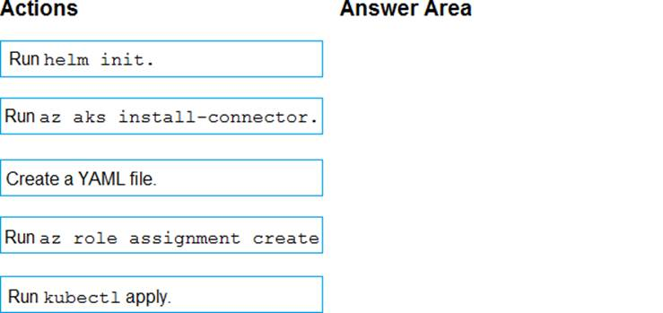

- [x] Box 1: Create a YAML file. Box 2: Run kubectl apply. Box 3: Run helm init.
- [ ] Box 1: Run az role assignment create. Box 2: Create a YAML file. Box 3: Run helm init.
- [ ] Box 1: Run az aks install-connector. Box 2: Run kubectl apply. Box 3: Run az aks install-connector.
- [ ] Box 1: Run helm init. Box 2: Run az role assignment create. Box 3: Run kubectl apply.

### You integrate a cloud-hosted Jenkins server and a new Azure DevOps deployment. You need Azure DevOps to send a notification to Jenkins when a developer commits changes to a branch in Azure Repos. Solution: You create a service hook subscription that uses the build completed event. Does this meet the goal?

- [ ] Yes.
- [x] No.

### Your company uses cloud-hosted Jenkins for builds. You need to ensure that Jenkins can retrieve source code from Azure Repos. Which three actions should you perform?

- [x] Add the Team Foundation Server (TFS) plug-in to Jenkins.
- [x] Create a Personal Access Token m your Azure DevOps account.
- [ ] Create a webhook in Jenkins.
- [x] Create a service hook in Azure DevOps.
- [ ] Add a Personal Access Token to your Jenkins account.

### Your company builds a multi tier web application. You use Azure DevOps and host the production application on Azure virtual machines. Your team prepares an Azure Resource Manager template of the virtual machine that you mil use to test new features. You need to create a staging environment in Azure that meets the following requirements: Minimizes the cost of Azure hosting. Provisions the virtual machines automatically. Use the custom Azure Resource Manager template to provision the virtual machines. What should you do?

- [x] In Azure DevOps, configure new tasks in the release pipeline to create and delete the virtual machines m Azure DevTest Labs.
- [ ] From Azure Cloud Shell, run Azure PowerShell commands to create and delete the new virtual machines in a staging resource group.
- [ ] In Azure DevOps, configure new tasks in the release pipeline to deploy to Azure Cloud Services.
- [ ] In Azure Cloud Shell, run Azure CLI commands to create and delete the new virtual machines in a staging resource group.

### Your company uses Team Foundation Server 2013 (TFS 2013). You plan to migrate to Azure DevOps. You need to recommend a migration strategy that meets the following requirements: Preserves the dates of Team Foundation Version Control changesets. Preserves the changes dates of work items revisions. Minimizes migration effort. Migrates all TFS artifacts. What should you recommend?

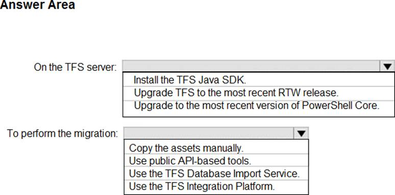

- [x] On the TFS server: Upgrade TFS to the most recent RTW release. To perform the migration: Use the TFS Database Import Service.
- [ ] On the TFS server: Install the TFS Java SDK. To perform the migration: Copy the assets manually.
- [ ] On the TFS server: Upgrade to the most recent version of PowerShell Core. To perform the migration: Use the TFS Integration Platform.
- [ ] On the TFS server: Install the TFS Java SDK. To perform the migration: Use the TFS Database Import Service.

### Your company is currently making use of Team Foundation Server 2013 (TFS 2013), but intend to migrate to Azure DevOps. You have been tasked with supplying a migration approach that allows for the preservation of Team Foundation Version Control changesets dates, as well as the changes dates of work items revisions. The approach should also allow for the migration of all TFS artifacts, while keeping migration effort to a minimum. You have suggested upgrading TFS to the most recent RTW release. Which of the following should also be suggested?

- [ ] Installing the TFS kava SDK.
- [x] Using the TFS Database Import Service to perform the upgrade.
- [ ] Upgrading PowerShell Core to the latest version.
- [ ] Using the TFS Integration Platform to perform the upgrade.

### What should you use to implement the code quality restriction on the release pipeline for the investment planning applications suite?

- [ ] Trigger.
- [ ] Pre-deployment approval.
- [ ] Post-deployment approval.
- [x] Deployment gate.

### You use Azure DevOps to manage the build and deployment of an app named App1. You have a release pipeline that deploys a virtual machine named VM1. You plan to monitor the release pipeline by using Azure Monitor You need to create an alert to monitor the performance of VM1. The alert must be triggered when the average CPU usage exceeds 70 percent for five minutes. The alert must calculate the average once every minute. How should you configure the alert rule?

- [x] Aggregation granularity (Period): 5 minutes. Threshold value: Static. Operator: Greater than.
- [ ] Aggregation granularity (Period): 1 minute. Threshold value: Static. Operator: Greater than.
- [ ] Aggregation granularity (Period): 1 minute. Threshold value: Dynamic. Operator: Greater than.
- [ ] Aggregation granularity (Period): 5 minutes. Threshold value: Dynamic. Operator: Less than.

### You have an Azure DevOps organization named Contoso and an Azure subscription. The subscription contains an Azure virtual machine scale set named VMSS1 that is configured for autoscaling. You have a project in Azure DevOps named Project1. Project1 is used to build a web app named App1 and deploy App1 to VMSS1. You need to ensure that an email alert is generated whenever VMSS1 scales in or out. Solution: From Azure Monitor, create an action group. Does this meet the goal?

- [x] Yes.
- [ ] No.

### You have a project in Azure DevOps. You plan to deploy a self-hosted agent by using an unattended configuration script. Which two values should you define in the configuration script?

- [x] Authorization credentials.
- [ ] Project name.
- [ ] Deployment group name.
- [x] Organization URL.
- [ ] Agent pool name.

### Your company has a project in Azure DevOps. You plan to create a release pipeline that will deploy resources by using Azure Resource Manager templates. The templates will reference secrets stored in Azure Key Vault. You need to recommend a solution for accessing the secrets stored in the key vault during deployments. The solution must use the principle of least privilege. What should you include in the recommendation?

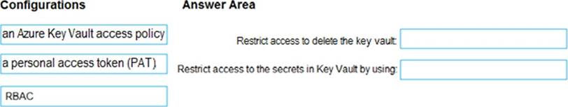

- [ ] Restrict access to delete the key vault: a personal access token (PAT). Restrict access to the secrets in Key Vault by using: a personal access token (PAT).
- [ ] Restrict access to delete the key vault: a personal access token (PAT). Restrict access to the secrets in Key Vault by using: RBAC.
- [ ] Restrict access to delete the key vault: an Azure Key Vault access policy. Restrict access to the secrets in Key Vault by using: RBAC.
- [x] Restrict access to delete the key vault: RBAC. Restrict access to the secrets in Key Vault by using: an Azure Key Vault access policy.

### You provision an Azure Kubernetes Service (AKS) cluster that has RBAC enabled. You have a Helm chart for a client application. You need to configure Helm and Tiller on the cluster and install the chart. Which three commands should you recommend be run in sequence?

- [ ] Box 1: helm init. Box 2: kubectl create. Box 3: helm install.
- [x] Box 1: kubectl create. Box 2: helm init. Box 3: helm install.
- [ ] Box 1: helm init. Box 2: helm serve. Box 3: helm completion.
- [ ] Box 1: kubectl create. Box 2: helm init. Box 3: helm serve.

### You need to recommend a solution for deploying charts by using Helm and Tiller to Azure Kubernetes Service (AKS) in an RBAC-enabled cluster. Which three commands should you recommend be run in sequence?

- [ ] Box 1: helm init. Box 2: kubectl create. Box 3: helm install.
- [x] Box 1: kubectl create. Box 2: helm init. Box 3: helm install.
- [ ] Box 1: helm init. Box 2: helm serve. Box 3: helm completion.
- [ ] Box 1: kubectl create. Box 2: helm init. Box 3: helm serve.

### You have an Azure DevOps organization named Contoso, an Azure DevOps project named Project1, an Azure subscription named Sub1, and an Azure key vault named vault1. You need to ensure that you can reference the values of the secrets stored in vault1 in all the pipelines of Project1. The solution must prevent the values from being stored in the pipelines. What should you do?

- [x] Create a variable group in Project1.
- [ ] Add a secure file to Project1.
- [ ] Modify the security settings of the pipelines.
- [ ] Configure the security policy of Contoso.

### You have an Azure DevOps organization named Contoso that contains a project named Project1. You provision an Azure key vault named Keyvault1. You need to reference Keyvault1 secrets in a build pipeline of Project1. What should you do first?

- [ ] Add a secure file to Project1.
- [ ] Create an XAML build service.
- [x] Create a variable group in Project1.
- [ ] Configure the security policy of Contoso.

### You have a project in Azure DevOps. You have an Azure Resource Group deployment project in Microsoft Visual Studio that is checked in to the Azure DevOps project. You need to create a release pipeline that will deploy resources by using Azure Resource Manager templates. The solution must minimize administrative effort. Which task type should you include in the solution?

- [ ] Azure Cloud Service Deployment.
- [ ] Azure RM Web App Deployment.
- [x] Azure PowerShell.
- [ ] Azure App Service Manage.

### You need to use Azure Automation State Configuration to manage the ongoing consistency of virtual machine configurations. Which five actions should you perform in sequence?

- [x] Box 1: Upload a configuration to Azure Automation State Configuration. Box 2: Compile a configuration into a node configuration. Box 3: Onboard the virtual machines to Azure Automation State Configuration. Box 4: Assign the node configuration. Box 5: Check the compliance status of the node.
- [ ] Box 1: Onboard the virtual machines to Azure Automation State Configuration. Box 2: Assign tags to the virtual machines. Box 3: Upload a configuration to Azure Automation State Configuration. Box 4: Compile a configuration into a node configuration. Box 5: Assign the node configuration.
- [ ] Box 1: Assign tags to the virtual machines. Box 2: Assign the node configuration. Box 3: Create a management group. Box 4: Check the compliance status of the node. Box 5: Onboard the virtual machines to Azure Automation State Configuration.
- [ ] Box 1: Assign the node configuration. Box 2: Upload a configuration to Azure Automation State Configuration. Box 3: Compile a configuration into a node configuration. Box 4: Onboard the virtual machines to Azure Automation State Configuration. Box 5: Check the compliance status of the node.

### You are automating the build process for a Java-based application by using Azure DevOps. You need to add code coverage testing and publish the outcomes to the pipeline. What should you use?

- [x] Cobertura.
- [ ] Bullseye Coverage.
- [ ] MSTest.
- [ ] Coverlet.
- [ ] Coverage.py.
- [ ] NUnit.

### You have a private distribution group that contains provisioned and unprovisioned devices. You need to distribute a new iOS application to the distribution group by using Microsoft Visual Studio App Center. What should you do?

- [ ] Request the Apple ID associated with the user of each device.
- [x] Register the devices on the Apple Developer portal.
- [ ] Create an active subscription in App Center Test.
- [ ] Add the device owner to the organization in App Center.

### You have a private distribution group that contains provisioned and unprovisioned devices. You need to distribute a new iOS application to the distribution group by using Microsoft Visual Studio App Center. What should you do?

- [x] Select Register devices and sign my app.
- [ ] Create an active subscription in App Center Test.
- [ ] Create an unsigned build.
- [ ] Add the device owner to the collaborators group.

### Your company is concerned that when developers introduce open source libraries, it creates licensing compliance issues. You need to add an automated process to the build pipeline to detect when common open source libraries are added to the code base. What should you use?

- [ ] Code Style.
- [ ] OWASP ZAP.
- [x] WhiteSource Bolt.
- [ ] Jenkins.

### Your company is concerned that when developers introduce open source libraries, it creates licensing compliance issues. You need to add an automated process to the build pipeline to detect when common open source libraries are added to the code base. What should you use?

- [ ] SourceGear.
- [ ] Microsoft Visual SourceSafe.
- [x] Black Duck.
- [ ] PDM.

### You are planning projects for three customers. Each customer's preferred process for work items is shown in the following table. The customers all plan to use Azure DevOps for work item management. Which work item process should you use for each customer?

- [ ] Litware: XP. Contoso: CMMI. A. Datum: Agile.
- [ ] Litware: Scrum. Contoso: Agile. A. Datum: CMMI.
- [x] Litware: Scrum. Contoso: Agile. A. Datum: CMMI.
- [ ] Litware: XP. Contoso: CMMI. A. Datum: Scrum.

### Your company plans to use an agile approach to software development. You need to recommend an application to provide communication between members of the development team who work in locations around the world. The applications must meet the following requirements: Provide the ability to isolate the members of different project teams into separate communication channels and to keep a history of the chats within those channels. Be available on Windows 10, Mac OS, iOS, and Android operating systems. Provide the ability to add external contractors and suppliers to projects. Integrate directly with Azure DevOps. What should you recommend?

- [ ] Microsoft Project.
- [ ] Bamboo.
- [ ] Microsoft Lync.
- [x] Microsoft Teams.

### Your company plans to use an agile approach to software development. You need to recommend an application to provide communication between members of the development team who work in locations around the world. The applications must meet the following requirements: Provide the ability to isolate the members of different project teams into separate communication channels and to keep a history of the chats within those channels. Be available on Windows 10, Mac OS, iOS, and Android operating systems. Provide the ability to add external contractors and suppliers to projects. Integrate directly with Azure DevOps. What should you recommend?

- [ ] Skype for Business.
- [ ] Bamboo.
- [ ] Octopus.
- [x] Slack.

### You have an Azure Resource Manager template that deploys a multi-tier application. You need to prevent the user who performs the deployment from viewing the account credentials and connection strings used by the application. What should you use?

- [ ] Azure Resource Manager parameter file.
- [ ] Azure Storage table.
- [ ] Appsettings.json files.
- [x] Azure Key Vault.
- [ ] Web.config file.

### Your company has a project in Azure DevOps for a new web application. You need to ensure that when code is checked in, a build runs automatically. Solution: From the Continuous deployment trigger settings of the release pipeline, you enable the Pull request trigger setting. Does the meet the goal?

- [ ] Yes.
- [x] No.

### Your company has a project in Azure DevOps for a new web application. You need to ensure that when code is checked in, a build runs automatically. Solution: From the Pre-deployment conditions settings of the release pipeline, you select Batch changes while a build is in progress. Does this meet the goal?

- [ ] Yes.
- [x] No.

### Your company has a project in Azure DevOps for a new web application. You need to ensure that when code is checked in, a build runs automatically. Solution: From the Pre-deployment conditions settings of the release pipeline, you select After stage. Does this meet the goal?

- [ ] Yes.
- [x] No.

### You are developing a multi-tier application. The application will use Azure App Service web apps as the front end and an Azure SQL database as the back end. The application will use Azure functions to write some data to Azure Storage. You need to send the Azure DevOps team an email message when the front end fails to return a status code of 200. Which feature should you use?

- [ ] Service Map in Azure Log Analytics.
- [ ] Profiler in Azure Application Insights.
- [x] Availability tests in Azure Application Insights.
- [ ] Application Map in Azure Application Insights.

### You have a multi-tier application that has an Azure Web Apps front end and an Azure SQL Database back end. You need to recommend a solution to capture and store telemetry data. The solution must meet the following requirements: Support using ad-hoc queries to identify baselines. Trigger alerts when metrics in the baseline are exceeded. Store application and database metrics in a central location. What should you include in the recommendation?

- [ ] Azure Event Hubs.
- [ ] Azure SQL Database Intelligent Insights.
- [ ] Azure Application Insights.
- [x] Azure Log Analytics.

### You have an approval process that contains a condition. The condition requires that releases be approved by a team leader before they are deployed. You have a policy stating that approvals must occur within eight hours. You discover that deployments fail if the approvals lake longer than two hours. You need to ensure that the deployments only fail if the approvals take longer than eight hours. Solution: From Post-deployment conditions, you modify the Time between re-evaluation of gates option. Does this meet the goal?

- [ ] Yes.
- [x] No.

### You have an approval process that contains a condition. The condition requires that releases be approved by a team leader before they are deployed. You have a policy stating that approvals must occur within eight hours. You discover that deployments fail if the approvals lake longer than two hours. You need to ensure that the deployments only fail if the approvals take longer than eight hours. Solution: From Pre-deployment conditions, you modify the Time between re-evaluation of gates option. Does this meet the goal?

- [ ] Yes.
- [x] No.

### You have an approval process that contains a condition. The condition requires that releases be approved by a team leader before they are deployed. You have a policy stating that approvals must occur within eight hours. You discover that deployments fail if the approvals lake longer than two hours. You need to ensure that the deployments only fail if the approvals take longer than eight hours. Solution: From Post-deployment conditions, you modify the Timeout setting for post-deployment approvals. Does this meet the goal?

- [ ] Yes.
- [x] No.

### You use Azure Artifacts to host NuGet packages that you create. You need to make one of the packages available to anonymous users outside your organization. The solution must minimize the number of publication points. What should you do?

- [ ] Create a new feed for the package.
- [x] Publish the package to a public NuGet repository.
- [ ] Promote the package to a release view.
- [ ] Change the feed URL of the package.

### Your company creates a web application. You need to recommend a solution that automatically sends to Microsoft Teams a daily summary of the exceptions that occur m the application. Which two Azure services should you recommend?

- [ ] Microsoft Visual Studio App Center.
- [ ] Azure DevOps Project.
- [x] Azure Logic Apps.
- [ ] Azure PipelinesAzure Application Insights.
- [x] Azure Application Insights.

### You have recently created a web application for your company. You have been tasked with making sure that a summary of the exceptions that transpire in the application is automatically sent to Microsoft Teams on a daily basis. Which of the following Azure services should you use?

- [x] Azure Logic Apps, Azure Application Insights.
- [ ] Azure Application Insights, Azure DevOps Project.
- [ ] Azure DevOps Project, Azure Pipelines.
- [ ] Azure Logic Apps, Azure Pipelines.

### Your company has a project in Azure DevOps for a new web application. The company identifies security as one of the highest priorities. You need to recommend a solution to minimize the likelihood that infrastructure credentials will be leaked. What should you recommend?

- [ ] Add a Run Inline Azure PowerShell task to the pipeline.
- [ ] Add a PowerShell task to the pipeline and run Set-AzureKeyVaultSecret.
- [ ] Add a Azure Key Vault task to the pipeline.
- [x] Add Azure Key Vault references to Azure Resource Manger templates.

### Your company has a hybrid cloud between Azure and Azure Stack. The company uses Azure DevOps for its CI/CD pipelines. Some applications are built by using Erlang and Hack. You need to ensure that Erlang and Hack are supported as part of the build strategy across the hybrid cloud. The solution must minimize management overhead. What should you use to execute the build pipeline?

- [ ] Azure DevOps self-hosted agents on Azure DevTest Labs virtual machines.
- [x] Azure DevOps self-hosted agents on virtual machine that run on Azure Stack.
- [ ] Azure DevOps self-hosted agents on Hyper-V virtual machines.
- [ ] Microsoft-hosted agent.

### You plan to create an image that will contain a .NET Core application. You have a Dockerfile file that contains the following code. You need to ensure that the image is as small as possible when the image is built. Which line should you modify in the file?

- [ ] 1.
- [ ] 3.
- [x] 4.
- [ ] 7.

### Your company develops an app for iOS. All users of the app have devices that are members of a private distribution group in Microsoft Visual Studio App Center. You plan to distribute a new release of the app. You need to identify which certificate file you require to distribute the new release from App Center. Which file type should you upload to App Center?

- [ ] .cer.
- [ ] .pvk.
- [ ] .pfx.
- [x] .p12.

### Your company has a prefect in Azure DevOps for a new web application. You need to ensure that when code is checked in, a build runs automatically. Solution: from the Triggers tab of the build pipeline, you select Enable continuous integration Does this meet the goal?

- [x] Yes.
- [ ] No.

### You have a project Azure DevOps. You plan to create a build pipeline that will deploy resources by using Azure Resource Manager templates. The templates will reference secretes stored in Azure Key Vault. You need to ensure that you can dynamically generate the resource ID of the key vault during template deployment. What should you include in the template?

- [ ] Box 1: Microsoft.KeyVault/vaults. Box 2: templateLink.
- [x] Box 1: Microsoft.Resources/deployment. Box 2: templateLink.
- [ ] Box 1: Microsoft.KeyVault/vaults. Box 2: deployment.
- [ ] Box 1: templateLink. Box 2: deployment.

### Which branching strategy should you recommend for the investment planning applications suite?

- [ ] Release isolation.
- [ ] Main only.
- [ ] Development isolation.
- [x] Feature isolation.

### You intend to make use of Azure Artifacts to share packages that you wrote, tested, validated, and deployed. You want to use a solitary feed to release several builds of each package. You have to make sure that the release of packages that are in development is restricted. Which of the following actions should you take?

- [ ] You should make use of static code analysis.
- [x] You should make use of views.
- [ ] You should make use of dynamic code analysis.
- [ ] You should make use of upstream sources.

### You plan to share packages that you wrote, tested, validated, and deployed by using Azure Artifacts. You need to release multiple builds of each package by using a single feed. The solution must limit the release of packages that are in development. What should you use?

- [ ] Global symbols.
- [ ] Local symbols.
- [ ] Upstream sources.
- [x] Views.

### You need to configure access to Azure DevOps agent pools to meet the following requirements: Use a project agent pool when authoring build release pipelines. View the agent pool and agents of the organization. Use the principle of least privilege. Which role memberships are required for the Azure DevOps organization and the project?

- [ ] Organization: Service Account. Project: Administrator.
- [ ] Organization: User. Project: Service Account.
- [x] Organization: Reader. Project: User.
- [ ] Organization: Reader. Project: Service Account.

### Your company has an Azure subscription. The company requires that all resource groups in the subscription have a tag named organization set to a value of Contoso. You need to implement a policy to meet the tagging requirement. How should you complete the policy?

- [ ] Box 1: "Deny". Box 2: "Microsoft Resources/subscriptions/resourceGroups".
- [ ] Box 1: "Append". Box 2: "Microsoft Resources/subscriptions/resourceGroups".
- [x] Box 1: "Microsoft Resources/subscriptions/resourceGroups". Box 2: "Append".
- [ ] Box 1: "Microsoft Resources/subscriptions/resourceGroups". Box 2: "Deny".

### You have 50 Node.js-based projects that you scan by using WhiteSource. Each project includes Package.json, Package-lock.json, and Npm-shrinkwrap.json files. You need to minimize the number of libraries reports by WhiteSource to only the libraries that you explicitly reference. What should you do?

- [ ] Configure the File System Agent plug in.
- [ ] Delete Package lock.json.
- [ ] Configure the Artifactory plug-in.
- [x] Add a devDependencies section to Package.json.

### Your company develops a client banking application that processes a large volume of data. Code quality is an ongoing issue for the company. Recently, the code quality has deteriorated because of an increase in time pressure on the development team. You need to implement static code analysis. During which phase should you use static code analysis?

- [x] Build.
- [ ] Production release.
- [ ] Staging.
- [ ] Integration testing.

### You have a GitHub repository. You create a new repository in Azure DevOps. You need to recommend a procedure to clone the repository from GitHub to Azure DevOps. What should you recommend?

- [ ] Create a webhook.
- [ ] Create a service connection for GitHub.
- [x] From Import a Git repository, click Import.
- [ ] Create a pull request.
- [ ] Create a Personal Access Token in Azure DevOps.

### Your company is building a mobile app that targets Android devices and OS devices. Your team uses Azure DevOps to manage all work items and release cycles. You need to recommend a solution to perform the following tasks. Collect crash reports for issue analysis. Distribute beta releases to your testers. Get user feedback on the functionality of new apps. What should you include in the recommendation?

- [ ] Jenkins integration.
- [ ] Azure Application Insights widgets.
- [ ] Microsoft Test & Feedback extension.
- [x] Microsoft Visual Studio App Center integration.

### You are in the process of building a mobile app aimed at Android and iOS devices. All work items and release cycles are managed via Azure DevOps. You want to make sure that crash reports for issue analysis is collected, and that beta releases are distributed to your testers. Also, you want to ensure that user feedback on the functionality of new apps is received. Which of the following must be part of your solution?

- [x] Microsoft Test & Feedback extension.
- [ ] OWASP ZAP.
- [ ] TFS Integration Platform.
- [ ] Code Style.

### You manage build pipelines and deployment pipelines by using Azure DevOps. Your company has a team of 500 developers. New members are added continually to the team. You need to automate the management of users and licenses whenever possible. Which task must you perform manually?

- [ ] Modifying group memberships.
- [x] Procuring licenses.
- [ ] Adding users.
- [ ] Assigning entitlements.

### You are making use of Azure DevOps manage build pipelines, and also deploy pipelines. The development team is quite large, and is regularly added to. You have been informed that the management of users and licenses must be automated when it can be. Which of the following is a task that can't be automated?

- [ ] Group membership changes.
- [ ] License assignment.
- [ ] Assigning entitlements.
- [x] License procurement.

### You are developing an open source solution that uses a GitHub repository. You create a new public project in Azure DevOps. You plan to use Azure Pipelines for continuous build. The solution will use the GitHub Checks API. Which authentication type should you use?

- [ ] Personal Access Token.
- [ ] SAML.
- [x] GitHub App.
- [ ] OAuth.

### You need to recommend a Docker container build strategy that meets the following requirements: Minimizes image sizes. Minimizes the security surface area of the final image. What should you include in the recommendation?

- [x] Multi-stage builds.
- [ ] Single-stage builds.
- [ ] PowerShell Desired State Configuration (DSC).
- [ ] Docker Swarm.

### During a code review, you discover quality issues in a Java application. You need to recommend a solution to detect quality issues including unused variables and empty catch blocks. What should you recommend?

- [x] In a Maven build task, select Run PM.
- [ ] In an Xcode build task, select Use xcpretty from Advanced.
- [ ] In a Gulp build task, specify a custom condition expression.
- [ ] In a Grunt build task, select Enabled from Control Options.

### You create a Microsoft ASP.NET Core application. You plan to use Azure Key Vault to provide secrets to the application as configuration data. You need to create a Key Vault access policy to assign secret permissions to the application. The solution must use the principle of least privilege. Which secret permissions should you use?

- [ ] List only.
- [x] Get only.
- [ ] Get and List.

### You have a branch policy in a project in Azure DevOps. The policy requires that code always builds successfully. You need to ensure that a specific user can always merge changes to the master branch, even if the code fails to compile. The solution must use the principle of least privilege. What should you do?

- [ ] Add the user to the Build Administrators group.
- [ ] Add the user to the Project Administrators group.
- [ ] From the Security settings of the repository, modify the access control for the user.
- [x] From the Security settings of the branch, modify the access control for the user.

### Your team uses an agile development approach. You need to recommend a branching strategy for the team's Git repository. The strategy must meet the following requirements. Provide the ability to work on multiple independent tasks in parallel. Ensure that checked-in code remains in a releasable state always. Ensure that new features can be abandoned at any time. Encourage experimentation. What should you recommend?

- [ ] Single long-running branch without forking.
- [ ] Multiple long-running branches.
- [ ] Single fork per team member.
- [x] Single long-running branch with multiple short-lived topic branches.

### You plan to use a NuGet package in a project in Azure DevOps. The NuGet package is in a feed that requires authentication. You need to ensure that the project can restore the NuGet package automatically. What should the project use to automate the authentication?

- [ ] Azure Automation account.
- [x] Azure Artifacts Credential Provider.
- [ ] Azure Active Directory (Azure AD) account that has multi-factor authentication (MFA) enabled.
- [ ] Azure Active Directory (Azure AD) service principal.

### You are implementing a package management solution for a Node.js application by using Azure Artifacts. You need to configure the development environment to connect to the package repository. The solution must minimize the likelihood that credentials will be leaked. Which file should you use to configure each connection?

- [ ] Feed registry information: The .npmrc file in the user's home folder. Credentials: The .npmrc file in the project.
- [ ] Feed registry information: The Package.json file in the project. Credentials: The Project.json file in the project.
- [ ] Feed registry information: The Project.json file in the project. Credentials: The .npmrc file in the project.
- [x] Feed registry information: The .npmrc file in the project. Credentials: The .npmrc file in the user's home folder.

### Your company plans to deploy an application to the following endpoints: Ten virtual machines hosted in Azure. Ten virtual machines hosted in an on-premises data center environment. All the virtual machines have the Azure Pipelines agent. You need to implement a release strategy for deploying the application to the endpoints. What should you recommend using to deploy the application to the endpoints?

- [ ] Ten virtual machines hosted in Azure: A management group. Ten virtual machines hosted in an on-premises data center environment: Application roles.
- [ ] Ten virtual machines hosted in Azure: A resource group. Ten virtual machines hosted in an on-premises data center environment: A management group.
- [x] Ten virtual machines hosted in Azure: A deployment group. Ten virtual machines hosted in an on-premises data center environment: A deployment group.
- [ ] Ten virtual machines hosted in Azure: Application roles. Ten virtual machines hosted in an on-premises data center environment: A resource group.

### You need to recommend project metrics for dashboards in Azure DevOps. Which chart widgets should you recommend for each metric?

- [ ] The elapsed time from the creation of work items to their completion: Burndown. The elapsed time to complete work items once they are active: Lead Time. The remaining work: Cycle Time.
- [ ] The elapsed time from the creation of work items to their completion: Cycle Time. The elapsed time to complete work items once they are active: Burndown. The remaining work: Lead Time.
- [x] The elapsed time from the creation of work items to their completion: Lead Time. The elapsed time to complete work items once they are active: Cycle Time. The remaining work: Burndown.
- [ ] The elapsed time from the creation of work items to their completion: Burndown. The elapsed time to complete work items once they are active: Lead Time. The remaining work: Velocity.

### To find when common open source libraries are added to the code base, you should add [Jenkins] to the build pipeline.

- [ ] No adjustment required.
- [ ] SourceGear Vault.
- [x] WhiteSource.
- [ ] OWASP ZAP.

### Your company is concerned that when developers introduce open source libraries, it creates licensing compliance issues. You need to add an automated process to the build pipeline to detect when common open source libraries are added to the code base. What should you use?

- [ ] SourceGear Vault.
- [ ] Jenkins.
- [ ] Microsoft Visual SourceSafe.
- [x] WhiteSource Bolt.

### You have several apps that use an Azure SQL Database named db1. You need to ensure that queries to db1 are tuned by Azure over time. The solution must only apply to db1. To complete this task, sign in to the Microsoft Azure portal.

- [x] 1. To enable automatic tuning on a single database, navigate to the database in the Azure portal and select Automatic tuning. 2. Select the automatic tuning options you want to enable and select Apply.

### You need to ensure that the https://contoso.com/statushook webhook is called every time a repository named az4009940427acr1 receives a new version of an image named dotnetapp. To complete this task, sign in to the Microsoft Azure portal.

- [x] 1. Sign in to the Azure portal. 2. Navigate to the container registry az4009940427acr1. 3. Under Services, select Webhooks. 4. Select the existing webhook https://contoso.com/statushook, and double-click on it to get its properties. 5. For Trigger actions select image push.

### You need to ensure that an Azure web app named az400-123456789-main can retrieve secrets from an Azure key vault named az400-123456789-kv1 by using a system managed identity. The solution must use the principle of least privilege. To complete this task, sign in to the Microsoft Azure portal.

- [x] 1. In Azure portal navigate to the az400-123456789-main app. 2. Scroll down to the Settings group in the left navigation. 3. Select Managed identity. 4. Within the System assigned tab, switch Status to On. Click Save.

### You have an Azure key vault named KV1 and three web servers. You plan to deploy an app named App1 to the web servers. You need to ensure that App1 can retrieve a secret from KV1. The solution must meet the following requirements: Minimize the number of permission grants required. Follow the principle of least privilege. What should you include in the solution?

- [ ] Role-based access control (RBAC) permission.
- [ ] System-assigned managed identity.
- [x] User-assigned managed identity.
- [ ] Service principal.

### You need to create deployment files for an Azure Kubernetes Service (AKS) cluster. The deployments must meet the provisioning storage requirements shown in the following table.

- [ ] Deployment 1: azurekeyvault-flexvolume. Deployment 2: blobfuse-flexvol. Deployment 3: volume.beta.kubernetes.io/storage-provisioner.
- [ ] Deployment 1: kubernetes.io/azure-disk. Deployment 2: kubernetes.io/azure-file. Deployment 3: volume.beta.kubernetes.io/storage-provisioner.
- [ ] Deployment 1: azurekeyvault-flexvolume. Deployment 2: blobfuse-flexvol. Deployment 3: kubernetes.io/azure-file.
- [x] Deployment 1: kubernetes.io/azure-file. Deployment 2: kubernetes.io/azure-disk. Deployment 3: azurekeyvault-flexvolume.

### You need to create deployment files for an Azure Kubernetes Service (AKS) cluster. The deployments must meet the provisioning storage requirements shown in the following table.

- [ ] Deployment 1: blobfuse-flexvol. Deployment 2: blobfuse-flexvol. Deployment 3: volume.beta.kubernetes.io/storage-provisioner.
- [ ] Deployment 1: provisioner: kubernetes.io/azure-disk. Deployment 2: provisioner: kubernetes.io/azure-file. Deployment 3: volume.beta.kubernetes.io/storage-provisioner.
- [ ] Deployment 1: driver: secrets-store.csi.k8s.io. Deployment 2: blobfuse-flexvol. Deployment 3: provisioner: kubernetes.io/azure-file.
- [x] Deployment 1: provisioner: kubernetes.io/azure-file. Deployment 2:  provisioner: kubernetes.io/azure-disk. Deployment 3: driver: secrets-store.csi.k8s.io.

### Your company uses Git as a source code control system for a complex app named App1. You plan to add a new functionality to App1. You need to design a branching model for the new functionality. Which branch lifetime and branch time should you use in the branching model?

- [ ] Branch lifetime: Long-lived. Branch type: Feature.
- [ ] Branch lifetime: Short-lived. Branch type: Integration.
- [x] Branch lifetime: Short-lived. Branch type: Feature.
- [ ] Branch lifetime: Long-lived. Branch type: Integration.

### You store source code in a Git repository in Azure Repos. You use a third-party continuous integration (CI) tool to control builds. What will Azure DevOps use to authenticate with the tool?

- [ ] Certificate authentication.
- [x] Personal Access Token (PAT).
- [ ] Shared Access Signature (SAS) token.
- [ ] NTLM authentication.

### You are configuring Azure Pipelines for three projects in Azure DevOps as shown in the following table. Which version control system should you recommend for each project?

- [ ] Project1: Git in Azure Repos. Project2: GitHub Enterprise. Project3: Bitbucket Cloud.
- [x] Project1: Git in Azure Repos. Project2: GitHub Enterprise. Project3: Subversion.
- [ ] Project1: Bitbucket Cloud. Project2: Assembla Subversion. Project3: GitHub Enterprise.
- [ ] Project1: GitHub Enterprise. Project2: Assembla Subversion. Project3: Git in Azure Repos.

### You have been tasked with strengthening the security of your team's development process. You need to suggest a security tool type for the Continuous Integration (CI) phase of the development process. Which of the following is the option you would suggest?

- [ ] Penetration Testing.
- [x] Static Code Analysis.
- [ ] Threat Modeling.
- [ ] Dynamic Code Analysis.

### You need to increase the security of your team's development process. Which type of security tool should you recommend for each stage of the development process?

- [ ] Pull request: Threat modeling. Continuous integration: Static code analysis. Continuous delivery: Penetration testing.
- [ ] Pull request: Static code analysis. Continuous integration: Static code analysis. Continuous delivery: Penetration testing.
- [ ] Pull request: Penetration testing. Continuous integration: Threat modeling. Continuous delivery: Static code analysis.
- [ ] Pull request: Static code analysis. Continuous integration: Penetration testing. Continuous delivery: Threat modeling.

### You plan to use Azure Kubernetes Service (AKS) to host containers deployed from images hosted in a Docker Trusted Registry. You need to recommend a solution for provisioning and connecting to AKS. The solution must ensure that AKS is RBAC-enabled and uses a custom service principal. Which three commands should you recommend be run in sequence?

- [ ] Box 1: az aks create. Box 2: az ad sp create-for-rbac. Box 3: kubectl create.
- [ ] Box 1: kubectl create. Box 2: az aks get-credentials. Box 3: az ad sp create-for-rbac.
- [x] Box 1: az ad sp create-for-rbac. Box 2: az aks create. Box 3: az role assignment create.
- [ ] Box 1: az aks create. Box 2: az role assignment create. Box 3: kubectl create.

### You need to deploy Azure Kubernetes Service (AKS) to host an application. The solution must meet the following requirements: Containers must only be published internally. AKS clusters must be able to create and manage containers in Azure. What should you use for each requirement?

- [ ] Containers must only be published internally: Azure Container Registry. AKS clusters must be able to create and manage containers in Azure: An Azure Active Directory (Azure AD) group.
- [ ] Containers must only be published internally: Azure Container Instances. AKS clusters must be able to create and manage containers in Azure: An Azure Automation account.
- [ ] Containers must only be published internally: Dockerfile. AKS clusters must be able to create and manage containers in Azure: An Azure service principal.
- [x] Containers must only be published internally: Azure Container Registry. AKS clusters must be able to create and manage containers in Azure: An Azure service principal.

### Your company is creating a suite of three mobile applications. You need to control access to the application builds. The solution must be managed at the organization level. What should you use?

- [ ] Groups to control the build access: Azure Active Directory groups. Group type: Private.
- [ ] Groups to control the build access: Azure Active Directory groups. Group type: Public.
- [x] Groups to control the build access: Microsoft Visual Studio App Center distribution groups. Group type: Shared.
- [ ] Groups to control the build access: Active Directory groups. Group type: Shared.

### Your company has 60 developers who are assigned to four teams. Each team has 15 members. The company uses an agile development methodology. You need to structure the work of the development teams so that each team owns their respective work while working together to reach a common goal. Which parts of the taxonomy should you enable the team to perform autonomously?

- [ ] Features and Tasks.
- [ ] Initiatives and Epics.
- [ ] Epics and Features.
- [x] Stories and Tasks.

### Your company has an Azure DevOps project, The source code for the project is stored in an on-premises repository and uses on an on-premises build server. You plan to use Azure DevOps to control the build process on the build server by using a self-hosted agent. You need to implement the self-hosted agent. You download and install the agent on the build server. Which two actions should you perform next?

- [ ] From Azure, create a shared access signature (SAS).
- [ ] From the build server, create a certificate, and then upload the certificate to Azure Storage.
- [ ] From the build server, create a certificate, and then upload the certificate to Azure Key Vault.
- [x] From DevOps, create a Personal Access Token (PAT).
- [x] From the build server, run config.cmd.

### Your company creates a new Azure DevOps team. You plan to use Azure DevOps for sprint planning. You need to visualize the flow of your work by using an agile methodology. Which Azure DevOps component should you use?

- [x] Kanban boards.
- [ ] sprint planning.
- [ ] delivery plans.
- [ ] portfolio backlogs.

### You are implementing an Azure DevOps strategy for mobile devices using App Center. You plan to use distribution groups to control access to releases. You need to create the distribution groups shown in the following table. Which type of distribution group should you use for each group?

- [ ] Group 1: Shared. Group 2: Public. Group 3: Private.
- [ ] Group 1: Private. Group 2: Shared. Group 3: Public.
- [x] Group 1: Private. Group 2: Public. Group 3: Shared.
- [ ] Group 1: Public. Group 2: Shared. Group 3: Private.

### Your company is building a new web application. You plan to collect feedback from pilot users on the features being delivered. All the pilot users have a corporate computer that has Google Chrome and the Microsoft Test & Feedback extension installed. The pilot users will test the application by using Chrome. You need to identify which access levels are required to ensure that developers can request and gather feedback from the pilot users. The solution must use the principle of least privilege. Which access levels in Azure DevOps should you identify?

- [x] Developers: Basic. Pilot users: Stakeholder.
- [ ] Developers: Stakeholder. Pilot users: Basic.
- [ ] Developers: Stakeholder. Pilot users: Stakeholder.
- [ ] Developers: Basic. Pilot users: Basic.

### Your company has a project in Azure DevOps. You need to ensure that when there are multiple builds pending deployment, only the most recent build is deployed. What should you use?

- [x] Deployment queue settings.
- [ ] Deployment conditions.
- [ ] Release gates.
- [ ] Pull request triggers.

### You have an Azure DevOps organization named Contoso and an Azure DevOps project named Project1. You plan to use Microsoft-hosted agents to build container images that will host full Microsoft .NET Framework apps in a YAML pipeline in Project1. What are two possible virtual machine images that you can use for the Microsoft-hosted agent pool?

- [x] windows-2019.
- [x] ubuntu-22.04.
- [ ] win1803.
- [ ] macOS-10.13.
- [ ] vs.2015-win2012r2.

### You are configuring a release pipeline in Azure DevOps as shown in the exhibit.

- [x] How many stages have triggers set?: 7. Which component should you modify to enable continuous delivery?: The Web Application artifact.
- [ ] How many stages have triggers set?: 0. Which component should you modify to enable continuous delivery?: The Production stage.
- [ ] How many stages have triggers set?: 2. Which component should you modify to enable continuous delivery?: The Develooment stage.
- [ ] How many stages have triggers set?: 7. Which component should you modify to enable continuous delivery?: The Internal Review stage.

### Which package feed access levels should be assigned to the Developers and Team Leaders groups for the investment planning applications suite?

- [x] Developers: Reader. Team Leaders: Owner.
- [ ] Developers: Collaborator. Team Leaders: Reader.
- [ ] Developers: Contributor. Team Leaders: Owner.
- [ ] Developers: Contributor. Team Leaders: Collaborator.

### Your company uses Azure DevOps for the build pipelines and deployment pipelines of Java-based projects. You need to recommend a strategy for managing technical debt. Which two actions should you include in the recommendation?

- [ ] Configure post-deployment approvals in the deployment pipeline.
- [x] Configure pre-deployment approvals in the deployment pipeline.
- [x] Integrate Azure DevOps and SonarQube.
- [ ] Integrate Azure DevOps and Azure DevTest Labs.

### Your company uses Azure DevOps for the build pipelines and deployment pipelines of Java-based projects. You need to recommend a strategy for managing technical debt. Which action should you include in the recommendation?

- [ ] Configure post-deployment approvals in the deployment pipeline.
- [x] Integrate Azure DevOps and SonarQube.
- [ ] Integrate Azure DevOps and Azure DevTest Labs.

### Your company deploys applications in Docker containers. You want to detect known exploits in the Docker images used to provision the Docker containers. You need to integrate image scanning into the application lifecycle. The solution must expose the exploits as early as possible during the application lifecycle. What should you configure?

- [x] Task executed in the continuous integration pipeline and a scheduled task that analyzes the image registry.
- [ ] Manual tasks performed during the planned phase and the deployment phase.
- [ ] Task executed in the continuous deployment pipeline and a scheduled task against a running production container.
- [ ] Task executed in the continuous integration pipeline and a scheduled task that analyzes the production container.

### Your company uses a Git repository in Azure Repos to manage the source code of a web application. The master branch is protected from direct updates. Developers work on new features in the topic branches. Because of the high volume of requested features, it is difficult to follow the history of the changes to the master branch. You need to enforce a pull request merge strategy. The strategy must meet the following requirements: Consolidate commit histories. Merge the changes into a single commit. Which merge strategy should you use in the branch policy?

- [x] Squash merge.
- [ ] Fast-forward merge.
- [ ] Git fetch.
- [ ] No-fast-forward merge

### You use a Git repository in Azure Repos to manage the source code of a web application. Developers commit changes directly to the master branch. You need to implement a change management procedure that meets the following requirements: The master branch must be protected, and new changes must be built in the feature branches first. Changes must be reviewed and approved by at least one release manager before each merge. Changes must be brought into the master branch by using pull requests. What should you configure in Azure Repos?

- [x] Branch policies of the master branch.
- [ ] Services in Project Settings.
- [ ] Deployment pools in Project Settings.
- [ ] Branch security of the master branch.

### Your company has an on-premises Bitbucket Server that is used for Git-based source control. The server is protected by a firewall that blocks inbound Internet traffic. You plan to use Azure DevOps to manage the build and release processes. Which two components are required to integrate Azure DevOps and Bitbucket?

- [ ] Deployment group.
- [ ] Microsoft-hosted agent.
- [ ] Service hooks.
- [x] Self-hosted agent.
- [x] External Git service connection.

### You have an on-premises Bitbucket Server with a firewall configured to block inbound Internet traffic. The server is used for Git-based source control. You intend to manage the build and release processes using Azure DevOps. This plan requires you to integrate Azure DevOps and Bitbucket. Which of the following will allow for this integration?

- [ ] A Microsoft-hosted agent, Service hooks.
- [ ] Service hooks, A Microsoft-hosted agent.
- [ ] Service hooks, A Microsoft-hosted agent.
- [x] A self-hosted agent, An External Git service connection.

### You are preparing to deploy an Azure resource group via Terraform. To achieve your goal, you have to install the necessary frameworks. Which of the following are the frameworks you should use?

- [ ] Vault, Terratest.
- [ ] Yeoman, Tiller.
- [x] Yeoman, Terratest.
- [ ] Terratest, Yeoman.

### You are creating a YAML-based Azure pipeline to deploy an Azure Data factory instance that has the following requirements: If a Data Factory instance exists already, the instance must be overwritten. No other resources in a resource group named Fabrikam must be affected. How should you complete the code?

- [x] Box 1: 'Create Or Update Resource Group'. Box 2: 'Incremental'.
- [ ] Box 1: 'Select Resource Group'. Box 2: 'Complete'.
- [ ] Box 1: 'Select Resource Group'. Box 2: 'Validation only'.
- [ ] Box 1: 'Start'. Box 2: 'Incremental'.

### You use release pipelines in Azure Pipelines to deploy an app. Secrets required be the pipeline are stored as pipeline variables. Logging of commands is enabled for the Azure Pipelines agent. You need to prevent the values of the secrets from being logged. What should you do?

- [x] Store the secrets in the environment variables instead of the pipeline variables.
- [ ] Pass the secrets on the command line instead of in the pipeline variables.
- [ ] Apply a prefix of secret to the name of the variables.
- [ ] Echo the values of the secrets to the command line.

### You are using the Dependency Tracker extension in a project in Azure DevOps. You generate a risk graph for the project. What should you use in the risk graph to identify the number of dependencies and the risk level of the project?

- [ ] Number of dependencies: Node color. Risk level: Link color.
- [ ] Number of dependencies: Link color. Risk level: Link length.
- [ ] Number of dependencies: Node color. Risk level: Link length.
- [x] Number of dependencies: Link width. Risk level: Link color.

### You need to recommend an integration strategy for the build process of a Java application. The solution must meet the following requirements: The builds must access an on-premises dependency management system. The build outputs must be stored as Server artifacts in Azure DevOps. The source code must be stored in a Git repository in Azure DevOps. Solution: Configure the build pipeline to use a Hosted Ubuntu agent pool. Include the Java Tool Installer task in the build pipeline. Does this meet the goal?

- [ ] Yes.
- [x] No.

### You need to recommend an integration strategy for the build process of a Java application. The solution must meet the following requirements: The builds must access an on-premises dependency management system. The build outputs must be stored as Server artifacts in Azure DevOps. The source code must be stored in a Git repository in Azure DevOps. Solution: Configure the build pipeline to use a Microsoft-hosted agent pool running a Linux image. Include the Java Tool Installer task in the build pipeline. Does this meet the goal?

- [ ] Yes.
- [x] No.

### You need to recommend an integration strategy for the build process of a Java application. The solution must meet the following requirements: The builds must access an on-premises dependency management system. The build outputs must be stored as Server artifacts in Azure DevOps. The source code must be stored in a Git repository in Azure DevOps. Solution: Configure the build pipeline to use a Hosted VS 2019 agent pool. Include the Java Tool Installer task in the build pipeline. Does this meet the goal?

- [ ] Yes.
- [x] No.

### You need to recommend an integration strategy for the build process of a Java application. The solution must meet the following requirements: The builds must access an on-premises dependency management system. The build outputs must be stored as Server artifacts in Azure DevOps. The source code must be stored in a Git repository in Azure DevOps. Solution: Install and configure a self-hosted build agent on an on-premises machine. Configure the build pipeline to use the Default agent pool. Include the Java Tool Installer task in the build pipeline. Does this meet the goal?

- [x] Yes.
- [ ] No.

### You have an Azure solution that contains a build pipeline in Azure Pipelines. You experience intermittent delays before the build pipeline starts. You need to reduce the time it takes to start the build pipeline. What should you do?

- [x] Enable self-hosted build agents.
- [ ] Create a new agent pool.
- [ ] Split the build pipeline into multiple stages.
- [ ] Purchase an additional parallel job.

### You have a project in Azure DevOps. You create the following YAML template named Template1.yml. steps: – script: npm install. – script: yarn install. – script: npm run compile. You create the following pipeline named File1.yml. parameters: usersteps: – task: MyTask@1. – script: echo Done. You need to ensure that Template1.yaml runs before File1.yml. How should you update File1.yml?

- [ ] parameters: usersteps: extends: template: template1.yml. – task: MyTask@1 – script: echo Done.
- [ ] template: template1.yml parameters: usersteps: – task: MyTask@1. – script: echo Done.
- [x] extends: template: templatel.yml parameters: usersteps: – task: MyTask@1. – script: echo Done.
- [ ] parameters: usersteps: – template: templatel.yml – task: MyTask@1. – script: echo Done.

### You plan to use Desired State Configuration (DSC) to maintain the configuration state of virtual machines that run Windows Server. You need to perform the following: Install Internet Information Services (IIS) on the virtual machines. Update the default home page of the IIS web server. How should you configure the DSC configuration file?

- [x] Box 1: WindowsFeature. Box 2: File.
- [ ] Box 1: Script. Box 2: Package.
- [ ] Box 1: WindowsFeature. Box 2: Package.
- [ ] Box 1: Script. Box 2: WindowsFeature.

### You plan to use Desired State Configuration (DSC) to maintain the configuration of a server that runs Windows Server 2019. The server must have the following features installed: A web server. An email server. How should you complete the DSC configuration file?

- [ ] Box 1: = @("Mail-Server", "IIS"). Box 2: Ensure.
- [x] Box 1: = @("SMTP-Server", "Web-Server"). Box 2: Ensure.
- [ ] Box 1: = @("Mail-Server", "Web-Server"). Box 2: Install.
- [ ] Box 1: = @("SMTP-Server", "IIS"). Box 2: Required.

### You plan to onboard 10 new developers. You need to recommend a development environment that meets the following requirements: Integrates with GitHub. Provides integrated debugging tools. Supports remote workers and hot-desking environments. Supports developers who use browsers, tablets, and Chromebooks What should you recommend?

- [ ] VS Code.
- [ ] Xamarin Studio.
- [ ] MonoDevelop.
- [x] GitHub Studio Codespaces.

### You have a project in Azure DevOps that has a release pipeline. You need to integrate work item tracking and an Agile project management system to meet the following requirements: Ensure that developers can track whether their commits are deployed to production. Report the deployment status. Minimize integration effort. Which system should you use?

- [ ] Asana.
- [ ] Basecamp.
- [ ] Trello.
- [x] Jira.

### You have several Azure Active Directory (Azure AD) accounts. You need to ensure that users use multi-factor authentication (MFA) to access Azure apps from untrusted networks. What should you configure in Azure AD?

- [ ] Access reviews.
- [ ] Managed identities.
- [ ] Entitlement management.
- [x] Conditional access.

### You have an Azure subscription that contains the resources shown in the following table. You plan to create a linked service in DF1. The linked service will connect to SQL1 by using Microsoft SQL Server authentication. The password for the SQL Server login will be stored in KV1. You need to configure DF1 to retrieve the password when the data factory connects to SQL1. The solution must use the principle of least privilege. How should you configure DF1?

- [ ] Permission type: Access policy. Access method: Secret.
- [ ] Permission type: Access policy. Access method: Role-based access control (RBAC).
- [x] Permission type: Secret. Access method: Access policy.
- [ ] Permission type: Role-based access control (RBAC). Access method: Secret.

### You configure Azure Application Insights and the shared service plan tier for a web app. You enable Smart Detection. You confirm that standard metrics are visible in the logs, but when you test a failure, you do not receive a Smart Detection notification. What prevents the Smart Detection notification from being sent?

- [ ] You must enable the Snapshot Debugger for the web app.
- [x] Smart Detection uses the first 24 hours to establish the normal behavior of the web app.
- [ ] The web app is configured to use the shared service plan tier.
- [ ] You must restart the web app before Smart Detection is enabled.

### You have an Azure DevOps organization named Contoso. You have 10 Azure virtual machines that run Windows Server 2019. The virtual machines host an application that you build and deploy by using Azure Pipelines. Each virtual machine has the Web Server (IIS) role installed and configured. You need to ensure that the web server configurations on the virtual machines is maintained automatically. The solution must provide centralized management of the configuration settings and minimize management overhead. Which four actions should you perform in sequence?

- [ ] Box 1: Create an Azure Automation account. Box 2: Install the custom Desired State Configuration (DSC) extension on the virtual machines. Box 3: Onboard the virtual machines to the Azure Automation account. Box 4: Complete the Desired State Configuration (DSC) configuration.
- [ ] Box 1: Install the custom Desired State Configuration (DSC) extension on the virtual machines. Box 2: Create a zip file and upload it to Azure Blob storage. Box 3: Onboard the virtual machines to the Azure Automation account. Box 4: Complete the Desired State Configuration (DSC) configuration.
- [x] Box 1: Create an Azure Automation account. Box 2: Complete the Desired State Configuration (DSC) configuration. Box 3: Onboard the virtual machines to the Azure Automation account. Box 4: Install the custom Desired State Configuration (DSC) extension on the virtual machines.
- [ ] Box 1: Onboard the virtual machines to the Azure Automation account. Box 2: Complete the Desired State Configuration (DSC) configuration. Box 3: Create a zip file and upload it to Azure Blob storage. Box 4: Create an Azure Automation account.

### You have an Azure Kubernetes Service (AKS) cluster. You need to deploy an application to the cluster by using Azure DevOps. Which three actions should you perform in sequence?

- [ ] Box 1: Add a Helm package and deploy a task to the deployment pipeline. Box 2: Configure RBAC roles in the cluster. Box 3: Create a service account in the cluster.
- [x] Box 1: Create a service principal in Azure Active Directory (Azure AD). Box 2: Configure RBAC roles in the cluster. Box 3: Add a Helm package and deploy a task to the deployment pipeline.
- [ ] Box 1: Create a service account in the cluster. Box 2: Configure RBAC roles in the cluster. Box 3: Add a llelm package and deploy a task to the deployment pipeline.
- [ ] Box 1: Create a service principal in Azure Active Directory (Azure AD). Box 2: Add a Helm package and deploy a task to the deployment pipeline. Box 3: Add a Docker Compose task to the deployment pipeline.

### You have a project in Azure DevOps. You need to associate an automated test to a test case. Which three actions should you perform in sequence?

- [ ] Box 1: Debug the project. Box 2: Add the automated test to a build pipeline. Box 3: Create a work item.
- [x] Box 1: Create a test project. Box 2: Check in a project to the Azure DevOps repository. Box 3: Add the automated test to a build pipeline.
- [ ] Box 1: Debug the project. Box 2: Add the automated test to a build pipeline. Box 3: Create a work item.
- [ ] Box 1: Create a work item. Box 2: Check in a project to the Azure DevOps repository. Box 3: Debug the project.

### You have a project in Azure DevOps named Project that has a release pipeline in Azure Pipeline named ReleaseP1. You need to ensure that when a new release is generated for ReleaseP1, a new release note document is created. The release notes must contain new features and bug fixes. Which three actions should you perform in sequence?

- [ ] Box 1: Create a personal access token (PAT). Box 2: Create a service principal. Box 3: Create a PowerShell task in ReleaseP1 that writes the retrieved data to a markdown file.
- [ ] Box 1: Create a personal access token (PAT). Box 2: Create a query that retrieves the feature and bug fix information. Box 3: Create a PowerShell task in ReleaseP1 that writes the retrieved data to a markdown file.
- [ ] Box 1: Create a query that retrieves the feature and bug fix information. Box 2: Create a personal access token (PAT). Box 3: Create a PowerShell task in ReleaseP1 that writes the retrieved data to a markdown file.
- [ ] Box 1: Create a query that retrieves the feature and bug fix information. Box 2: Create a service principal. Box 3: Add a dashboard widget that retrieves the feature and bug fix information.

### You use Azure Pipelines to manage project builds and deployments. You plan to use Azure Pipelines for Microsoft Teams to notify the legal team when a new build is ready for release. You need to configure the Organization Settings in Azure DevOps to support Azure Pipelines for Microsoft Teams. What should you turn on?

- [x] Third-party application access via OAuth.
- [ ] Azure Active Directory Conditional Access Policy Validation.
- [ ] Alternate authentication credentials.
- [ ] SSH authentication.

### You use Azure Pipelines to manage the build and deployment of apps. You are planning the release strategies for a new app. You need to choose strategies for the following scenarios: Releases will be made available to users who are grouped by their tolerance for software faults. Code will be deployed to enable functionality that will be available in later releases of the app. When a new release occurs, the existing deployment will remain active to minimize recovery time if a return to the previous version is required. Which strategy should you choose for each scenario?

- [x] Releases will be made available to users who are grouped by their tolerance for software faults: Progressive exposure. Code will be deployed to enable functionality that will be available in later releases of the app: Feature flags. When a new release occurs, the existing deployment will remain active to minimize recovery time if a return to the previous version is required: Blue/green.
- [ ] Releases will be made available to users who are grouped by their tolerance for software faults: Blue/green. Code will be deployed to enable functionality that will be available in later releases of the app: Progressive exposure. When a new release occurs, the existing deployment will remain active to minimize recovery time if a return to the previous version is required: Feature flags.
- [ ] Releases will be made available to users who are grouped by their tolerance for software faults: Feature flags. Code will be deployed to enable functionality that will be available in later releases of the app: Progressive exposure. When a new release occurs, the existing deployment will remain active to minimize recovery time if a return to the previous version is required: Blue/green.
- [ ] Releases will be made available to users who are grouped by their tolerance for software faults: Blue/green. Code will be deployed to enable functionality that will be available in later releases of the app: Feature flags. When a new release occurs, the existing deployment will remain active to minimize recovery time if a return to the previous version is required: Progressive exposure.

### As part of your application build process, you need to deploy a group of resources to Azure by using an Azure Resource Manager template located on GitHub. Which three action should you perform in sequence?

- [x] Box 1: Create a release pipeline. Box 2: Add an Azure Resource Group Deployment task. Box 3: Set the template parameters.
- [ ] Box 1: Set the template parameters. Box 2: Create a job agent. Box 3: Create a release pipeline.
- [ ] Box 1: Create a job agent. Box 2: Create a package. Box 3: Add an Azure Resource Group Deployment task.
- [ ] Box 1: Create a release pipeline. Box 2: Create a package. Box 3: Set the template parameters.

### You are finalizing a release in GitHub. You need to apply the following labels to the release: Name. Email. Release v3.0. Release date. How should you complete the git command?

- [ ] Box 1: add. Box 2: -c. Box 3: -b.
- [ ] Box 1: commit. Box 2: -b. Box 3: -c.
- [ ] Box 1: push. Box 2: -a. Box 3: -a.
- [x] Box 1: tag. Box 2: -a. Box 3: -m.

### You manage the Git repository for a large enterprise application. During the development of the application, you use a file named Config.json. You need to prevent Config.json from being committed to the source control whenever changes to the application are committed. Which three actions should you perform in sequence?

- [ ] Box 1: Delete and recreate the repository. Box 2: Add Config.json to the .gitignore file. Box 3: Run the git add .gitignore command.
- [x] Box 1: Add Config.json to the .gitignore file. Box 2: Run the git add .gitignore command. Box 3: Run the git commit command.
- [ ] Box 1: Delete and recreate the repository. Box 2: Run the git commit command. Box 3: Run the git reflog expire command.
- [ ] Box 1: Run the git add .gitignore command. Box 2: Add Config.json to the .gitignore file. Box 3: Delete and recreate the repository.

### You manage the Git repository for a large enterprise application. You need to minimize the data size of the repository. How should you complete the commands?

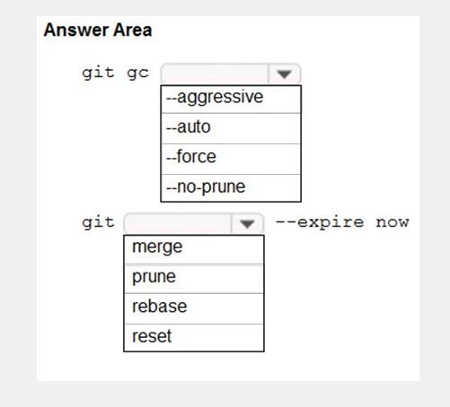

- [x] Box 1: aggressive. Box 2: prune.
- [ ] Box 1: prune. Box 2: auto.
- [ ] Box 1: prune. Box 2: force.
- [ ] Box 1: auto. Box 2: aggressive.

### You plan to deploy a website that will be hosted in two Azure regions. You need to create an Azure Traffic Manager profile named az400123456789n1-tm in a resource group named RG1lod123456789. The solution must ensure that users will always connect to a copy of the website that is in the same country. To complete this task, sign in to the Microsoft Azure portal.

- [x] 1. Go to the Azure portal, navigate to Traffic Manager profiles and click on the Add button to create a routing profile. 2. In the Create Traffic Manager profile, enter, or select these settings: Name: az400123456789n1-tm. Routing method: Geographic. Resource group: RG1lod123456789.

### You are developing an iOS application by using Azure DevOps. You need to test the application manually on 10 devices without releasing the application to the public. Which two actions should you perform?

- [ ] Create a Microsoft Intune device compliance policy.
- [ ] Deploy a certificate from an internal certification authority (CA) to each device.
- [ ] Register the application in the iTunes store.
- [ ] Onboard the devices into Microsoft Intune.
- [x] Distribute a new release of the application.
- [x] Register the IDs of the devices in the Apple Developer portal.

### Your company develops an application named App1 that is deployed in production. As part of an application update, a new service is being added to App1. The new service requires access to an application named App2 that is currently in development. You need to ensure that you can deploy the update to App1 before App2 becomes available. You must be able to enable the service in App1 once App2 is deployed. What should you do?

- [x] Implement a feature flag.
- [ ] Create a fork in the build.
- [ ] Create a branch in the build.
- [ ] Implement a branch policy.

### You have an Azure DevOps project named Project1 and an Azure subscription named Sub1. Sub1 contains an Azure SQL database named DB1. You need to create a release pipeline that uses the Azure SQL Database Deployment task to update DB1. Which artifact should you deploy?

- [ ] BACPAC.
- [x] DACPAC.
- [ ] LDF file.
- [ ] MDF file.

### You have an Azure DevOps project named Project1 and an Azure subscription named Sub1. You need to prevent releases from being deployed unless the releases comply with the Azure Policy rules assigned to Sub1. What should you do in the release pipeline of Project1?

- [x] Add a deployment gate.
- [ ] Modify the Deployment queue settings.
- [ ] Configure a deployment trigger.
- [ ] Create a pipeline variable.

### You have a free tier of an Azure DevOps organization named Contoso. Contoso contains 10 private projects. Each project has multiple jobs with no dependencies. The build process requires access to resource files located in an onpremises file system. You frequently run the jobs on five self-hosted agents but experience long build times and frequently queued builds. You need to minimize the number of queued builds and the time it takes to run the builds. What should you do?

- [ ] Configure the pipelines to use the Microsoft-hosted agents.
- [ ] Register additional self-hosted agents.
- [x] Purchase self-hosted parallel jobs.
- [ ] Purchase Microsoft-hosted parallel jobs.

### Your company plans to implement a new compliance strategy that will require all Azure web apps to be backed up every five hours. You need to back up an Azure web app named az400-123456789-main every five hours to an Azure Storage account in your resource group.

- [x] 1. Open the App Service az400-123456789-main, which you want to protect, in the Azure Portal and browse to Settings > Backups. Click Configure and a Backup Configuration blade should appear. 2. Select the storage account. 3. Click + to create a private container. You could name this container after the web app or App Service. 4. Select the container. 5. If you want to schedule backups, then set Scheduled Backup to On and configure a schedule: every five hours. 6. Select your retention. Note that 0 means never delete backups. 7. Decide if at least one backup should always be retained. 8. Choose if any connected databases should be included in the web app backup. 9. Click Save to finalize the backup configuration.
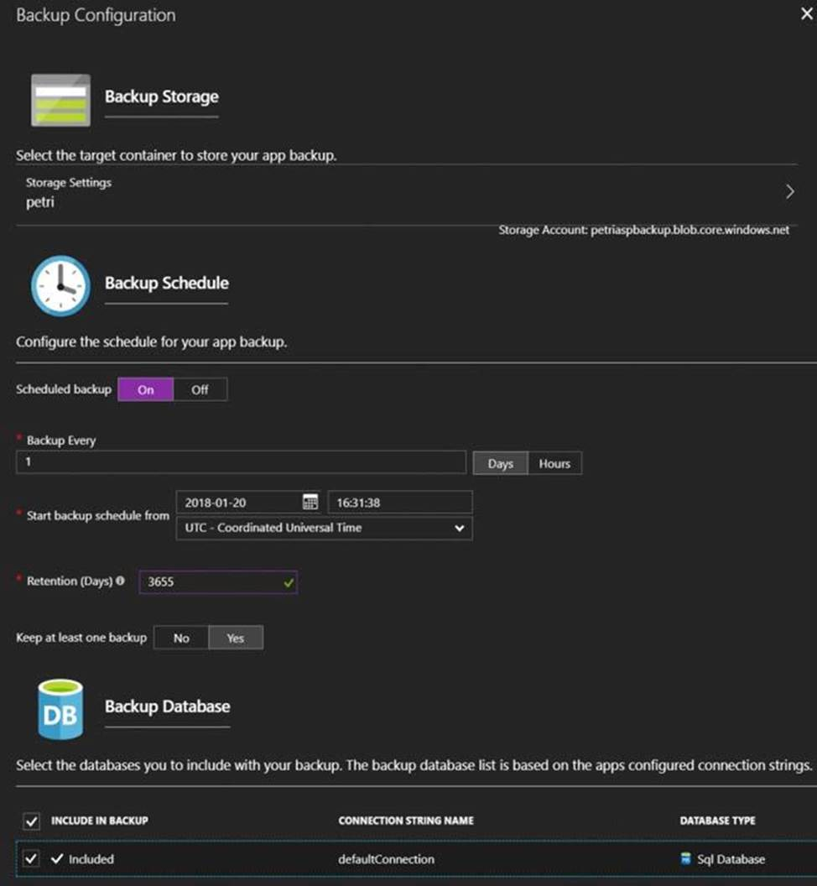

### You plan to implement a CI/CD strategy for an Azure Web App named az400-123456789-main. You need to configure a staging environment for az400-123456789-main. To complete this task, sign in to the Microsoft Azure portal.

- [x] 1. In the Azure portal, search for and select App Services and select your app az400-123456789-main. 2. In the left pane, select Deployment slots > Add Slot. 3. In the Add a slot dialog box, give the slot a name, and select whether to clone an app configuration from another deployment slot. Select Add to continue. 4. After the slot is added, select Close to close the dialog box. The new slot is now shown on the Deployment slots page.
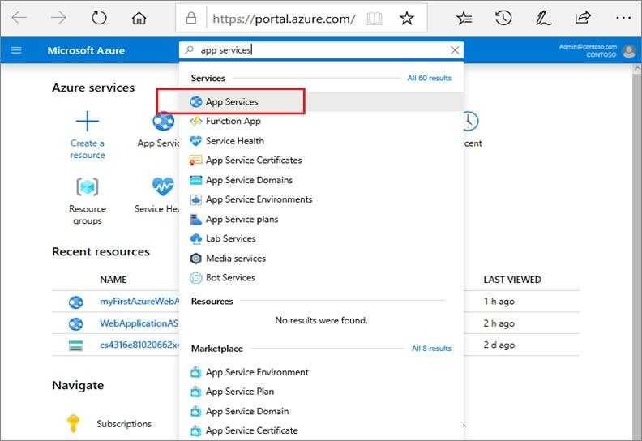
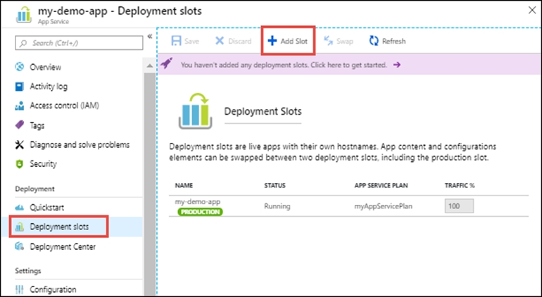

### You plan to use Terraform to deploy an Azure resource group. You need to install the required frameworks to support the planned deployment. Which two frameworks should you install?

- [ ] Vault.
- [x] Terratest.
- [ ] Node.js.
- [x] Yeoman.
- [ ] Tiller.

### You need to create a virtual machine template in an Azure DevTest Labs environment named az400-123456789-dtl1. The template must be based on Windows Server 2019 Datacenter. Virtual machines created from the template must include the selenium tool and the Google Chrome browser. To complete this task, sign in to the Microsoft Azure portal.

- [x] 1. Open Microsoft Azure Portal. 2. Select All Services, and then select DevTest Labs in the DEVOPS section. 3. From the list of labs, select the az400-123456789-dtl1 lab. 4. On the home page for your lab, select + Add on the toolbar. 5. Select the Windows Server 2019 Datacenter base image for the VM. 6. Select automation options at the bottom of the page above the Submit button. 7. You see the Azure Resource Manager template for creating the virtual machine. 8. The JSON segment in the resources section has the definition for the image type you selected earlier.

### Your company has a release pipeline in an Azure DevOps project. You plan to deploy to an Azure Kubernetes Services (AKS) cluster by using the Helm package and deploy task. You need to install a service in the AKS namespace for the planned deployment. Which service should you install?

- [ ] Azure Container Registry.
- [ ] Chart.
- [ ] Kubectl.
- [x] Tiller.

### You plan to add a new web farm that will be published by using an IP address of 10.0.0.5. You need to allow traffic from the web farm to an Azure Database for MySQL server named az400-11566895-mysql. To complete this task, sign in to the Microsoft Azure portal.

- [x] 1. On the MySQL server page, under Settings heading, click Connection Security to open the Connection Security page for the Azure Database for MySQL. 2. In the firewall rules for the Azure Database for MySQL, you can specify a single IP address or a range of addresses. If you want to limit the rule to a single IP address, type the same address in the Start IP and End IP fields. Opening the firewall enables administrators, users, and application to access any database on the MySQL server to which they have valid credentials. 3. Click Save on the toolbar to save this server-level firewall rule. Wait for the confirmation that the update to the firewall rules is successful.

### You have an Azure DevOps project that contains a release pipeline and a Git repository. When a new code revision is committed to the repository, a build and release is triggered. You need to ensure that release information for the pipeline is added automatically to the work items associated to the Git commit. What should you do?

- [x] Modify the Integrations options for the pipeline.
- [ ] Modify the post-deployment conditions for the last stage of the pipeline.
- [ ] Add an agentless job to the pipeline.
- [ ] Modify the service hooks for the project.

### You are designing a build pipeline in Azure Pipelines. The pipeline requires a self-hosted agent. The build pipeline will run once daily and will take 30 minutes to complete. You need to recommend a compute type for the agent. The solution must minimize costs. What should you recommend?

- [ ] Azure Kubernetes Service (AKS) cluster.
- [x] Azure Container Instances.
- [ ] Azure virtual machine scale set.
- [ ] Azure virtual machines.

### You have an Azure subscription that contains multiple Azure services. You need to send an SMS alert when scheduled maintenance is planned for the Azure services. Which two actions should you perform?

- [ ] Enable Azure Security Center.
- [ ] Create and configure an Azure Monitor alert rule.
- [x] Create an Azure Service Health alert.
- [x] Create and configure an action group.

### Your company makes use of Azure SQL Database Intelligent Insights and Azure Application Insights for monitoring purposes. You have been tasked with analyzing the monitoring using ad-hoc queries. You need to utilize the correct query language. Solution: You use Azure Log Analytics. Does the solution meet the goal?

- [ ] Yes.
- [x] No.

### Your company makes use of Azure SQL Database Intelligent Insights and Azure Application Insights for monitoring purposes. You have been tasked with analyzing the monitoring using ad-hoc queries. You need to utilize the correct query language. Solution: You use the Contextual Query Language (CQL). Does the solution meet the goal?

- [ ] Yes.
- [x] No.

### Your company makes use of Azure SQL Database Intelligent Insights and Azure Application Insights for monitoring purposes. You have been tasked with analyzing the monitoring using ad-hoc queries. You need to utilize the correct query language. Solution: You use the Transact-SQL. Does the solution meet the goal?

- [ ] Yes.
- [x] No.

### Your company makes use of Azure SQL Database Intelligent Insights and Azure Application Insights for monitoring purposes. You have been tasked with analyzing the monitoring using ad-hoc queries. You need to utilize the correct query language. Solution: You use the Kusto Query Language (KQL). Does the solution meet the goal?

- [x] Yes.
- [ ] No.

### Your company has a multi-tier application that has its front end hosted in Azure App Service. To pinpoint the average load times of the application pages, you should make use of [Azure Event Hubs].

- [ ] No adjustment required.
- [x] Azure Application Insights.
- [ ] Azure Log Analytics.
- [ ] Azure Advisor.

### Your company has an application that contains a number of Azure App Service web apps and Azure functions. You would like to view recommendations with regards to the security of the web apps and functions. You plan to navigate to Compute and Apps to achieve your goal. Which of the following should you access to make use of Compute and Apps?

- [ ] Azure Log Analytics.
- [ ] Azure Event Hubs.
- [ ] Azure Advisor.
- [x] Azure Security Center.

### Your company has an Azure DevOps project, which includes a build pipeline that makes use of roughly fifty open source libraries. You have been tasked with making sure that you are able to scan project for common security weaknesses in the open source libraries. Which of the following actions should you take?

- [x] You should create a build task and use the WhiteSource Bolt service.
- [ ] You should create a deployment task and use the WhiteSource Bolt service.
- [ ] You should create a build task and use the Chef service.
- [ ] You should create a deployment task and use the Chef service.

### You have an Azure DevOps project that contains a build pipeline. The build pipeline uses approximately 50 open source libraries. You need to ensure that all the open source libraries comply with your company's licensing standards. Which service should you use?

- [ ] NuGet.
- [ ] Maven.
- [x] Black Duck.
- [ ] Helm.

### You have an Azure DevOps project that contains a build pipeline. The build pipeline uses approximately 50 open source libraries. You need to ensure that all the open source libraries comply with your company's licensing standards. Which service should you use?

- [ ] Ansible.
- [ ] Maven.
- [x] WhiteSource Bolt.
- [ ] Helm.

### You are currently defining a release strategy for an app, named APP-01. The strategy should allow you to keep the time it takes to deploy new releases of the app to a minimum. The strategy should also allow you to roll back in the shortest time required. Which of the following is the release strategy you should use?

- [x] Red/Black deployment.
- [ ] Rolling deployment.
- [ ] Big Bang deployment.
- [ ] Canary deployment.

### You scan a Node.js application using WhiteSource Bolt. The scan finds numerous libraries with invalid licenses, but are only used during development. You have to make sure that only production dependencies are scanned by WhiteSource Bolt. Which of the following is a command you should run?

- [ ] npm edit.
- [ ] npm publish.
- [x] npm install.
- [ ] npm update.

### You use WhiteSource Bolt to scan a Node.js application. The WhiteSource Bolt scan identifies numerous libraries that have invalid licenses. The libraries are used only during development and are not part of a production deployment. You need to ensure that WhiteSource Bolt only scans production dependencies. Which two actions should you perform?

- [x] Run npm install and specify the –production flag.
- [ ] Modify the WhiteSource Bolt policy and set the action for the licenses used by the development tools to Reassign.
- [ ] Modify the devDependencies section of the project's Package.json file.
- [x] Configure WhiteSource Bolt to scan the node_modules directory only.

### You are making use of Azure DevOps to configure Azure Pipelines for project, named PROJ-01. You are preparing to use a version control system that allows for source code to be stored on a managed Windows server located on the company network. Which of the following is the version control system you should use?

- [x] Github Enterprise.
- [ ] Bitbucket cloud.
- [ ] Github Professional.
- [ ] Git in Azure Repos.

### You have a GitHub repository. You need to ensure that all the code in the repository is scanned for vulnerabilities. What should you use?

- [ ] Dependabot alerts.
- [ ] branch protection rules.
- [x] CodeQL actions.
- [ ] GitHub Advisory Database databases.

### You have an Azure DevOps project that contains a build pipeline. The build pipeline uses approximately 50 open source libraries. You need to ensure that the project can be scanned for known security vulnerabilities in the open source libraries. What should you do?

- [x] Object to create: A build task. Service to use: WhiteSource Bolt.
- [ ] Object to create: An artifacts repository. Service to use: WhiteSource Bolt.
- [ ] Object to create: A deployment task. Service to use: A build task.
- [ ] Object to create: WhiteSource Bolt. Service to use: A build task.

### You plan to store signed images in an Azure Container Registry instance named az4009940427acr1. You need to modify the SKU for az4009940427acr1 to support the planned images. The solution must minimize costs. To complete this task, sign in to the Microsoft Azure portal.

- [x] 1. Open Microsoft Azure Portal, and select the Azure Container Registry instance named az4009940427acr1. 2. Under Policies, select Content Trust > Enabled > Save.

### Your company has an Azure DevOps environment that can only be accessed by Azure Active Directory users. You are instructed to make sure that the Azure DevOps environment can only be accessed from devices connected to the company's on-premises network. Which of the following actions should you take?

- [ ] Assign the devices to a security group.
- [ ] Create a GPO.
- [ ] Configure Security in Project Settings from Azure DevOps.
- [x] Configure conditional access in Azure Active Directory.

### You run the Register-AzureRmAutomationDscNode command in your company's environment. You need to make sure that your company's test servers remain correctly configured, regardless of configuration drift. Solution: You set the -ConfigurationMode parameter to ApplyAndAutocorrect. Does the solution meet the goal?

- [x] Yes.
- [ ] No.

### Establish if the solution satisfies the requirements. You run the Register-AzureRmAutomationDscNode command in your company's environment. You need to make sure that your company's test servers remain correctly configured, regardless of configuration drift. Solution: You set the -ConfigurationMode parameter to ApplyAndMonitor. Does the solution meet the goal?

- [ ] Yes.
- [x] No.

### Establish if the solution satisfies the requirements. You run the Register-AzureRmAutomationDscNode command in your company's environment. You need to make sure that your company's test servers remain correctly configured, regardless of configuration drift. Solution: You set the -ConfigurationMode parameter to ApplyOnly. Does the solution meet the goal?

- [ ] Yes.
- [x] No.

### You are currently developing a project for a client that will be managing work items via Azure DevOps. You want to make sure that the work item process you use for the client allows for requirements, change requests, risks, and reviews to be tracked. Which of the following is the option you would choose?

- [ ] Basic.
- [ ] Agile.
- [ ] Scrum.
- [x] CMMI.

### The [Burnup widget] measures the elapsed time from creation of work items to their completion.

- [ ] No adjustment required.
- [x] Lead time.
- [ ] Test results trend.
- [ ] Burndown.

### You are configuring project metrics for dashboards in Azure DevOps. You need to configure a chart widget that measures the elapsed time to complete work items once they become active. Which of the following is the widget you should use?

- [ ] Cumulative Flow Diagram.
- [ ] Burnup.
- [x] Cycle time.
- [ ] Burndown.

### You administer an Azure DevOps project that includes package feeds. You need to ensure that developers can unlist and deprecate packages. The solution must use the principle of least privilege. Which access level should you grant to the developers?

- [ ] Collaborator.
- [x] Contributor.
- [ ] Owner.

### You are creating a NuGet package. You plan to distribute the package to your development team privately. You need to share the package and test that the package can be consumed. Which four actions should you perform in sequence?

- [ ] Box 1: Configure a self-hosted agent. Box 2: Create a new Azure Artifacts feed. Box 3: Publish a package. Box 4: Connect to an Azure Artifacts feed.
- [x] Box 1: Create a new Azure Artifacts feed. Box 2: Publish a package. Box 3: Connect to an Azure Artifacts feed. Box 4: Install a package.
- [ ] Box 1: Configure a self-hosted agent. Box 2: Publish a package. Box 3: Connect to an Azure Artifacts feed. Box 4: Create a new Azure Artifacts feed.
- [ ] Box 1: Create a new Azure Artifacts feed. Box 2: Connect to an Azure Artifacts feed. Box 3: Publish a package. Box 4: Configure a self-hosted agent.

### You need to deploy Internet Information Services (IIS) to an Azure virtual machine that runs Windows Server 2019. How should you complete the Desired State Configuration (DSC) configuration script?

- [x] Box 1: Configuration. Box 2: WindowsFeature.
- [ ] Box 1: IncludeAllSubFeature. Box 2: File.
- [ ] Box 1: Configuration. Box 2: DependsOn.
- [ ] Box 1: WindowsFeature. Box 2: Configuration.

### You need to configure GitHub to use Azure Active Directory (Azure AD) for authentication. What should you do first?

- [ ] Create a conditional access policy in Azure AD.
- [x] Register GitHub in Azure AD.
- [ ] Create an Azure Active Directory B2C (Azure AD B2C) tenant.
- [ ] Modify the Security settings of the GitHub organization.

### You manage a website that uses an Azure SQL Database named db1 in a resource group named RG1lod11566895. You need to modify the SQL database to protect against SQL injection. To complete this task, sign in to the Microsoft Azure portal.

- [x] 1. From the Azure portal, open your server or managed instance. 2. Under the Security heading, select Security Center. 3. Select Enable Azure Defender for SQL.

### Your company has a project in Azure DevOps for a new web application. The company uses ServiceNow for change management. You need to ensure that a change request is processed before any components can be deployed to the production environment. What are two ways to integrate ServiceNow into the Azure DevOps release pipeline?

- [ ] Define a deployment control that invokes the ServiceNow REST API.
- [x] Define a pre-deployment gate before the deployment to the Prod stage.
- [ ] Define a deployment control that invokes the ServiceNow SOAP API.
- [x] Define a post-deployment gate after the deployment to the QA stage.

### You have an application named App1 that has a custom domain of app.contoso.com. You create a test in Azure Application Insights as shown in the following exhibit.

- [ ] The test will execute [...]: every five minutes at a random location. The test will pass if [...] within 30 seconds: all the HTML, JavaScripts, and images of App1 load.
- [x] The test will execute [...]: every five minutes per location. The test will pass if [...] within 30 seconds: all the HTML, JavaScripts, and images of App1 load.
- [ ] The test will execute [...]: the HTML of App1 and the HTML from URLs in <a> tags load. The test will pass if [...] within 30 seconds: App1 responds to an ICMP ping.
- [ ] The test will execute [...]: all the HTML, JavaScripts, and images of App1 load. The test will pass if [...] within 30 seconds: App1 responds to an ICMP ping.

### You are creating a build pipeline in Azure Pipelines. You define several tests that might fail due to third-party applications. You need to ensure that the build pipeline completes successfully if the third-party applications are unavailable. What should you do?

- [ ] Configure the build pipeline to use parallel jobs.
- [x] Configure flaky tests.
- [ ] Increase the test pass percentage.
- [ ] Add the Requirements quality widget to your dashboard.

### You have a build pipeline in Azure Pipelines that occasionally fails. You discover that a test measuring the response time of an API endpoint causes the failures. You need to prevent the build pipeline from failing due to the test. Which two actions should you perform?

- [ ] Set Flaky test detection to Off.
- [x] Clear Flaky tests included in test pass percentage.
- [ ] Enable Test Impact Analysis (TIA).
- [x] Manually mark the test as flaky.
- [ ] Enable test slicing.

### You have a build pipeline in Azure Pipelines that uses different jobs to compile an application for 10 different architectures. The build pipeline takes approximately one day to complete. You need to reduce the time it takes to execute the build pipeline. Which two actions should you perform?

- [ ] Move to a blue/green deployment pattern.
- [ ] Create a deployment group.
- [x] Increase the number of parallel jobs.
- [ ] Reduce the size of the repository.
- [x] Create an agent pool.

### You have an Azure subscription that contains a resources group named RG1. RG1 contains the following resources: Four Azure virtual machines that run Windows Server and have Internet Services (IIS) installed. SQL Server on an Azure virtual machine. An Azure Load Balancer. You need to deploy an application to the virtual machines in RG1 by using Azure Pipelines. Which four actions should you perform in sequence?

- [ ] Box 1: Create an agent pool. Box 2: Create a deployment group. Box 3: Execute the Azure Pipelines Agent extension to the virtual machines. Box 4: Add and configure a deployment group job for the pipeline.
- [ ] Box 1: Create an agent pool. Box 2: Execute the Azure Pipelines Agent extension to the virtual machines. Box 3: Create a deployment group. Box 4: .Add the Puppet Agent extension to the virtual machines
- [ ] Box 1: Add and configure a deployment group job for the pipeline. Box 2: Create an agent pool. Box 3: Create a deployment group. Box 4: Add the Puppet Agent extension to the virtual machines.
- [x] Box 1: Create a deployment group. Box 2: Add the Puppet Agent extension to the virtual machines. Box 3: Add and configure a deployment group job for the pipeline. Box 4: Execute the Azure Pipelines Agent extension to the virtual machines.

### You company uses a Git source-code repository. You plan to implement Gitflow as a workflow strategy. You need to identify which branch types are used for production code and preproduction code in the strategy. Which branch type should you identify for each code type?

- [ ] Box 1: Develop. Box 2: Feature.
- [ ] Box 1: Feature. Box 2: Main.
- [x] Box 1: Main. Box 2: Develop.
- [ ] Box 1: Main. Box 2: Feature.

### You have an Azure DevOps release pipeline as shown in the following exhibit. You need to complete the pipeline to configure OWASP ZAP for security testing. Which five Azure CLI tasks should you add in sequence?

- [x] Box 1: Call the Baseline Scan. Box 2: Download the file. Box 3: Convert Report Format. Box 4: Publish Test Results. Box 5: Destroy OWASP Container.
- [ ] Box 1: Docker CLI installer. Box 2: Destroy OWASP Container. Box 3: Publish Test Results. Box 4: Call the Baseline Scan. Box 5: Download the file.
- [ ] Box 1: Call the Baseline Scan. Box 2: Destroy OWASP Container. Box 3: Download the file. Box 4: Build machine image. Box 5: Publish Test Results.
- [ ] Box 1: Download the file. Box 2: Publish Test Results. Box 3: Destroy OWASP Container. Box 4: Call the Baseline Scan. Box 5: Docker CLI installer.

### You need to execute inline testing of an Azure DevOps pipeline that uses a Docker deployment model. The solution must prevent the results from being published to the pipeline. What should you use for the inline testing?

- [ ] Single stage Dockerfile.
- [ ] Azure Kubernetes Service (AKS) pod.
- [x] Multi-stage Dockerfile.
- [ ] Docker Compose file.

### You have an Azure Pipelines application CI/CD pipeline named Pipeline1. You need to add OWASP ZAP testing to Pipeline1. Which four actions should you add to Pipeline1 in sequence?

- [ ] Box 1: Start a container. Box 2: Run the baseline. Box 3: Run an active scan. Box 4: Report the results.
- [x] Box 1: Pull OWASP ZAP Weekly. Box 2: Start a container. Box 3: Run the baseline. Box 4: Report the results.
- [ ] Box 1: Spider the site. Box 2: Run the baseline. Box 3: Run an active scan. Box 4: Report the results.
- [ ] Box 1: Spider the site. Box 2: Run the baseline. Box 3: Pull OWASP ZAP Weekly. Box 4: Report the results.

### You have an Azure subscription that contains an Azure Active Directory (Azure AD) tenant. You are configuring a build pipeline in Azure Pipelines that will include a task named Task1. Task1 will authenticate by using an Azure AD service principal. Which three values should you configure for Task1?

- [x] Tenant ID.
- [ ] Subscription ID.
- [x] Client secret.
- [x] App ID.
- [ ] Object ID.

### You have a tenant in Microsoft Azure Active Directory (Azure AD), part of Microsoft Entra. The tenant contains three groups named Group1, Group2, and Group3. You create a new project in Azure DevOps named Project1. You need to secure the service connections for Project1. The solution must meet the following requirements: The members of Group1 must be able to share and unshare a service connection with other projects. The members of Group2 must be able to rename a service connection and update the description. The members of Group3 must be able to use the service connection within build or release pipelines. The principle of least privilege must be followed. Which permission should you grant to each group?

- [ ] Group 1: Project-level Administrator. Group 2: Contributor. Group 3: User.
- [ ] Group 1: Project-level Administrator. Group 2: Contributor. Group 3: Organizational-level Administrator.
- [x] Group 1: Organizational-level Administrator. Group 2: Project-level Administrator. Group 3: User.
- [ ] Group 1: Organizational-level Administrator. Group 2: Creator. Group 3: User.

### You are deploying a new application that uses Azure virtual machines. You plan to use the Desired State Configuration (DSC) extension on the virtual machines. You need to ensure that the virtual machines always have the same Windows feature installed. Which three actions should you perform in sequence?

- [ ] Box 1: Create a YAML configuration file. Box 2: Load the file to Azure Blob storage. Box 3: Create a PowerShell configuration file.
- [ ] Box 1: Create a PowerShell configuration file. Box 2: Load the file to Azure Blob storage. Box 3: Configure the Custom Script Extension on the virtual machines.
- [x] Box 1: Create a PowerShell configuration file. Box 2: Load the file to Azure Blob storage. Box 3: Configure the DSC extension on the virtual machines.
- [ ] Box 1: Load the file to Azure Files. Box 2: Load the file to Azure Blob storage. Box 3: Create a PowerShell configuration file.

### You are developing an application. The application source has multiple branches. You make several changes to a branch used for experimentation. You need to update the main branch to capture the changes made to the experimentation branch and override the history of the Git repository. Which Git option should you use?

- [x] Rebase.
- [ ] Fetch.
- [ ] Merge.
- [ ] Push.

### You plan to update the Azure DevOps strategy of your company. You need to identify the following issues as they occur during the company's development process: Licensing violations. Prohibited libraries. Solution: You implement pre-deployment gates. Does this meet the goal?

- [ ] Yes.
- [x] No.

### You plan to update the Azure DevOps strategy of your company. You need to identify the following issues as they occur during the company's development process: Licensing violations. Prohibited libraries. Solution: You implement automated security testing. Does this meet the goal?

- [ ] Yes.
- [x] No.

### You plan to update the Azure DevOps strategy of your company. You need to identify the following issues as they occur during the company's development process: Licensing violations. Prohibited libraries. Solution: You implement continuous integration. Does this meet the goal?

- [ ] Yes.
- [x] No.

### You plan to update the Azure DevOps strategy of your company. You need to identify the following issues as they occur during the company's development process: Licensing violations. Prohibited libraries. Solution: You implement continuous deployment. Does this meet the goal?

- [ ] Yes.
- [x] No.

### You plan to create alerts that will be triggered based on the page load performance of a home page. You have the Application Insights log query shown in the following exhibit.

- [x] To create an alert based on the page load experience of most users, the alerting level must be based on [...]: percentile_duration_95. To only create an alert when authentication error occurs on the server, the query must be filtered on [...]: resultCode.
- [ ] To create an alert based on the page load experience of most users, the alerting level must be based on [...]: percentile_duration_95. To only create an alert when authentication error occurs on the server, the query must be filtered on [...]: success.
- [ ] To create an alert based on the page load experience of most users, the alerting level must be based on [...]: success. To only create an alert when authentication error occurs on the server, the query must be filtered on [...]: percentile_duration_95.
- [ ] To create an alert based on the page load experience of most users, the alerting level must be based on [...]: percentile_duration_50. To only create an alert when authentication error occurs on the server, the query must be filtered on [...]: source.

### You plan to deploy a runbook that will create Azure AD user accounts. You need to ensure that runbooks can run the Azure PowerShell cmdlets for Azure Active Directory. To complete this task, sign in to the Microsoft Azure portal.

- [x] 1. Select the Automation account with the runbook. 2. select Modules, the "browse gallery". 3. search "AzureAD" and install it.

### You are creating a container for an ASP.NET Core app. You need to create a Dockerfile file to build the image. The solution must ensure that the size of the image is minimized. How should you configure the file?

- [ ] Box 1: mcr.microsoft.com/dotnet/sdk:5.0. Box 2: dotnet restore. Box 3: mcr.microsoft.com/dotnet/aspnet:5.0.
- [ ] Box 1: mcr.microsoft.com/dotnet/aspnet:5.0. Box 2: mcr.microsoft.com/dotnet/sdk:5.0. Box 3: dotnet restore.
- [x] Box 1: mcr.microsoft.com/dotnet/sdk:5.0. Box 2: dotnet publish -c Release -o out. Box 3: mcr.microsoft.com/dotnet/aspnet:5.0.
- [ ] Box 1: dotnet restore. Box 2: mcr.microsoft.com/dotnet/sdk:5.0. Box 3: mcr.microsoft.com/dotnet/aspnet:5.0.

### You are creating a container for an ASP.NET Core app. You need to create a Dockerfile file to build the image. The solution must ensure that the size of the image is minimized. How should you configure the file?

- [ ] Box 1: Microsoft/dotnet:2.2-sdk. Box 2: dotnet restore. Box 3: microsoft/dotnet:2.2-aspnetcore-runtime.
- [ ] Box 1: microsoft/dotnet:2.2-aspnetcore-runtime. Box 2: Microsoft/dotnet:2.2-sdk. Box 3: dotnet restore.
- [x] Box 1: Microsoft/dotnet:2.2-sdk. Box 2: dotnet publish -c Release -o out. Box 3: microsoft/dotnet:2.2-aspnetcore-runtime.
- [ ] Box 1: dotnet restore. Box 2: Microsoft/dotnet:2.2-sdk. Box 3: microsoft/dotnet:2.2-aspnetcore-runtime.

### Your company uses ServiceNow for incident management. You develop an application that runs on Azure. The company needs to generate a ticket in ServiceNow when the application fails to authenticate. Which Azure Log Analytics solution should you use?

- [ ] Application Insights Connector.
- [ ] Automation & Control.
- [x] IT Service Management Connector (ITSM).
- [ ] Insight & Analytics.

### You need to configure an Azure web app named az400-123456789-main to contain an environmental variable named 'MAX_ITEMS'. The environmental variable must have a value of 50. To complete this task, sign in to the Microsoft Azure portal.

- [x] 1. In the Azure portal, navigate to the az400-123456789-main app's management page. In the app's left menu, click Configuration > Application settings. 2. Click New Application settings. 3. Enter the following: Name: MAX_ITEMS. Value: 50.

### You need to prepare a network security group (NSG) named az400-123456789-nsg1 to host an Azure DevOps pipeline agent. The solution must allow only the required outbound port for Azure DevOps and deny all other inbound and outbound access to the Internet. To complete this task, sign in to the Microsoft Azure portal.

- [x] 1. Open Microsoft Azure Portal and Log into your Azure account. 2. Select network security group (NSG) named az400-123456789-nsg1. 3. Select Settings, Outbound security rules, and click Add 4. Click Advanced. 5. Change the following settings: Name: Allow-Outbound. Priority: 100 (or any number lower than 65000). Source: Any. Source Port Range: *. Destination: Any. Destination Port Range: 443. Protocol: TCP. Action: Allow.

### You plan to create a release pipeline that will deploy Azure resources by using Azure Resource Manager templates. The release pipeline will create the following resources: Two resource groups. Four Azure virtual machines in one resource group. Two Azure SQL databases in other resource group. You need to recommend a solution to deploy the resources. Solution: Create a single standalone template that will deploy all the resources. Does this meet the goal?

- [ ] Yes.
- [x] No.

### You plan to create a release pipeline that will deploy Azure resources by using Azure Resource Manager templates. The release pipeline will create the following resources: Two resource groups. Four Azure virtual machines in one resource group. Two Azure SQL databases in other resource group. You need to recommend a solution to deploy the resources. Solution: Create two standalone templates, each of which will deploy the resources in its respective group. Does this meet the goal?

- [x] Yes.
- [ ] No.

### You plan to create a release pipeline that will deploy Azure resources by using Azure Resource Manager templates. The release pipeline will create the following resources: Two resource groups. Four Azure virtual machines in one resource group. Two Azure SQL databases in other resource group. You need to recommend a solution to deploy the resources. Solution: Create a main template that will deploy the resources in one resource group and a nested template that will deploy the resources in the other resource group. Does this meet the goal?

- [ ] Yes.
- [x] No.

### When moving to Azure DevOps, JIRA must be replaced with the build pipelines Azure [DevOps] service.

- [ ] No adjustment required.
- [ ] Repos.
- [ ] Release pipelines.
- [x] Boards.

### You currently use JIRA, Jenkins, and Octopus as part of your DevOps processes. You plan to use Azure DevOps to replace these tools. Which Azure DevOps service should you use to replace each tool?

- [ ] JIRA: Release pipelines. Jenkins: Repos. Octopus: Build pipelines.
- [ ] JIRA: Repos. Jenkins: Release pipelines. Octopus: Repos.
- [ ] JIRA: Build pipelines. Jenkins: Boards. Octopus: Build pipelines.
- [x] JIRA: Boards. Jenkins: Build pipelines. Octopus: Release pipelines.

### You are developing a full Microsoft .NET Framework solution that includes unit tests. You need to configure SonarQube to perform a code quality validation of the C# code as part of the build pipelines. Which four tasks should you perform in sequence?

- [ ] Box 1: Visual Studio Build. Box 2: Run Code Analysis. Box 3: Publish Build Artifacts. Box 4: Prepare Analysis Configuration.
- [ ] Box 1: Visual Studio Test. Box 2: Visual Studio Build. Box 3: Prepare Analysis Configuration. Box 4: Visual Studio Test.
- [ ] Box 1: Publish Build Artifacts. Box 2: Prepare Analysis Configuration. Box 3: Visual Studio Build. Box 4: Run Code Analysis.
- [x] Box 1: Prepare Analysis Configuration. Box 2: Visual Studio Build. Box 3: Visual Studio Test. Box 4: Run Code Analysis.

### To compile an Internet Information Services (IIS) web application that runs docker, you should use a [Default build agent pool].

- [ ] No adjustment required.
- [x] Hosted Windows Container.
- [ ] Hosted.
- [ ] Hosted macOS

### To deploy an application to a number of Azure virtual machines, you should create a [universal] group.

- [ ] No adjustment required.
- [ ] Security.
- [x] Deployment.
- [ ] Resource.

### [Black Duck] can be used to make sure that all the open source libraries conform to your company's licensing criteria.

- [x] No adjustment required.
- [ ] Maven.
- [ ] Bamboo.
- [ ] CMAKE.

### You manage an Azure web app that supports an e-commerce website. You need to increase the logging level when the web app exceeds normal usage patterns. The solution must minimize administrative overhead. Which two resources should you include in the solution?

- [x] Azure Automation runbook.
- [x] Azure Monitor alert that has a dynamic threshold.
- [ ] Azure Monitor alert that has a static threshold.
- [ ] Azure Monitor autoscale settings.
- [ ] Azure Monitor alert that uses an action group that has an email action.

### You have an Azure Kubernetes Service (AKS) pod. You need to configure a probe to perform the following actions: Confirm that the pod is responding to service requests. Check the status of the pod four times a minute. Initiate a shutdown if the pod is unresponsive. How should you complete the YAML configuration file?

- [ ] Box 1: readinessProbe: 15. Box 2: timeoutSeconds: 15.
- [x] Box 1: livenessProbe. Box 2: periodSeconds: 15.
- [ ] Box 1: ShutdownProbe: 15. Box 2: initialDelaySeconds: 15.
- [ ] Box 1: readinessProbe. Box 2: periodSeconds: 15.

### You need to create an instance of Azure Application Insights named az400-123456789-main and configure the instance to receive telemetry data from an Azure web app named az400-123456789-main. To complete this task, sign in to the Microsoft Azure portal.

- [x] 1. Login to Az Portal 2. Create an App Insights resource. 3. Locate your Az Web App, if it does not exist, create it. 4. Go to the resource, to Settings, to Application Insights and enable it. Select the App Insights resource you created earlier and Apply.

### Your company wants to use Azure Application Insights to understand how user behaviors affect an application. Which Application Insights tool should you use to analyze each behavior?

- [ ] Feature usage: Impact. Number of people who used the actions and its features: Impact. The effect that the performance of the application has on the usage of a page or a feature: User Flows.
- [x] Feature usage: Users. Number of people who used the actions and its features: User Flows. The effect that the performance of the application has on the usage of a page or a feature: Impact.
- [ ] Feature usage: User Flows. Number of people who used the actions and its features: Users. The effect that the performance of the application has on the usage of a page or a feature: Impact.
- [ ] Feature usage: Users. Number of people who used the actions and its features: User Flows. The effect that the performance of the application has on the usage of a page or a feature: Impact.

### You have an Azure DevOps project named Project1 and an Azure subscription named Sub1. Sub1 contains an Azure virtual machine scale set named VMSS1. VMSS1 hosts a web application named WebApp1. WebApp1 uses stateful sessions. The WebApp1 installation is managed by using the Custom Script extension. The script resides in an Azure Storage account named sa1. You plan to make a minor change to a UI element of WebApp1 and to gather user feedback about the change. You need to implement limited user testing for the new version of WebApp1 on VMSS1. Which three actions should you perform?

- [ ] Modify the load balancer settings of VMSS1.
- [ ] Redeploy VMSS1.
- [x] Upload a custom script file to sa1.
- [x] Modify the Custom Script extension settings of VMSS1.
- [x] Update the configuration of a virtual machine in VMSS1.

### You have several Azure virtual machines that run Windows Server 2019. You need to identify the distinct event IDs of each virtual machine as shown in the following table. How should you complete the Azure Monitor query?

- [ ] Box 1: count(). Box 2: summarize.
- [ ] Box 1: mv-expand. Box 2: render.
- [ ] Box 1: summarize. Box 2: makelist(EventID).
- [x] Box 1: summarize. Box 2: makeset(EventID).

### You have a GitHub repository that contains the source code for an app named App1. You need to create process documentation for App1. The solution must include a diagram that displays the relationships between the phases of App1 as shown in the following exhibit. How should you complete the markdown code?

- [ ] Box 1: sequenceDiagram. Box 2: flowChart.
- [x] Box 1: stateDiagram. Box 2: Processing.
- [ ] Box 1: stateDiagram. Box 2: Failed.
- [ ] Box 1: sequenceDiagram. Box 2: Waiting.

### You have an Azure web app named Webapp1. You need to use an Azure Monitor query to create a report that details the top 10 pages of Webapp1 that failed. How should you complete the query?

- [x] Box 1: requests. Box 2: success == false.
- [ ] Box 1: itemType == "availabilityResult". Box 2: traces.
- [ ] Box 1: pageViews. Box 2: success == false.
- [ ] Box 1: traces. Box 2: requests.

### You are monitoring the health and performance of an Azure web app by using Azure Application Insights. You need to ensure that an alert is sent when the web app has a sudden rise in performance issues and failures. What should you use?

- [ ] Custom events.
- [ ] Application Insights Profiler.
- [ ] Usage analysis.
- [x] Smart Detection.
- [ ] Continuous export.

### You have a project in Azure DevOps named Contoso App that contains pipelines in Azure Pipelines for GitHub repositories. You need to ensure that developers receive Microsoft Teams notifications when there are failures in a pipeline of Contoso App. What should you run in Teams?

- [ ] Box 1: signin. Box 2: https://dev.azure.com/contoso/contoso-app/_work-items.
- [ ] Box 1: feedback. Box 2: https://dev.azure.com/contoso/contoso-app/_packaging.
- [ ] Box 1: subscriptions. Box 2: https://dev.azure.com/contoso/contoso-app/_work-items.
- [x] Box 1: subscribe. Box 2: https://dev.azure.com/contoso/contoso-app/.

### You are integrating Azure Pipelines and Microsoft Teams. You install the Azure Pipelines app in Microsoft Teams. You have an Azure DevOps organization named Contoso that contains a project name Project1. You subscribe to Project1 in Microsoft Teams. You need to ensure that you only receive events about failed builds in Microsoft Teams. What should you do first?

- [ ] From Microsoft Teams, run @azure pipelines subscribe https://dev.azure.com/Contoso/Project1.
- [ ] From Azure Pipelines, add a Publish Build Artifacts task to Project1.
- [x] From Microsoft Teams, run @azure pipelines subscriptions.
- [ ] From Azure Pipelines, enable continuous integration for Project1.

### You have an Azure DevOps organization named Contoso. You need to receive Microsoft Teams notifications when work items are updated. What should you do?

- [ ] From Azure DevOps, configure a service hook subscription.
- [x] From Microsoft Teams, configure a connector.
- [ ] From the Microsoft Teams admin center, configure external access.
- [ ] From Microsoft Teams, add a channel.
- [ ] From Azure DevOps, install an extension.

### You create an alert rule in Azure Monitor as shown in the following exhibit. Which action will trigger an alert?

- [x] Failed attempt to delete the ASP-9bb7 resource.
- [ ] Change to a role assignment for the ASP-9bb7 resource.
- [ ] Successful attempt to delete the ASP-9bb7 resource.
- [ ] Failed attempt to scale up the ASP-9bb7 resource.

### You have a web app hosted on Azure App Service. The web app stores data in an Azure SQL database. You need to generate an alert when there are 10,000 simultaneous connections to the database. The solution must minimize development effort. Which option should you select in the Diagnostics settings of the database?

- [x] Send to Log Analytics.
- [ ] Stream to an event hub.
- [ ] Archive to a storage account.

### You have an Azure DevOps organization named Contoso and an Azure subscription. The subscription contains an Azure virtual machine scale set named VMSS1 that is configured for autoscaling. You have a project in Azure DevOps named Project1. Project1 is used to build a web app named App1 and deploy App1 to VMSS1. You need to ensure that an email alert is generated whenever VMSS1 scales in or out. Solution: From Azure Monitor, configure the autoscale settings.

- [ ] Yes.
- [x] No.

### You configure an Azure Application Insights availability test. You need to notify the customer services department at your company by email when availability is degraded. You create an Azure logic app that will handle the email and follow up actions. Which type of trigger should you use to invoke the logic app?

- [ ] HTTPWebhook trigger.
- [ ] HTTP trigger.
- [x] Request trigger.
- [ ] ApiConnection trigger.

### You have an Azure DevOps organization named Contoso and an Azure subscription. You use Azure DevOps to build a containerized app named App1 and deploy App1 to an Azure container instance named ACI1. You need to restart ACI1 when App1 stops responding. What should you do?

- [x] Add a liveness probe to the YAML configuration of App1.
- [ ] Add a readiness probe to the YAML configuration of App1.
- [ ] Use Connection Monitor in Azure Network Watcher.
- [ ] Use IP flow verify in Azure Network Watcher.

### You use Azure Pipelines to automate Continuous Integration/Continuous Deployment (CI/CD) for an Azure web app named WebApp1. You configure an Azure Monitor alert that is triggered when WebApp1 generates an error. You need to configure the alert to forward details of the error to a third-party system. The solution must minimize administrative effort. Which three actions should you perform in sequence?

- [x] Box 1: Create an Azure logic app. Box 2: Select the HTTP request trigger. Box 3: Update the action group in Azure Monitor.
- [ ] Box 1: Select the HTTP request trigger. Box 2: Select the Recurrence trigger. Box 3: Update the action group in Azure Monitor.
- [ ] Box 1: Select the HTTP request trigger. Box 2: Select the Recurrence trigger. Box 3: Create an Azure logic app.
- [ ] Box 1: Update the action group in Azure Monitor. Box 2: Create an Azure logic app. Box 3: Select the Recurrence trigger.

### Your company has an Azure subscription named Subscription1. Subscription1 is associated to an Azure Active Directory tenant named contoso.com. You need to provision an Azure Kubernetes Services (AKS) cluster in Subscription1 and set the permissions for the cluster by using RBAC roles that reference the identities in contoso.com. Which three objects should you create in sequence?

- [ ] Box 1: a cluster. Box 2: an RBAC binding. Box 3: a system-assigned managed identity.
- [ ] Box 1: a cluster. Box 2: a system-assigned managed identity. Box 3: an RBAC binding.
- [x] Box 1: an application registration in contoso.com. Box 2: a cluster. Box 3: an RBAC binding.
- [ ] Box 1: a system-assigned managed identity. Box 2: an RBAC binding. Box 3: a cluster.

### You have an Azure DevOps organization named Contoso and an Azure subscription. The subscription contains an Azure virtual machine scale set named VMSS1 that is configured for autoscaling. You use Azure DevOps to build a web app named App1 and deploy App1 to VMSS1. App1 is used heavily and has usage patterns that vary on a weekly basis. You need to recommend a solution to detect an abnormal rise in the rate of failed requests to App1. The solution must minimize administrative effort. What should you include in the recommendation?

- [x] Smart Detection feature in Azure Application Insights.
- [ ] Failures feature in Azure Application Insights.
- [ ] Azure Service Health alert.
- [ ] Azure Monitor alert that uses an Azure Log Analytics query.

### You manage build and release pipelines by using Azure DevOps. Your entire managed environment resides in Azure. You need to configure a service endpoint for accessing Azure Key Vault secrets. The solution must meet the following requirements: Ensure that the secrets are retrieved by Azure DevOps. Avoid persisting credentials and tokens in Azure DevOps. How should you configure the service endpoint?

- [ ] Service connection type: Managed Service Identity Authentication. Authentication/authorization method for the connection: Team Foundation Server / Azure Pipelines service connection.
- [ ] Service connection type: Team Foundation Server / Azure Pipelines service connection. Authentication/authorization method for the connection: Azure Active Directory Auth 2.0.
- [ ] Service connection type: Team Foundation Server / Azure Pipelines service connection. Authentication/authorization method for the connection: Managed Service Identity Authentication.
- [x] Service connection type: Azure Resource Manager. Authentication/authorization method for the connection: Managed Service Identity Authentication.

### You have the following Azure policy. You assign the policy to the Tenant root group. What is the effect of the policy?

- [ ] Prevents all HTTP traffic to existing Azure Storage accounts.
- [x] Ensures that all traffic to new Azure Storage accounts is encrypted.
- [ ] Prevents HTTPS traffic to new Azure Storage accounts when the accounts are accessed over the Internet.
- [ ] Ensures that all data for new Azure Storage accounts is encrypted at rest.

### You use GitHub Enterprise Server as a source code repository. You create an Azure DevOps organization named Contoso. In the Contoso organization, you create a project named Project1. You need to link GitHub commits, pull requests, and issues to the work items of Project1. The solution must use OAuth-based authentication. Which three actions should you perform in sequence?

- [ ] Box 1: From Project Settings in Azure DevOps, add a GitHub connection. Box 2: From Organization settings in Azure DevOps, add an Auth configuration. Box 3: From Developer settings in GitHub Enterprise Server, register a new OAuth app.
- [ ] Box 1: From Organization settings in Azure DevOps, add an Auth configuration. Box 2: From Developer settings in GitHub Enterprise Server, register a new OAuth app. Box 3: From Project Settings in Azure DevOps, add a GitHub connection.
- [ ] Box 1: From Developer settings in GitHub Enterprise Server, generate a private kev. Box 2: From Organization settings in Azure DevOps, connect to Azure Active Directory (Azure AD). Box 3: From Developer settings in GitHub Enterprise Server, register a new OAuth app.
- [x] Box 1: From Developer settings in GitHub Enterprise Server, register a new OAuth app. Box 2: From Organization settings in Azure DevOps, add an Auth configuration. Box 3: From Project Settings in Azure DevOps, add a GitHub connection.

### You use Exabeam Fusion SIEM and the Azure cloud platform. You need to integrate Exabeam and Azure. The solution must use OAuth authentication. Which three actions should you perform in sequence?

- [ ] Box 1: Create a client secret. Box 2: Register an Exabeam application in Microsoft Azure Active Directory (Azure AD), part of Microsoft Entra. Box 3: Configure the Exabeam Azure cloud connector.
- [x] Box 1: Register an Exabeam application in Microsoft Azure Active Directory (Azure AD), part of Microsoft Entra. Box 2: Configure the Exabeam Azure cloud connector. Box 3: Configure API permissions.
- [ ] Box 1: Create a client secret. Box 2: Register an Exabeam application in Microsoft Azure Active Directory (Azure AD), part of Microsoft Entra. Box 3: Upload a certificate.
- [ ] Box 1: Configure API permissions. Box 2: Register an Exabeam application in Microsoft Azure Active Directory (Azure AD), part of Microsoft Entra. Box 3: Configure the Exabeam Azure cloud connector.

### You have a private project in Azure DevOps and two users named User1 and User2. You need to add User1 and User2 to groups to meet the following requirements: User1 must be able to create a code wiki. User2 must be able to edit wiki pages. The solution must use the principle of least privilege. To which group should you add each user?

- [ ] User 1: Project Valid Users. User 2: Project Administrators.
- [x] User 1: Project Administrators. User 2: Contributors.
- [ ] User 1: Project Administrators. User 2: Stakeholders.
- [ ] User 1: Contributors. User 2: Project Administrators.

### You have a project in Azure DevOps that has three teams as shown in the Teams exhibit. You create a new dashboard named Dash1. You configure the dashboard permissions for the Contoso project as shown in the Permissions exhibit. All other permissions have the default values set. Web Team can delete Dash1.

- [ ] Yes.
- [x] No.

### You have a project in Azure DevOps that has three teams as shown in the Teams exhibit. You create a new dashboard named Dash1. You configure the dashboard permissions for the Contoso project as shown in the Permissions exhibit. All other permissions have the default values set. Contoso Team can view Dash1.

- [x] Yes.
- [ ] No.

### You have a project in Azure DevOps that has three teams as shown in the Teams exhibit. You create a new dashboard named Dash1. You configure the dashboard permissions for the Contoso project as shown in the Permissions exhibit. All other permissions have the default values set. Project administrators can create new dashboards.

- [x] Yes.
- [ ] No.

### You have a project in Azure DevOps named Project1 that contains two Azure DevOps pipelines named Pipeline1 and Pipeline2. You need to ensure that Pipeline1 can deploy code successfully to an Azure web app named webapp1. The solution must ensure that Pipeline2 does not have permission to webapp1. Which three actions should you perform in sequence?

- [ ] Box 1: Create a service principal in Azure Active Directory. Box 2: In Project1, create a service connection. Box 3: In Project1, configure permissions.
- [ ] Box 1: In Project1, create a service connection. Box 2: Create a service principal in Azure Active Directory. Box 3: Create a system-assigned managed identity in Azure Active Directory.
- [ ] Box 1: In Pipeline1, create a variable. Box 2: Create a service principal in Azure Active Directory. Box 3: Create a service principal in Azure Active Directory.
- [x] Box 1: Create a service principal in Azure Active Directory. Box 2: In Project1, create a service connection. Box 3: In Pipeline1, authorize the service connection.

### You have an Azure subscription that contains resources in several resource groups. You need to design a monitoring strategy that will provide a consolidated view. The solution must support the following requirements: Support role-based access control (RBAC) by using Azure Active Directory (Azure AD) identifies. Include visuals from Azure Monitor that are generated by using the Kusto query language. Support documentation written in markdown. Use the latest data available for each visual. What should you use to create the consolidated view?

- [ ] Azure Monitor.
- [ ] Microsoft Power BI.
- [ ] Azure Data Explorer.
- [x] Azure dashboards.

### You are building an ASP.NET Core application. You plan to create an application utilization baseline by capturing telemetry data. You need to add code to the application to capture the telemetry data. The solution must minimize the costs of storing the telemetry data. Which two actions should you perform?

- [ ] Add the <InitialSamplingPercentage>99</InitialSamplingPercentage> parameter to the ApplicationInsights.config file.
- [ ] From the code of the application, enable adaptive sampling.
- [x] From the code of the application, add Azure Application Insights telemetry.
- [ ] Add the <MaxTelemetryItemsPerSecond>5</MaxTelemetryItemsPerSecond> parameter to the ApplicationInsights.config file.
- [x] From the code of the application, disable adaptive sampling.

### Your company uses the following resources: Windows Server 2019 container images hosted in an Azure Container Registry. Azure virtual machines that run the latest version of Ubuntu. An Azure Log Analytics workspace. Azure Active Directory (Azure AD). An Azure key vault. For which two resources can you receive vulnerability assessments in Azure Security Center?

- [ ] Azure Log Analytics workspace.
- [ ] Azure key vault.
- [x] Azure virtual machines that run the latest version of Ubuntu.
- [ ] Azure Active Directory (Azure AD).
- [x] Windows Server 2019 container images hosted in the Azure Container Registry.

### Your company uses GitHub for source control. GitHub repositories store source code and store process documentation. The process documentation is saved as Microsoft Word documents that contain simple flow charts stored as .bmp files. You need to optimize the integration and versioning of the process documentation and the flow charts. The solution must meet the following requirements: Store documents as plain text. Minimize the number of files that must be maintained. Simplify the modification, merging, and reuse of flow charts. Simplify the modification, merging, and reuse of documents.

- [ ] Convert the .docx files to: LaTex Typesetting (.tex). Convert the flow charts to: Markdown (.md).
- [x] Convert the .docx files to: Markdown (.md). Convert the flow charts to: Mermaid diagrams.
- [ ] Convert the .docx files to: Portable Document Format (.pdf). Convert the flow charts to: Portable Network Graphics (.png).
- [ ] Convert the .docx files to: LaTex Typesetting (tex). Convert the flow charts to: Markdown (.md).

### You have a project in Azure DevOps that uses packages from multiple public feeds. Some of the feeds are unreliable. You need to consolidate the packages into a single feed. Which three actions should you perform in sequence?

- [ ] Box 1: Create a Microsoft Visual Studio project that includes all the packages. Box 2: Create a NuGet package. Box 3: Create an Azure Artifacts feed that uses upstream sources.
- [ ] Box 1: Create a NuGet package. Box 2: Create an Azure Artifacts feed that uses upstream sources. Box 3: Create a Microsoft Visual Studio project that includes all the packages.
- [x] Box 1: Create an Azure Artifacts feed that uses upstream sources. Box 2: Modify the configuration files to reference the Azure Artifacts feed. Box 3: Run an initial package restore.
- [ ] Box 1: Create a Microsoft Visual Studio project that includes all the packages. Box 2: Create a NuGet package. Box 3: Create a NuGet package.

### You use Azure Pipelines to manage build pipelines, GitHub to store source code, and Dependabot to manage dependencies. You have an app named App1. Dependabot detects a dependency in App1 that requires an update. What should you do first to apply the update?

- [ ] Create a pull request.
- [x] Approve the pull request.
- [ ] Create a branch.
- [ ] Perform a commit.

### You are designing a configuration management solution to support five apps hosted on Azure App Service. Each app is available in the following three environments: development, test, and production. You need to recommend a configuration management solution that meets the following requirements: Supports feature flags. Tracks configuration changes from the past 30 days. Stores hierarchically structured configuration values. Controls access to the configurations by using role-based access control (RBAC) permissions. Stores shared values as key/value pairs that can be used by all the apps. Which Azure service should you recommend as the configuration management solution?

- [ ] Azure Cosmos DB.
- [ ] Azure App Service.
- [x] Azure App Configuration.
- [ ] Azure Key Vault.

### You have a containerized solution that runs in Azure Container Instances. The solution contains a frontend container named App1 and a backend container named DB1. DB1 loads a large amount of data during startup. You need to verify that DB1 can handle incoming requests before users can submit requests to App1. What should you configure?

- [ ] Liveness probe.
- [ ] Performance log.
- [x] Readiness probe.
- [ ] Azure Load Balancer health probe.

### You are designing a strategy to monitor the baseline metrics of Azure virtual machines that run Windows Server. You need to collect detailed data about the processes running in the guest operating system. Which two agents should you deploy?

- [ ] Telegraf agent.
- [x] Azure Log Analytics agent.
- [ ] Azure Network Watcher Agent for Windows.
- [x] Dependency agent.

### You plan to provision a self-hosted Linux agent. Which authentication mechanism should you use to register the self-hosted agent?

- [x] Personal Access Token (PAT).
- [ ] SSH key.
- [ ] Alternate credentials.
- [ ] Certificate.

### You are building a Microsoft ASP.NET application that requires authentication. You need to authenticate users by using Azure Active Directory (Azure AD). What should you do first?

- [ ] Assign an enterprise application to users and groups.
- [x] Create an app registration in Azure AD.
- [ ] Configure the application to use a SAML endpoint.
- [ ] Create a new OAuth token from the application.
- [ ] Create a membership database in an Azure SQL database.

### You have an Azure DevOps organization named Contoso. You need to recommend an authentication mechanism that meets the following requirements: Supports authentication from Git. Minimizes the need to provide credentials during authentication. What should you recommend?

- [x] Personal Access Tokens (PATs) in Azure DevOps.
- [ ] Alternate credentials in Azure DevOps.
- [ ] user accounts in Azure Active Directory (Azure AD).
- [ ] managed identities in Azure Active Directory (Azure AD).

### You have an existing project in Azure DevOps. You plan to integrate GitHub as the repository for the project. You need to ensure that Azure Pipelines runs under the Azure Pipelines identity. Which authentication mechanism should you use?

- [ ] Personal Access Token (PAT).
- [x] GitHub App.
- [ ] Azure Active Directory (Azure AD).
- [ ] OAuth.

### The lead developer at your company reports that adding new application features takes longer than expected due to a large accumulated technical debt. You need to recommend changes to reduce the accumulated technical debt. Solution: You recommend reducing the code coupling and the dependency cycles. Does this meet the goal?

- [x] Yes.
- [ ] No.

### The lead developer at your company reports that adding new application features takes longer than expected due to a large accumulated technical debt. You need to recommend changes to reduce the accumulated technical debt. Solution: You recommend increasing the test coverage. Does this meet the goal?

- [ ] Yes.
- [x] No.

### You use GitHub for source control. A file that contains sensitive data is committed accidentally to the Git repository of a project. You need to delete the file and its history form the repository. Which two tools can you use?

- [x] Git filter-branch command.
- [x] BFG Repo-Cleaner.
- [ ] Git rebase command.
- [ ] GitHub Desktop.

### You manage source code control and versioning by using GitHub. A large file is committed to a repository accidentally. You need to reduce the size of the repository. The solution must remove the file from the repository. What should you use?

- [x] bfg.
- [ ] lfs.
- [ ] gvfs.
- [ ] init.

### You are integrating an Azure Boards project and a GitHub repository. You need to authenticate Azure Boards to GitHub. Which two authentication methods can you use?

- [ ] Trusted root certificate.
- [ ] Publisher certificate.
- [ ] Microsoft Azure Active Directory (Azure AD), part of Microsoft Entra.
- [x] GitHub user credentials.
- [x] Personal Access Token (PAT).

### You plan to deploy a new database environment. The solution must meet the technical requirements. You need to prepare the database for the deployment. How should you format the export?

- [ ] NDF.
- [ ] MDF.
- [x] BACPAC.
- [ ] DACPAC.

### To resolve the current technical issue, what should you do to the Register-AzureRmAutomationDscNode command?

- [x] Change the value of the ConfigurationMode parameter.
- [ ] Replace the Register-AzureRmAutomationDscNode cmdlet with Register-AzureRmAutomationScheduledRunbook.
- [ ] Add the AllowModuleOverwrite parameter.
- [ ] Add the DefaultProfile parameter.

### Your team uses Azure Pipelines to deploy applications. You need to ensure that when a failure occurs during the build or release process, all the team members are notified by using Microsoft Teams. The solution must minimize development effort. What should you do?

- [ ] Use Azure Automation to connect to the Azure DevOps REST API and notify the team members.
- [x] Install the Azure Pipelines app for Teams and configure a subscription to receive notifications in a channel.
- [ ] Install the Azure Boards app for Teams and configure a subscription to receive notifications in a channel.
- [ ] Use an Azure function to connect to the Azure DevOps REST API and notify the team members.

### You have an Azure DevOps project that uses many package feeds. You need to simplify the project by using a single feed that stores packages produced by your company and packages consumed from remote feeds. The solution must support public feeds and authenticated feeds. What should you enable in DevOps?

- [ ] Universal Packages.
- [ ] Views in Azure Artifacts.
- [x] Upstream sources.
- [ ] Symbol server.

### Litware, Inc. an independent software vendor (ISV) Litware has a main office and five branch offices. Application Architecture The company' s primary application is a single monolithic retirement fund management system based on ASP.NE T web forms that use logic written in V8.NET. Some new sections of the application are written in C#. Variations of the application are created for individual customers. Currently, there are more than 80 have code branches in the application's code base. The application was developed by using Microsoft Visual Studio. Source code is stored in Team Foundation Server (TFS) in the main office. The branch offices access of the source code by using TFS proxy servers. Architectural Issues Litware focuses on writing new code for customers. No resources are provided to refactor or remove existing code. Changes to the code base take a long time, AS dependencies are not obvious to individual developers. Merge operations of the code often take months and involve many developers. Code merging frequently introduces bugs that are difficult to locate and resolve. Customers report that ownership costs of the retirement fund management system increase continually. The need to merge unrelated code makes even minor code changes expensive. Requirements Planned Changes Litware plans to develop a new suite of applications for investment planning. The investment planning Applications will require only minor integration with the easting retirement fund management system. The investment planning applications suite will include one multi-tier web application and two iOS mobile applications. One mobile application will be used by employees; the other will be used by customers. Litware plans to move to a more agile development methodology. Shared code will be extracted into a series of package. Litware has started an internal cloud transformation process and plans to use cloud based services whenever suitable. Litware wants to become proactive m detecting failures, rather than always waning for customer bug reports. Technical Requirements The company's investment planning applications suite must meet the following technical requirements: New incoming connections through the firewall must be minimized. Members of a group named Developers must be able to install packages. The principle of least privilege must be used for all permission assignments A branching strategy that supports developing new functionality in isolation must be used. Members of a group named Team leaders must be able to create new packages and edit the permissions of package feeds Visual Studio App Center must be used to centralize the reporting of mobile application crashes and device types in use. By default, all App Center must be used to centralize the reporting of mobile application crashes and device types in use. Code quality and release quality are critical. During release, deployments must not proceed between stages if any active bugs are logged against the release. The mobile applications must be able to call the share pricing service of the existing retirement fund management system. Until the system is upgraded, the service will only support basic authentication over HUPS. The required operating system configuration tor the test servers changes weekly. Azure Automation State Configuration must be used to ensure that the operating system on each test servers configured the same way when the servers are created and checked periodically. The test servers are configured correctly when first deployed, but they experience configuration drift over time. Azure Automation State Configuration fails to correct the configurations. Azure Automation State Configuration nodes are registered by using the following command. You need to configure a cloud service to store the secrets required by the mobile applications to call the share pricing service. What should you include in the solution?

- [ ] Required secrets: Certificate. Storage location: Azure Data Lake.
- [x] Required secrets: Shared Access Authorization token. Storage location: Azure Storage with HTTPS access.
- [ ] Required secrets: Shared Access Authorization token. Storage location: Azure Storage with HTTPS access.
- [ ] Required secrets: Username and password. Storage location: Azure Storage with HTTP access.

### How should you confrere the release retention policy for the investment planning depletions suite? To answer, select the appropriate options in the answer area. NOTE: Each correct selection is worth one point.

- [ ] Required secrets: Azure Storage with HTTPS access. Storage location: Shared Access Authorization token.
- [ ] Required secrets: Azure Data Lake. Storage location: Personal access token.
- [x] Required secrets: Shared Access Authorization token. Storage location: Azure Storage with HTTPS access.
- [ ] Required secrets: Azure Storage with HTTPS access. Storage location: Certificate.

### You are designing an Azure DevOps strategy for your company’s development team. You suspect that the team’s productivity is low due to accumulate technical debt. You need to recommend a metric to assess the amount of the team’s technical debt. What should you recommend?

- [ ] the number of code modules in an application.
- [ ] the number of unit test failures.
- [ ] the percentage of unit test failures.
- [x] the percentage of overall time spent on rework.

### You have an Azure subscription that contains multiple Azure pipelines. You need to deploy a monitoring solution for the pi*lines. The solution must meet the following requirements: ✑ Parse logs from multiple sources. ✑ identify the root cause of issues. What advanced feature of a monitoring tool should include in the solution?

- [ ] directed monitoring
- [x] synthetic monitoring
- [ ] analytics
- [ ] Alert Management

### You manage code by using GitHub. You need to ensure that repository owners are notified if a new vulnerable dependency or malware is found in their repository. What should you do?

- [ ] Configure branch protection rules for each repository.
- [x] Configure Dependabot alerts.
- [ ] Configure CodeQL scanning actions.
- [ ] Subscribe all the repository owners to the GitHub Advisory Database.

### You have a project in Azure DevOps named Project1. You need to ensure that all new pipelines in Project1 execute three specific tasks during pipeline execution. What should you create?

- [x] a task group
- [ ] a JSON template
- [ ] a YAML template
- [ ] a PowerShell task

### After you answer a question in this section, you will NOT be able to return to it As a result, these questions will not appear in the review screen. You use Azure Pipelines to build and test a React js application You have a pipeline that has a single job. You discover that installing JavaScript packages from npm lakes approximately five minutes each time you run the pipeline. You need to recommend a solution to reduce the pipeline execution time. Solution: You recommend enabling pipeline caching. Does this meet the goal?

- [x] Yes
- [ ] No

### You have a project in Azure DevOps named Project1. Project1 contains a build pipeline named Pipe1 that builds an application named Appl. You have an agent pool named Pool1 that contains a Windows Server 2019-based self-hosted agent. Pipe1 uses Pool1. You plan to implement another project named Project2. Project2 will have a build pipeline named Pipe2 that builds an application named App2. App1 and App2 have conflicting dependencies. You need to minimize the possibility that the two build pipelines will conflict with each other. The solution must minimize infrastructure costs. What should you do?

- [x] Create two container jobs.
- [ ] Change the self-hosted agent to use Red Hat Enterprise Linux (RHEL) 9.
- [ ] Add another self-hosted agent.
- [ ] Add a Docker Compose task to the build pipelines.

### You have a brand policy in a project in Azure DevOps. The policy requires that code always builds successfully. You need to ensure that a specific user can always merge change to the master branch, even if the code fails to compile. The solution must use the principle of least privilege. What should you do?

- [ ] From the Security setting of the repository, modify the access control tor the user.
- [x] From the Security settings of the branch, modify the access control for the user.
- [ ] Add the user to the Build Administrators group.
- [ ] Add the user to the Project Administrators group.

### You use GitHub for source control and project-related discussions. You receive a notification when an entry is made to any team discussion. You need to ensure that you receive email notifications only for discussions in which you commented or in which you are mentioned. Which two Notifications settings should you clear? Each correct answer presents part of the solution. NOTE: Each correct selection is worth one point.

- [ ] Participating.
- [x] Automatically watch repositories.
- [ ] Automatically watch teams.
- [x] Watching

### You have an Azure subscription. The subscription contains virtual machines that run either Windows Server or Linux. You plan to use Prometheus to monitor performance metrics. You need to integrate Prometheus and Azure Monitor. Which two actions should you perform? Each correct answer presents part of the solution. NOTE: Each correct selection is worth one point.

- [x] Install a Prometheus server on a Windows virtual machine in Azure.
- [x] On each virtual machine, expose the metrics endpoint.
- [ ] On each virtual machine, enable the Azure Diagnostics extension.
- [ ] On each virtual machine, enable the containerized agent for Azure Monitor.
- [ ] Expose a virtual network service endpoint for Azure Storage.
- [ ] Install a Prometheus server on a Linux virtual machine in Azure.

### You have a private project in Azure DevOps. You need to ensure that a project manager can create custom work item queries to report on the project’s progress. The solution must use the principle of least privilege. To which security group should you add the project manager?

- [ ] Project Collection Administrators.
- [ ] Reader.
- [ ] Project Administrators.
- [x] Contributor.

### You need !0 the merge the POC branch into the default branch. The solution must meet the technical requirements. Which command should you run?

- [ ] it push.
- [ ] git merge — allow-unrelated-histories.
- [ ] git rebase.
- [x] git merge –squash.

### You need to recommend changes to reduce the accumulated technical debt. Solution: You recommend increasing the code duplication. Does this meet the goal?

- [ ] Yes
- [x] No

### You need to meet the technical requirements for monitoring App1. What should you use?

- [ ] Splunk
- [x] Azure Application Insights
- [ ] Azure Advisor
- [ ] App Service logs

### You have an Azure DevOps organization that contains a project named Project1. You need to create a published wiki in Project1. What should you do first?

- [ ] Modify the Storage settings of Project1.
- [ ] In Project1, create an Azure DevOps pipeline.
- [x] In Project1, create an Azure DevOps repository.
- [ ] Modify the Team configuration settings of Project1.

### You manage projects by using Azure Boards. You have a current work item name item A that is dependant on a work item named item3. You need to define the dependency for item A. What should you do in the web portal for Azure DevOps?

- [ ] From Backlogs, open the context menu, select Add link and then select item3. Set Link type to Related and add the ID of item A.
- [x] From item A open the Links tab, and then select Add link. Set Link type to Successor and add the ID of item B.
- [ ] From Queries, open the context menu, select Add link, and then select Existing item.
- [ ] From item A, open the Links tab, and then select Add link. Set Link type to References and add the ID Of item B.

### DRAG DROP You have an Azure subscription that uses Azure Automation State Configuration to manage the configuration of virtual machines. You need to identify which nodes are noncompliant. How should you complete the query?

- [x] Box 1: Category. Box 2: OperationName. Box 3: ResultType.
- [ ] Box 1: Category. Box 2: ResultType. Box 3: OperationName.
- [ ] Box 1: OperationName. Box 2: Category. Box 3: ResultType.
- [ ] Box 1: ResultType. Box 2: OperationName. Box 3: Category.

### You have the services shown in the following table. You manage a project by using Azure Boards. You need to notify the services Of build Status changes. Which services can be notified by using a web hook?

- [ ] Service1 only
- [ ] Service2 only
- [x] Service1 and Service2 only

### You have an Azure subscription that contains the resources shown in the following table. Project1 produces 9pm packages that are published to Feed1. Feed1 is consumed by multiple projects. You need to ensure that only tested packages are available for consumption. The solution must minimize development effort. What should you do?

- [ ] Create a feed view named @default. After the 9pm packages test successfully, configure a release pipeline that tags the packages as release.
- [ ] Create a feed view named @release and set @release as the default view. After the 9pm packages test successfully, configure a release pipeline that tags the packages as release.
- [x] Create a feed view named @release and set @release as the default view After the 9pm packages test successfully, configure a release pipeline that promotes a package to the @release view.
- [ ] Create a feed view named @default. After the 9pm packages test successfully, configure a release pipeline that promotes a package to the @default view.

### You have an on-premises app named App1 that accesses Azure resources by using credentials stored in a configuration file. You plan to upgrade App1 to use an Azure service principal. What is required for App1 to programmatically sign in to Azure Active Directory (Azure AD)?

- [ ] the application ID, a client secret, and the object ID.
- [ ] a client secret, the object ID, and the tenant ID.
- [x] the application ID, a client secret, and the tenant ID.
- [ ] the application ID, a client secret, and the subscription ID.
